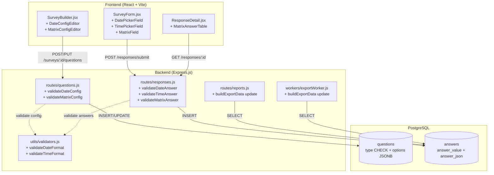
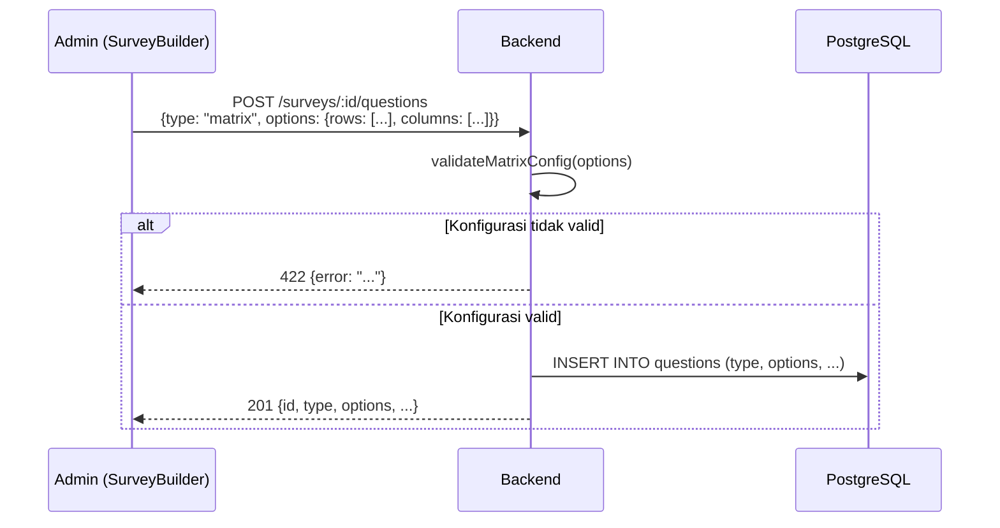
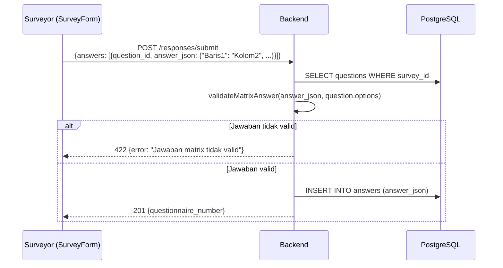
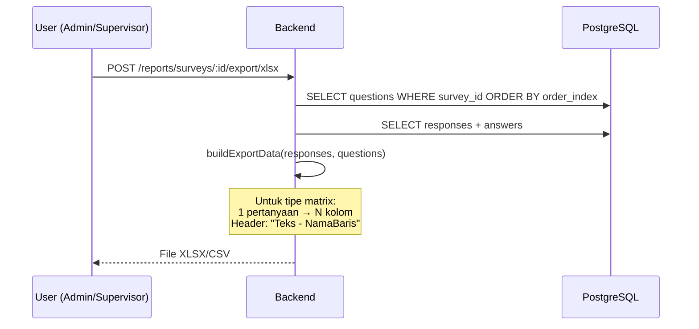

# Dokumen Desain: Additional Question Types

## Ikhtisar (Overview)

Fitur ini menambahkan dan melengkapi tiga tipe pertanyaan pada platform survei:

1. **Date Picker dengan konfigurasi min/max** — Tipe `date` sudah ada di CHECK constraint database, tetapi implementasinya masih dasar (hanya `<input type="date">`). Fitur ini melengkapi dengan konfigurasi `min_date` dan `max_date` di kolom `options` JSONB, validasi backend, dan batasan pada komponen date picker di frontend.
2. **Time Picker** — Tipe pertanyaan baru `time` untuk mencatat data waktu dalam format 24 jam (HH:mm). Disimpan sebagai `answer_value` string.
3. **Matrix/Grid Question** — Tipe pertanyaan baru `matrix` berbentuk tabel baris × kolom. Baris adalah sub-pertanyaan, kolom adalah opsi jawaban (radio button per baris). Jawaban disimpan sebagai objek JSON di `answer_json`.

### Keputusan Desain Utama

- **Reuse kolom `options` JSONB**: Semua konfigurasi tipe baru disimpan di kolom `options` yang sudah ada pada tabel `questions`, mengikuti pola yang sama dengan `rating_scale`, `phone_number`, dan `unique_id`. Tidak perlu kolom baru.
- **Reuse kolom `answer_value` dan `answer_json`**: Jawaban date dan time disimpan di `answer_value` (string). Jawaban matrix disimpan di `answer_json` (objek JSON). Tidak perlu kolom baru pada tabel `answers`.
- **Satu migration untuk dua tipe baru**: Tipe `time` dan `matrix` ditambahkan ke CHECK constraint dalam satu migration, mengikuti pola migration sebelumnya (`add-rating-scale-type.js`, `add-phone-and-unique-id-types.js`).
- **Validasi berlapis**: Validasi dilakukan di frontend (UX cepat) dan di backend (keamanan). Kedua layer menggunakan aturan yang sama untuk konsistensi.
- **Matrix export menggunakan kolom terpisah per baris**: Setiap baris matrix menjadi kolom tersendiri di CSV/Excel dengan header format `{TeksPertanyaan} - {NamaBaris}`, sehingga data mudah dianalisis di spreadsheet.
- **Backward compatibility**: Tipe `date` yang sudah ada tetap berfungsi tanpa konfigurasi min/max (perilaku default). Pertanyaan date lama yang tidak memiliki konfigurasi options tidak terpengaruh.

## Arsitektur (Architecture)



### Alur Pembuatan Pertanyaan Matrix



### Alur Pengisian dan Validasi Jawaban Matrix



### Alur Ekspor Data Matrix



## Komponen dan Antarmuka (Components and Interfaces)

### Backend

#### 1. Migration Baru: `add-time-and-matrix-types.js`

Menambahkan `time` dan `matrix` ke CHECK constraint pada kolom `type` di tabel `questions`:

```sql
ALTER TABLE questions DROP CONSTRAINT IF EXISTS questions_type_check;
ALTER TABLE questions ADD CONSTRAINT questions_type_check CHECK (type IN (
  'single_choice', 'multiple_choice', 'short_text',
  'long_text', 'numeric_scale', 'date', 'photo',
  'rating_scale', 'phone_number', 'unique_id',
  'time', 'matrix'
));
```

#### 2. Modifikasi `models/Question.js`

Tambahkan `'time'` dan `'matrix'` ke array `QUESTION_TYPES`:

```javascript
const QUESTION_TYPES = [
  'single_choice', 'multiple_choice', 'short_text', 'long_text',
  'numeric_scale', 'date', 'photo', 'rating_scale',
  'phone_number', 'unique_id', 'time', 'matrix',
];
```

#### 3. Modifikasi `routes/questions.js`

Tambahkan `'time'` dan `'matrix'` ke array `VALID_QUESTION_TYPES`.

Tambahkan fungsi validasi baru:

**`validateDateConfig(options)`** — Validasi konfigurasi date picker:
- `min_date` dan `max_date` opsional (boleh null)
- Jika diisi, harus format `YYYY-MM-DD` yang valid dan merepresentasikan tanggal nyata
- Jika keduanya diisi, `min_date <= max_date`
- Return: `{ valid: boolean, error?: string }`

**`validateMatrixConfig(options)`** — Validasi konfigurasi matrix:
- `options` harus objek dengan property `rows` (array) dan `columns` (array)
- `rows` minimal 1 elemen, `columns` minimal 2 elemen
- Setiap elemen harus string yang tidak kosong (setelah trim)
- Tidak boleh ada elemen duplikat dalam `rows` maupun `columns`
- Return: `{ valid: boolean, error?: string }`

Panggil validasi pada endpoint `POST` dan `PUT`:
- Jika `type === 'date'` dan `options` ada → `validateDateConfig(options)`
- Jika `type === 'matrix'` → `validateMatrixConfig(options)` (wajib)

#### 4. Modifikasi `routes/responses.js` — Endpoint `POST /responses/submit`

Tambahkan validasi jawaban untuk tipe baru di dalam loop validasi yang sudah ada:

**Validasi jawaban `date`**:
- Format harus `YYYY-MM-DD` yang valid
- Jika pertanyaan memiliki `min_date`/`max_date` di options, jawaban harus dalam rentang
- Gunakan `validateDateFormat()` dari `utils/validators.js`

**Validasi jawaban `time`**:
- Format harus `HH:mm` dengan jam 00-23 dan menit 00-59
- Gunakan `validateTimeFormat()` dari `utils/validators.js`

**Validasi jawaban `matrix`**:
- Jawaban harus ada di `answer_json` (bukan `answer_value`)
- Setiap key harus ada di `options.rows`
- Setiap value harus ada di `options.columns`
- Jika `is_required`, semua rows harus memiliki jawaban

#### 5. Modifikasi `utils/validators.js`

Tambahkan fungsi:

```javascript
/**
 * Validasi format tanggal YYYY-MM-DD dan pastikan tanggal valid.
 * @param {string} dateStr
 * @returns {boolean}
 */
function validateDateFormat(dateStr) { ... }

/**
 * Validasi format waktu HH:mm (24 jam).
 * @param {string} timeStr
 * @returns {boolean}
 */
function validateTimeFormat(timeStr) { ... }

/**
 * Validasi jawaban date terhadap konfigurasi min/max.
 * @param {string} dateStr - Jawaban tanggal
 * @param {object} config - { min_date, max_date }
 * @returns {{ valid: boolean, error?: string }}
 */
function validateDateAnswer(dateStr, config) { ... }

/**
 * Validasi jawaban matrix terhadap konfigurasi rows/columns.
 * @param {object} answer - Objek jawaban { "row1": "col1", ... }
 * @param {object} config - { rows: [...], columns: [...] }
 * @param {boolean} isRequired - Apakah pertanyaan wajib
 * @returns {{ valid: boolean, error?: string }}
 */
function validateMatrixAnswer(answer, config, isRequired) { ... }
```

#### 6. Modifikasi `routes/reports.js` dan `workers/exportWorker.js` — Fungsi `buildExportData`

Ubah logika pembuatan header dan pengisian data untuk mendukung matrix:

**Header generation**:
- Untuk pertanyaan non-matrix: satu kolom dengan header = `question.text` (tidak berubah)
- Untuk pertanyaan matrix: N kolom, satu per baris, dengan header = `{question.text} - {rowName}`

**Data population**:
- Untuk pertanyaan non-matrix: tidak berubah
- Untuk pertanyaan matrix: ambil `answer_json`, untuk setiap row ambil value yang dipilih, isi ke kolom yang sesuai. Jika tidak ada jawaban untuk row tertentu, isi string kosong.

Perubahan ini harus diterapkan di **dua tempat** yang memiliki fungsi `buildExportData`:
1. `routes/reports.js` (sync export)
2. `workers/exportWorker.js` (async export)

### Frontend

#### 7. Komponen Baru: `DateConfigEditor` (di dalam `SurveyBuilder.jsx`)

Editor konfigurasi untuk pertanyaan date:
- Input `min_date` (type="date", opsional)
- Input `max_date` (type="date", opsional)
- Validasi frontend: jika keduanya diisi, `min_date <= max_date`
- Tampilan info: "Kosongkan untuk tanpa batasan tanggal"

#### 8. Komponen Baru: `MatrixConfigEditor` (di dalam `SurveyBuilder.jsx`)

Editor konfigurasi untuk pertanyaan matrix:
- Daftar baris (rows) dengan tombol tambah/hapus/edit
- Daftar kolom (columns) dengan tombol tambah/hapus/edit
- Validasi frontend: minimal 1 baris, minimal 2 kolom, tidak boleh kosong, tidak boleh duplikat
- Preview tabel matrix

#### 9. Modifikasi `SurveyBuilder.jsx`

- Tambahkan `{ value: 'time', label: 'Waktu' }` dan `{ value: 'matrix', label: 'Matrix/Grid' }` ke array `QUESTION_TYPES`
- Tambahkan state `dateConfig` dan `matrixConfig` di `QuestionFormModal`
- Render `DateConfigEditor` saat `type === 'date'`
- Render `MatrixConfigEditor` saat `type === 'matrix'`
- Kirim config sebagai `options` di payload API
- Reset config saat tipe berubah (seperti pola `ratingConfig`, `phoneConfig`)

#### 10. Komponen Baru: `DatePickerField` (di dalam `SurveyForm.jsx`)

Komponen date picker untuk surveyor:
- Menggunakan `<input type="date">` dengan atribut `min` dan `max` dari konfigurasi
- Validasi frontend: tanggal harus dalam rentang jika dikonfigurasi
- Pesan error jika tanggal di luar rentang

#### 11. Komponen Baru: `TimePickerField` (di dalam `SurveyForm.jsx`)

Komponen time picker untuk surveyor:
- Menggunakan `<input type="time">` dengan format 24 jam
- Nilai disimpan sebagai string `HH:mm`

#### 12. Komponen Baru: `MatrixField` (di dalam `SurveyForm.jsx`)

Komponen matrix/grid untuk surveyor:
- Tabel HTML dengan header kolom dan baris
- Radio button per baris (satu pilihan per baris)
- Responsive: horizontal scroll pada layar kecil
- Highlight baris yang belum dijawab saat validasi gagal
- Nilai disimpan sebagai objek `{ "NamaBaris": "NamaKolom", ... }`

#### 13. Modifikasi `SurveyForm.jsx` — Fungsi `QuestionField`

Tambahkan case baru di switch statement:
- `case 'time'`: render `TimePickerField`
- `case 'matrix'`: render `MatrixField`
- Update case `'date'`: render `DatePickerField` (menggantikan `<input type="date">` yang ada)

Modifikasi `buildEmptyAnswers`:
- Untuk `type === 'matrix'`: inisialisasi sebagai objek kosong `{}`

Modifikasi `buildAnswersPayload`:
- Untuk `type === 'matrix'`: kirim sebagai `answer_json`
- Untuk `type === 'time'`: kirim sebagai `answer_value`

Modifikasi `validateRequiredQuestions`:
- Untuk `type === 'matrix'`: cek bahwa semua rows memiliki jawaban
- Untuk `type === 'time'`: cek bahwa value tidak kosong

#### 14. Modifikasi `ResponseDetail.jsx`

Tambahkan rendering untuk tipe baru di `AnswerCard`:

**Tipe `time`**: Tampilkan `answer_value` langsung (sudah format HH:mm).

**Tipe `matrix`**: Render tabel dari `answer_json`:
- Header: kolom-kolom dari `question_options.columns`
- Baris: setiap row dari `question_options.rows`
- Tandai sel yang dipilih (misalnya dengan ikon ✓ atau background biru)
- Jika `answer_json` kosong/null: tampilkan "Tidak ada jawaban" italic

Tambahkan label tipe baru di `typeLabel`:
- `time: 'Waktu'`
- `matrix: 'Matrix/Grid'`

## Model Data (Data Models)

### Tabel yang Dimodifikasi

#### `questions` — Perubahan CHECK Constraint

| Kolom | Tipe | Perubahan |
|-------|------|-----------|
| type | VARCHAR(30) | CHECK constraint ditambah `'time'`, `'matrix'` |

**CHECK constraint baru**:
```sql
CHECK (type IN (
  'single_choice', 'multiple_choice', 'short_text', 'long_text',
  'numeric_scale', 'date', 'photo', 'rating_scale',
  'phone_number', 'unique_id', 'time', 'matrix'
))
```

### Format Options JSONB per Tipe

#### Date (diperluas)
```json
{
  "min_date": "2024-01-01",
  "max_date": "2024-12-31"
}
```
Kedua field opsional. Jika tidak ada konfigurasi, `options` bisa `null` (backward compatible).

#### Time
Tidak memerlukan konfigurasi khusus. `options` bisa `null`.

#### Matrix
```json
{
  "rows": ["Kebersihan", "Pelayanan", "Fasilitas"],
  "columns": ["Sangat Buruk", "Buruk", "Cukup", "Baik", "Sangat Baik"]
}
```
- `rows`: minimal 1 elemen
- `columns`: minimal 2 elemen
- Semua elemen string non-kosong, tanpa duplikat

### Format Jawaban (Answers)

#### Date Answer
| Kolom | Nilai |
|-------|-------|
| answer_value | `"2024-06-15"` (format YYYY-MM-DD) |
| answer_json | `null` |

#### Time Answer
| Kolom | Nilai |
|-------|-------|
| answer_value | `"14:30"` (format HH:mm) |
| answer_json | `null` |

#### Matrix Answer
| Kolom | Nilai |
|-------|-------|
| answer_value | `null` |
| answer_json | `{"Kebersihan": "Baik", "Pelayanan": "Sangat Baik", "Fasilitas": "Cukup"}` |

### Format Ekspor Matrix

Untuk pertanyaan matrix dengan teks "Penilaian Layanan" dan rows `["Kebersihan", "Pelayanan"]`:

| ... | Penilaian Layanan - Kebersihan | Penilaian Layanan - Pelayanan | ... |
|-----|-------------------------------|-------------------------------|-----|
| ... | Baik | Sangat Baik | ... |


## Correctness Properties

*A property is a characteristic or behavior that should hold true across all valid executions of a system — essentially, a formal statement about what the system should do. Properties serve as the bridge between human-readable specifications and machine-verifiable correctness guarantees.*

### Property 1: Validasi Konfigurasi Date

*For any* pasangan string `min_date` dan `max_date`, fungsi `validateDateConfig` SHALL menerima konfigurasi jika dan hanya jika: (a) kedua string (jika diisi) memiliki format `YYYY-MM-DD` yang merepresentasikan tanggal nyata, dan (b) jika keduanya diisi, `min_date <= max_date`. Untuk semua konfigurasi lainnya (format salah, tanggal tidak valid, min > max), fungsi SHALL menolak.

**Validates: Requirements 1.3, 1.4, 6.1, 6.2**

### Property 2: Validasi Jawaban Date terhadap Rentang

*For any* string jawaban tanggal dan konfigurasi date (min_date, max_date), fungsi validasi jawaban date SHALL menerima jawaban jika dan hanya jika: (a) jawaban memiliki format `YYYY-MM-DD` yang valid, dan (b) jawaban berada dalam rentang `[min_date, max_date]` jika rentang dikonfigurasi. Jawaban di luar rentang atau dengan format tidak valid SHALL ditolak.

**Validates: Requirements 1.7, 1.8, 6.7**

### Property 3: Validasi Format Waktu

*For any* string input, fungsi `validateTimeFormat` SHALL mengembalikan `true` jika dan hanya jika string tersebut cocok dengan format `HH:mm` di mana jam berada dalam rentang 00-23 dan menit berada dalam rentang 00-59. Untuk semua string lainnya, fungsi SHALL mengembalikan `false`.

**Validates: Requirements 2.5, 2.6, 6.8**

### Property 4: Validasi Konfigurasi Matrix

*For any* objek konfigurasi matrix, fungsi `validateMatrixConfig` SHALL menerima konfigurasi jika dan hanya jika: (a) `rows` adalah array dengan minimal 1 elemen, (b) `columns` adalah array dengan minimal 2 elemen, (c) semua elemen adalah string non-kosong setelah trim, dan (d) tidak ada elemen duplikat dalam `rows` maupun `columns`. Untuk semua konfigurasi lainnya, fungsi SHALL menolak.

**Validates: Requirements 3.4, 3.5, 6.3, 6.4, 6.5**

### Property 5: Validasi Jawaban Matrix

*For any* objek jawaban matrix dan konfigurasi matrix yang valid, fungsi `validateMatrixAnswer` SHALL menerima jawaban jika dan hanya jika: (a) setiap key dalam jawaban ada di `rows` konfigurasi, (b) setiap value dalam jawaban ada di `columns` konfigurasi, dan (c) jika pertanyaan wajib (`is_required = true`), semua elemen `rows` memiliki jawaban. Jawaban dengan key/value yang tidak valid atau jawaban tidak lengkap pada pertanyaan wajib SHALL ditolak.

**Validates: Requirements 3.10, 3.11, 3.12, 6.9**

### Property 6: Round-trip Konfigurasi Pertanyaan

*For any* konfigurasi pertanyaan yang valid (date config dengan min/max, matrix config dengan rows/columns), menyimpan konfigurasi ke kolom `options` JSONB lalu membaca kembali SHALL menghasilkan objek yang identik dengan yang disimpan.

**Validates: Requirements 1.1, 3.2, 3.9, 6.6**

### Property 7: Ekspor Data Matrix Menghasilkan Kolom yang Benar

*For any* pertanyaan bertipe matrix dengan konfigurasi `N` baris dan kumpulan jawaban (termasuk jawaban kosong/parsial), fungsi `buildExportData` SHALL menghasilkan tepat `N` kolom tambahan untuk pertanyaan tersebut, dengan header format `{TeksPertanyaan} - {NamaBaris}`, dan setiap kolom berisi nilai kolom yang dipilih atau string kosong jika tidak ada jawaban.

**Validates: Requirements 5.3, 5.4, 5.5**

### Property 8: Clone Survei Mempertahankan Konfigurasi Tipe Baru

*For any* survei yang mengandung pertanyaan bertipe `date` (dengan konfigurasi min/max), `time`, atau `matrix`, operasi clone SHALL menghasilkan pertanyaan baru dengan `options` JSONB yang identik dengan pertanyaan sumber.

**Validates: Requirements 7.3**

## Penanganan Error (Error Handling)

### Backend Error Responses

| Skenario | HTTP Code | Pesan Error |
|----------|-----------|-------------|
| Format tanggal bukan YYYY-MM-DD (konfigurasi) | 422 | "Format tanggal harus YYYY-MM-DD" |
| Min_date > Max_date | 422 | "Tanggal minimum tidak boleh lebih besar dari tanggal maksimum" |
| Jawaban tanggal di luar rentang | 422 | "Tanggal harus antara {min_date} dan {max_date}" |
| Jawaban tanggal format tidak valid | 422 | "Format tanggal harus YYYY-MM-DD" |
| Jawaban waktu format tidak valid | 422 | "Format waktu harus HH:mm (24 jam)" |
| Matrix rows kosong | 422 | "Matrix harus memiliki minimal 1 baris" |
| Matrix columns kurang dari 2 | 422 | "Matrix harus memiliki minimal 2 kolom" |
| Elemen rows/columns kosong | 422 | "Elemen baris dan kolom tidak boleh kosong" |
| Elemen rows/columns duplikat | 422 | "Elemen baris/kolom matrix tidak boleh duplikat" |
| Jawaban matrix key tidak valid | 422 | "Jawaban matrix tidak valid" |
| Jawaban matrix value tidak valid | 422 | "Jawaban matrix tidak valid" |
| Jawaban matrix tidak lengkap (wajib) | 422 | "Semua baris matrix wajib dijawab" |
| Tipe pertanyaan tidak valid | 422 | "Tipe pertanyaan tidak valid. Tipe yang didukung: ..." |

### Strategi Penanganan Error

1. **Validasi berlapis**: Frontend melakukan validasi dasar (format, rentang, kelengkapan) sebelum submit. Backend melakukan validasi lengkap yang sama untuk keamanan.
2. **Error spesifik per tipe**: Setiap tipe pertanyaan memiliki pesan error yang jelas dan spesifik, memudahkan surveyor memahami masalah.
3. **Backward compatibility**: Pertanyaan date yang sudah ada tanpa konfigurasi min/max tetap berfungsi normal. Validasi rentang hanya diterapkan jika konfigurasi ada.
4. **Graceful degradation**: Jika `answer_json` untuk matrix tidak bisa di-parse, ResponseDetail menampilkan "Tidak ada jawaban" alih-alih error.

## Strategi Pengujian (Testing Strategy)

### Pendekatan Pengujian Ganda

Fitur ini menggunakan kombinasi **unit test** dan **property-based test** untuk cakupan yang komprehensif:

- **Property-based tests** (menggunakan `fast-check`): Memverifikasi properti universal yang berlaku untuk semua input valid — validasi format, validasi konfigurasi, validasi jawaban, round-trip, dan ekspor data.
- **Unit tests** (menggunakan `jest` untuk backend, `vitest` untuk frontend): Memverifikasi contoh spesifik, edge case, rendering komponen, dan integrasi.

### Property-Based Tests (Backend — Jest + fast-check)

Setiap property test HARUS:
- Menggunakan library `fast-check` yang sudah ada di project
- Menjalankan minimal 100 iterasi per property
- Menyertakan tag komentar yang mereferensikan property di dokumen desain
- Format tag: **Feature: additional-question-types, Property {number}: {property_text}**

Property tests akan ditempatkan di `backend/tests/properties/additionalQuestionTypes.property.test.js`.

**Daftar property tests:**
1. Property 1: Validasi konfigurasi date — generate random date pairs, verify acceptance/rejection
2. Property 2: Validasi jawaban date terhadap rentang — generate random dates and configs
3. Property 3: Validasi format waktu — generate random strings, verify HH:mm validation
4. Property 4: Validasi konfigurasi matrix — generate random configs with varying sizes/content
5. Property 5: Validasi jawaban matrix — generate random answers and configs
6. Property 6: Round-trip konfigurasi — generate valid configs, save/read via model
7. Property 7: Ekspor data matrix — generate matrix configs and answers, verify buildExportData output
8. Property 8: Clone mempertahankan konfigurasi — generate surveys with new types, clone, verify

### Unit Tests

#### Backend (`backend/tests/unit/`)
- `questions.test.js` — Tambahkan test untuk:
  - Membuat pertanyaan tipe `time` dan `matrix`
  - Validasi konfigurasi date (min/max)
  - Validasi konfigurasi matrix (rows/columns, duplikat, kosong)
  - Menolak konfigurasi tidak valid
- `responses.test.js` — Tambahkan test untuk:
  - Validasi jawaban date (format, rentang)
  - Validasi jawaban time (format HH:mm)
  - Validasi jawaban matrix (key/value valid, kelengkapan)
  - Menolak jawaban tidak valid
- `reports.test.js` — Tambahkan test untuk:
  - Ekspor data dengan jawaban date dan time
  - Ekspor data matrix (kolom terpisah per baris)
  - Ekspor data matrix dengan jawaban kosong/parsial

#### Frontend (`frontend/src/pages/__tests__/`)
- `SurveyBuilder.test.jsx` — Tambahkan test untuk:
  - Dropdown menampilkan opsi "Waktu" dan "Matrix/Grid"
  - DateConfigEditor muncul saat tipe date dipilih
  - MatrixConfigEditor muncul saat tipe matrix dipilih
  - Validasi frontend konfigurasi matrix
- `ResponseDetail.test.jsx` — Tambahkan test untuk:
  - Rendering jawaban time (format HH:mm)
  - Rendering jawaban matrix (tabel)
  - Badge tipe "Waktu" dan "Matrix/Grid"
  - Jawaban matrix kosong menampilkan "Tidak ada jawaban"

### Integration Tests
- Alur lengkap: buat pertanyaan matrix → isi jawaban → lihat di ResponseDetail → ekspor
- Clone survei dengan pertanyaan time dan matrix → verifikasi konfigurasi tersalin
- Skip logic dengan pertanyaan date/time/matrix sebagai sumber kondisi
