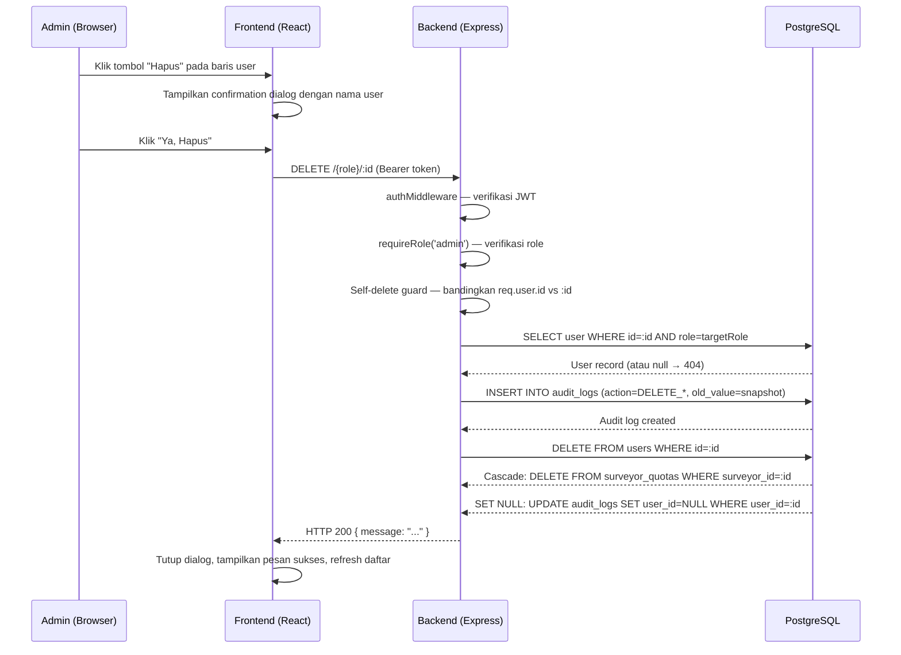

# Design Document: Admin Delete User

## Overview

Fitur ini menambahkan kemampuan penghapusan permanen akun pengguna oleh admin. Platform saat ini sudah memiliki fitur deactivate (soft-delete) yang hanya menonaktifkan akun. Fitur delete permanen diperlukan untuk kasus seperti pembersihan data, permintaan penghapusan (GDPR), atau akun yang dibuat secara keliru.

**Pendekatan desain utama:**
- Empat endpoint `DELETE /{role}/:id` baru, masing-masing hanya dapat diakses oleh admin
- Audit log dicatat **sebelum** penghapusan untuk menjamin jejak audit tidak hilang
- Foreign key `surveyor_quotas.surveyor_id` sudah memiliki `ON DELETE CASCADE` di migration — tidak perlu perubahan skema
- Foreign key `audit_logs.user_id` sudah memiliki `ON DELETE SET NULL` di migration — entri audit historis tetap terjaga
- Frontend menambahkan tombol "Hapus" merah dengan confirmation dialog inline (pola yang sama dengan tombol "Nonaktifkan" yang sudah ada)
- Self-delete dicegah di backend (HTTP 403) dan di frontend (tombol disabled + tooltip)

## Architecture



**Alur error:**
- Jika `AuditLog.create` gagal → rollback, kembalikan HTTP 500, user tidak terhapus
- Jika `User.destroy` gagal karena constraint → kembalikan HTTP 409
- Jika user tidak ditemukan → kembalikan HTTP 404

## Components and Interfaces

### Backend

#### Route Handler: `DELETE /{role}/:id`

Empat handler baru ditambahkan ke file route yang sudah ada, mengikuti pola yang sama:

```
DELETE /admins/:id      → backend/src/routes/admins.js
DELETE /supervisors/:id → backend/src/routes/supervisors.js
DELETE /viewers/:id     → backend/src/routes/viewers.js
DELETE /surveyors/:id   → backend/src/routes/surveyors.js
```

Setiap handler mengikuti urutan operasi yang sama:

```
1. authMiddleware (sudah ada via router.use)
2. requireRole('admin') (sudah ada via router.use untuk admins.js; ditambahkan per-route untuk yang lain)
3. Self-delete guard: if (req.user.id === id) → 403
4. User.findOne({ where: { id, role: targetRole } }) → 404 jika tidak ada
5. Snapshot old_value = { name, email, role, is_active }
6. AuditLog.create({ action: DELETE_*, old_value: snapshot, ... })
7. user.destroy()
8. res.json({ message: "Akun berhasil dihapus" })
```

**Catatan untuk `surveyors.js`:** Route ini menggunakan `router.use(authMiddleware, requireRole(['admin', 'supervisor']))` untuk semua route di bawahnya. Route DELETE harus menggunakan `requireRole('admin')` secara eksplisit karena supervisor tidak boleh menghapus.

**Catatan untuk `viewers.js` dan `supervisors.js`:** Route-route ini menggunakan `requireRole` per-route. Route DELETE ditambahkan dengan `requireRole('admin')`.

#### Middleware yang Digunakan (Tidak Berubah)

| Middleware | File | Fungsi |
|---|---|---|
| `authMiddleware` | `middleware/auth.js` | Verifikasi JWT, attach `req.user` |
| `requireRole('admin')` | `middleware/auth.js` | Pastikan hanya admin yang bisa akses |

#### Response Contracts

**Sukses (200):**
```json
{ "message": "Akun {name} berhasil dihapus" }
```

**Self-delete (403):**
```json
{ "error": "Tidak dapat menghapus akun sendiri" }
```

**Not found (404):**
```json
{ "error": "{Role} tidak ditemukan" }
```

**Audit log gagal / error internal (500):**
```json
{ "error": "Terjadi kesalahan internal" }
```

**Constraint violation (409):**
```json
{ "error": "Akun tidak dapat dihapus karena masih memiliki data terkait" }
```

### Frontend

#### `UserManagement.jsx` — Perubahan

1. **State baru:** `confirmDeleteId` (string | null) — menyimpan ID user yang sedang dikonfirmasi untuk dihapus
2. **Handler baru:** `handleDelete(user)` — memanggil `api.delete(activeTab.endpoint + '/' + user.id)`, lalu refresh list
3. **Tombol "Hapus"** ditambahkan di kolom Aksi setiap baris, dengan pola inline confirmation yang sama dengan tombol "Nonaktifkan":
   - Klik pertama: set `confirmDeleteId = user.id` → tampilkan "Hapus?" + tombol "Ya" (merah) + "Batal"
   - Klik "Ya": panggil `handleDelete(user)`
   - Klik "Batal": set `confirmDeleteId = null`
4. **Self-delete guard:** Jika `isSelf === true`, tombol "Hapus" ditampilkan sebagai `disabled` dengan `title="Tidak dapat menghapus akun sendiri"`
5. **Visibility guard:** Tombol "Hapus" hanya dirender jika `currentUser.role === 'admin'`

#### `Surveyors.jsx` — Perubahan

Perubahan yang sama seperti `UserManagement.jsx`, dengan perbedaan:
- Endpoint yang digunakan: `/surveyors/:id`
- Tidak ada self-delete concern (surveyor tidak bisa login sebagai admin)
- Tombol "Hapus" selalu enabled untuk semua baris (admin tidak bisa menjadi surveyor)

#### Pola Confirmation Dialog (Inline)

Mengikuti pola yang sudah ada untuk "Nonaktifkan":

```jsx
{/* Sebelum konfirmasi */}
<button
  onClick={() => setConfirmDeleteId(user.id)}
  disabled={isSelf}
  title={isSelf ? "Tidak dapat menghapus akun sendiri" : undefined}
  className="... text-red-700 bg-red-50 hover:bg-red-100 ..."
>
  Hapus
</button>

{/* Saat konfirmasi aktif */}
{confirmDeleteId === user.id && (
  <span className="flex items-center gap-1.5">
    <span className="text-xs text-gray-600">Hapus permanen?</span>
    <button onClick={() => handleDelete(user)} className="... bg-red-500 ...">Ya, Hapus</button>
    <button onClick={() => setConfirmDeleteId(null)} className="... bg-gray-100 ...">Batal</button>
  </span>
)}
```

## Data Models

### Tabel yang Terlibat

#### `users` (tidak ada perubahan skema)

| Kolom | Tipe | Keterangan |
|---|---|---|
| `id` | UUID PK | ID pengguna |
| `name` | VARCHAR(255) | Nama |
| `email` | VARCHAR(255) UNIQUE | Email |
| `role` | VARCHAR(20) | admin / supervisor / viewer / surveyor |
| `is_active` | BOOLEAN | Status aktif |

Operasi: `User.destroy()` — menghapus baris secara permanen.

#### `audit_logs` (tidak ada perubahan skema)

Foreign key `user_id` sudah memiliki `ON DELETE SET NULL` di migration. Ketika user dihapus, `user_id` pada entri audit log lama menjadi `NULL` — entri tetap ada untuk keperluan audit historis.

**Entri audit log yang dibuat sebelum penghapusan:**

| Field | Nilai |
|---|---|
| `user_id` | `req.user.id` (admin yang melakukan delete) |
| `action` | `DELETE_ADMIN` / `DELETE_SUPERVISOR` / `DELETE_VIEWER` / `DELETE_SURVEYOR` |
| `entity_type` | `admin` / `supervisor` / `viewer` / `surveyor` |
| `entity_id` | ID akun yang dihapus |
| `old_value` | `{ name, email, role, is_active }` — snapshot sebelum hapus |
| `new_value` | `null` |
| `ip_address` | `req.ip` |

#### `surveyor_quotas` (tidak ada perubahan skema)

Foreign key `surveyor_id` sudah memiliki `ON DELETE CASCADE` di migration. Ketika surveyor dihapus, semua baris quota terkait otomatis terhapus oleh database.

### Tidak Ada Perubahan Migrasi

Semua foreign key constraint yang diperlukan sudah ada di skema database:
- `surveyor_quotas.surveyor_id` → `ON DELETE CASCADE` ✅
- `audit_logs.user_id` → `ON DELETE SET NULL` ✅

Tidak diperlukan migration baru.

## Correctness Properties

*A property is a characteristic or behavior that should hold true across all valid executions of a system — essentially, a formal statement about what the system should do. Properties serve as the bridge between human-readable specifications and machine-verifiable correctness guarantees.*

### Property 1: Delete menghapus user secara permanen

*For any* user yang ada di database (dengan role admin, supervisor, viewer, atau surveyor), setelah admin berhasil memanggil endpoint DELETE yang sesuai, pencarian `User.findOne({ where: { id } })` harus mengembalikan `null`.

**Validates: Requirements 1.5**

---

### Property 2: Self-delete selalu ditolak

*For any* admin yang sedang login, mencoba menghapus akun dengan ID yang sama dengan `req.user.id` melalui `DELETE /admins/:id` harus selalu menghasilkan HTTP 403, terlepas dari data akun tersebut.

**Validates: Requirements 2.1, 2.2**

---

### Property 3: Audit log selalu dibuat sebelum penghapusan

*For any* penghapusan user yang berhasil, harus selalu ada entri di tabel `audit_logs` dengan `entity_id` yang sama dengan ID user yang dihapus, dan entri tersebut harus dibuat sebelum baris user dihapus dari tabel `users`.

**Validates: Requirements 3.1, 3.2, 3.3, 3.4, 3.5**

---

### Property 4: Audit log berisi data lengkap dan benar

*For any* penghapusan user yang berhasil, entri audit log yang dibuat harus memiliki: `user_id` = ID admin yang melakukan delete, `action` = `DELETE_{ROLE}` sesuai role target, `entity_type` = role target, `entity_id` = ID user yang dihapus, `old_value` berisi snapshot `{ name, email, role, is_active }` yang akurat, dan `ip_address` terisi.

**Validates: Requirements 3.2, 3.3, 3.4, 3.5, 3.6**

---

### Property 5: Non-admin selalu ditolak di semua endpoint delete

*For any* pengguna dengan role supervisor, viewer, atau surveyor, mencoba mengakses salah satu dari keempat endpoint DELETE (`/admins/:id`, `/supervisors/:id`, `/viewers/:id`, `/surveyors/:id`) harus selalu menghasilkan HTTP 403, terlepas dari ID yang diberikan.

**Validates: Requirements 5.1, 5.2, 5.3, 8.1, 8.2**

---

### Property 6: Tombol Hapus ada untuk setiap baris user (sebagai admin)

*For any* daftar pengguna yang ditampilkan di halaman UserManagement atau Surveyors ketika pengguna yang login adalah admin, setiap baris harus memiliki tombol "Hapus" yang dapat diklik — kecuali baris yang merupakan akun admin yang sedang login sendiri (yang harus disabled).

**Validates: Requirements 7.1, 7.2, 7.4, 7.5**

---

### Property 7: Confirmation dialog menampilkan nama user yang akan dihapus

*For any* user dengan nama apapun, ketika admin mengklik tombol "Hapus" pada baris tersebut, teks konfirmasi yang ditampilkan harus mengandung nama user tersebut.

**Validates: Requirements 4.1**

---

### Property 8: Endpoint DELETE yang dipanggil sesuai dengan role user

*For any* user yang akan dihapus dari tab manapun (admin/supervisor/viewer/surveyor), ketika admin mengkonfirmasi penghapusan, endpoint API yang dipanggil harus sesuai dengan role user tersebut (`DELETE /admins/:id` untuk admin, dst.).

**Validates: Requirements 4.4**

## Error Handling

### Backend

| Kondisi | HTTP Status | Pesan |
|---|---|---|
| Token tidak ada / tidak valid | 401 | "Sesi telah berakhir, silakan login kembali" |
| Role bukan admin | 403 | "Anda tidak memiliki izin untuk mengakses resource ini" |
| Self-delete | 403 | "Tidak dapat menghapus akun sendiri" |
| User tidak ditemukan / role tidak sesuai | 404 | "{Role} tidak ditemukan" |
| Constraint violation database | 409 | "Akun tidak dapat dihapus karena masih memiliki data terkait" |
| Audit log gagal dibuat | 500 | "Terjadi kesalahan internal" |
| Error tak terduga lainnya | 500 | Ditangani oleh global error handler di `app.js` |

**Atomicity:** Audit log dibuat terlebih dahulu. Jika `AuditLog.create` gagal, `user.destroy()` tidak dipanggil. Jika `user.destroy()` gagal setelah audit log berhasil dibuat, audit log tetap ada (ini dapat diterima — lebih baik ada audit log tanpa penghapusan daripada penghapusan tanpa audit log). Untuk atomicity penuh, bisa menggunakan Sequelize transaction, namun mengingat pola yang sudah ada di codebase tidak menggunakan transaction, pendekatan sequential sudah cukup.

### Frontend

| Kondisi | Penanganan |
|---|---|
| API mengembalikan 403 (self-delete) | Tampilkan pesan error, tutup confirmation |
| API mengembalikan 404 | Tampilkan pesan error, refresh list |
| API mengembalikan 500 | Tampilkan pesan error deskriptif |
| Network error | Tampilkan pesan error generic |
| Penghapusan berhasil | Tampilkan pesan sukses (auto-dismiss 4 detik), refresh list |

## Testing Strategy

### Unit Tests (Backend)

File: `backend/tests/unit/admins.test.js`, `supervisors.test.js`, `viewers.test.js`, `surveyors.test.js`

Menggunakan pola yang sudah ada di codebase (Jest + mock Sequelize models).

**Test cases per route:**
- ✅ Admin berhasil menghapus user dengan role yang sesuai → 200
- ✅ Admin mencoba menghapus dirinya sendiri → 403
- ✅ User tidak ditemukan → 404
- ✅ Non-admin (supervisor/viewer/surveyor) mencoba delete → 403
- ✅ Request tanpa token → 401
- ✅ Audit log dibuat dengan field yang benar sebelum delete
- ✅ Jika AuditLog.create gagal → 500, user tidak terhapus

### Unit Tests (Frontend)

File: `frontend/src/pages/__tests__/UserManagement.test.jsx`, `Surveyors.test.jsx`

Menggunakan pola yang sudah ada (Vitest + React Testing Library).

**Test cases:**
- ✅ Tombol "Hapus" muncul untuk setiap baris ketika role = admin
- ✅ Tombol "Hapus" tidak muncul ketika role = supervisor atau viewer
- ✅ Tombol "Hapus" disabled untuk baris currentUser dengan tooltip yang benar
- ✅ Klik tombol "Hapus" menampilkan confirmation inline dengan nama user
- ✅ Klik "Batal" menutup confirmation tanpa memanggil API
- ✅ Klik "Ya, Hapus" memanggil endpoint DELETE yang sesuai
- ✅ Setelah sukses: pesan sukses muncul, list di-refresh
- ✅ Setelah error: pesan error muncul

### Property-Based Tests (Backend)

Library: **fast-check** (sudah digunakan di codebase — lihat `backend/tests/properties/`)

File baru: `backend/tests/properties/adminDeleteUser.property.test.js`

Minimum 100 iterasi per property test.

**Property 1 — Delete menghapus user secara permanen:**
```
// Feature: admin-delete-user, Property 1: Delete menghapus user secara permanen
fc.assert(fc.asyncProperty(
  fc.record({ name: fc.string(), email: fc.emailAddress(), role: fc.constantFrom('admin','supervisor','viewer','surveyor') }),
  async (userData) => {
    // Setup: buat user dengan data random
    // Act: panggil DELETE endpoint sebagai admin
    // Assert: User.findOne({ where: { id } }) === null
  }
), { numRuns: 100 });
```

**Property 2 — Self-delete selalu ditolak:**
```
// Feature: admin-delete-user, Property 2: Self-delete selalu ditolak
fc.assert(fc.asyncProperty(
  fc.record({ name: fc.string(), email: fc.emailAddress() }),
  async (adminData) => {
    // Setup: buat admin, generate token untuk admin tersebut
    // Act: panggil DELETE /admins/{id} dengan token admin tersebut
    // Assert: response.status === 403
  }
), { numRuns: 100 });
```

**Property 3 & 4 — Audit log lengkap dan benar:**
```
// Feature: admin-delete-user, Property 3 & 4: Audit log dibuat sebelum penghapusan dengan data lengkap
fc.assert(fc.asyncProperty(
  fc.record({ name: fc.string(), email: fc.emailAddress(), role: fc.constantFrom('supervisor','viewer','surveyor') }),
  async (userData) => {
    // Setup: buat user dengan data random
    // Act: panggil DELETE endpoint sebagai admin
    // Assert: AuditLog.findOne({ where: { entity_id: user.id } }) !== null
    //         audit.action === `DELETE_${role.toUpperCase()}`
    //         audit.old_value.name === userData.name
    //         audit.user_id === adminId
  }
), { numRuns: 100 });
```

**Property 5 — Non-admin selalu ditolak:**
```
// Feature: admin-delete-user, Property 5: Non-admin selalu ditolak
fc.assert(fc.asyncProperty(
  fc.record({
    role: fc.constantFrom('supervisor', 'viewer', 'surveyor'),
    endpoint: fc.constantFrom('/admins', '/supervisors', '/viewers', '/surveyors'),
    targetId: fc.uuid(),
  }),
  async ({ role, endpoint, targetId }) => {
    // Setup: generate token untuk role non-admin
    // Act: panggil DELETE {endpoint}/{targetId}
    // Assert: response.status === 403
  }
), { numRuns: 100 });
```

### Property-Based Tests (Frontend)

Library: **fast-check** (sudah digunakan di codebase — lihat `frontend/src/utils/__tests__/randomizeOptions.property.test.js`)

**Property 6 — Tombol Hapus ada untuk setiap baris:**
```
// Feature: admin-delete-user, Property 6: Tombol Hapus ada untuk setiap baris user
fc.assert(fc.property(
  fc.array(fc.record({ id: fc.uuid(), name: fc.string(), email: fc.emailAddress(), is_active: fc.boolean() }), { minLength: 1 }),
  (users) => {
    // Render UserManagement dengan currentUser.role = 'admin' dan users = generated list
    // Assert: setiap baris memiliki tombol "Hapus"
    // Assert: baris currentUser memiliki tombol disabled
  }
), { numRuns: 100 });
```

**Property 7 — Confirmation dialog menampilkan nama user:**
```
// Feature: admin-delete-user, Property 7: Confirmation dialog menampilkan nama user
fc.assert(fc.property(
  fc.record({ id: fc.uuid(), name: fc.string({ minLength: 1 }), email: fc.emailAddress() }),
  (user) => {
    // Render komponen dengan user tersebut
    // Klik tombol "Hapus"
    // Assert: teks konfirmasi mengandung user.name
  }
), { numRuns: 100 });
```

**Property 8 — Endpoint yang dipanggil sesuai role:**
```
// Feature: admin-delete-user, Property 8: Endpoint DELETE sesuai role user
fc.assert(fc.asyncProperty(
  fc.record({
    id: fc.uuid(),
    name: fc.string(),
    role: fc.constantFrom('admin', 'supervisor', 'viewer'),
  }),
  async (user) => {
    // Mock api.delete
    // Render UserManagement, klik Hapus, konfirmasi
    // Assert: api.delete dipanggil dengan endpoint yang sesuai role
  }
), { numRuns: 100 });
```

### Integration Tests

File: `backend/tests/integration/e2e.test.js` (extend yang sudah ada)

- ✅ Hapus surveyor → verifikasi `surveyor_quotas` terhapus (CASCADE)
- ✅ Hapus user → verifikasi `audit_logs.user_id` menjadi NULL (SET NULL)
- ✅ End-to-end: login sebagai admin → hapus user → verifikasi tidak bisa login lagi
