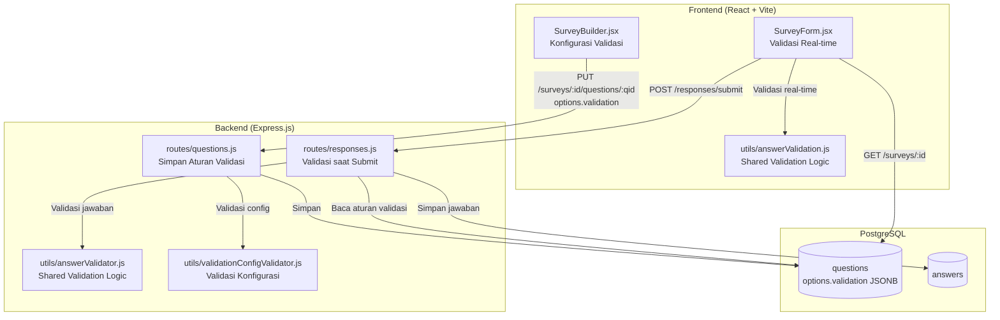
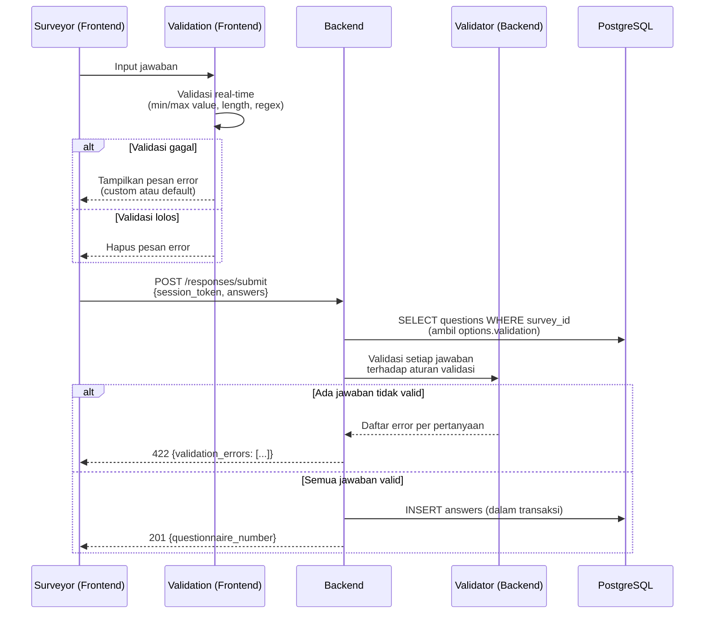
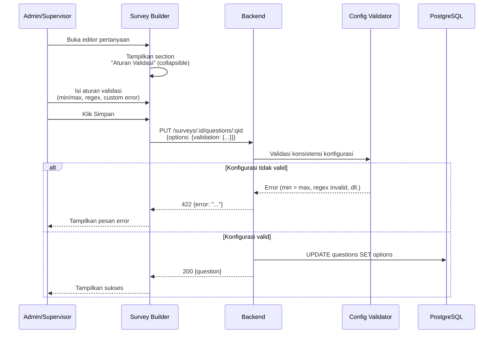

# Dokumen Desain: Answer Validation

## Ikhtisar (Overview)

Fitur ini menambahkan sistem validasi jawaban yang komprehensif pada platform survei. Aturan validasi dikonfigurasi oleh Admin/Supervisor per pertanyaan melalui Survey Builder dan disimpan dalam kolom `options` JSONB pada tabel `questions` di bawah key `validation`. Validasi dijalankan di dua lapisan:

1. **Validasi real-time di frontend** — Surveyor mendapat umpan balik langsung saat mengisi formulir di `SurveyForm.jsx`, termasuk pesan error di bawah field yang gagal validasi dan penghitung karakter untuk pertanyaan teks.
2. **Validasi di backend saat submit** — Endpoint `POST /responses/submit` memvalidasi ulang semua jawaban terhadap aturan validasi sebelum menyimpan ke database, mencegah data tidak valid masuk meskipun validasi frontend dilewati.

Jenis aturan validasi yang didukung:
- **Min/Max Value** — Batas nilai numerik untuk `numeric_scale` dan `rating_scale`
- **Min/Max Length** — Batas panjang karakter untuk `short_text` dan `long_text`
- **Regex Pattern** — Pola ekspresi reguler untuk validasi format jawaban pada `short_text`, `long_text`, dan `numeric_scale`
- **Custom Error Message** — Pesan error kustom yang menggantikan pesan default saat validasi gagal

### Keputusan Desain Utama

- **Shared validation logic**: Fungsi validasi inti (`validateAnswer`) ditulis sebagai modul utilitas murni (pure function) yang dapat digunakan baik di backend maupun di frontend. Ini menjamin konsistensi hasil validasi antara kedua lapisan.
- **Validasi konfigurasi saat simpan pertanyaan**: Backend memvalidasi konsistensi aturan validasi (min ≤ max, regex valid, dll.) saat Admin/Supervisor menyimpan pertanyaan, mencegah aturan yang mustahil dipenuhi.
- **Tidak ada migrasi database baru**: Aturan validasi disimpan di dalam kolom `options` JSONB yang sudah ada, sehingga tidak perlu menambah kolom atau tabel baru.
- **Collapsible UI section**: Bagian konfigurasi validasi di Survey Builder ditampilkan sebagai section yang dapat dibuka/ditutup agar tidak membebani UI untuk pertanyaan yang tidak memerlukan validasi.
- **Full regex match**: Pencocokan regex menggunakan full match (anchor `^...$`) untuk memastikan seluruh nilai jawaban cocok, bukan hanya sebagian.


## Arsitektur (Architecture)



### Alur Validasi Jawaban saat Submit



### Alur Konfigurasi Validasi di Survey Builder



## Komponen dan Antarmuka (Components and Interfaces)

### Backend

#### 1. Utilitas Baru: `utils/answerValidator.js`

Modul utilitas murni (pure function) untuk memvalidasi jawaban terhadap aturan validasi. Modul ini digunakan oleh `routes/responses.js` saat submit dan logikanya di-mirror di frontend.

```javascript
/**
 * Validasi satu jawaban terhadap aturan validasi pertanyaan.
 * @param {string|null} answerValue - Nilai jawaban (answer_value)
 * @param {object} question - Objek pertanyaan {type, options}
 * @returns {{ valid: boolean, error?: string }}
 */
function validateAnswer(answerValue, question) { ... }

/**
 * Validasi semua jawaban dalam satu submission.
 * @param {Array<{question_id, answer_value, answer_json}>} answers
 * @param {Array<{id, type, options, is_required}>} questions
 * @returns {{ valid: boolean, errors: Array<{question_id, error}> }}
 */
function validateAllAnswers(answers, questions) { ... }
```

**Logika validasi per jenis aturan:**

| Aturan | Tipe Pertanyaan | Logika |
|--------|----------------|--------|
| `min_value` | `numeric_scale`, `rating_scale` | `parseFloat(answer) >= min_value` |
| `max_value` | `numeric_scale`, `rating_scale` | `parseFloat(answer) <= max_value` |
| `min_length` | `short_text`, `long_text` | `answer.length >= min_length` |
| `max_length` | `short_text`, `long_text` | `answer.length <= max_length` |
| `pattern` | `short_text`, `long_text`, `numeric_scale` | `new RegExp('^(' + pattern + ')$').test(answer)` |
| `custom_error` | Semua yang mendukung validasi | Digunakan sebagai pesan error jika ada, menggantikan pesan default |

**Pesan error default:**

| Aturan yang Dilanggar | Pesan Default |
|----------------------|---------------|
| `min_value` | `"Nilai minimum adalah {min_value}"` |
| `max_value` | `"Nilai maksimum adalah {max_value}"` |
| `min_value` + `max_value` | `"Nilai harus antara {min_value} dan {max_value}"` |
| `min_length` | `"Panjang minimum adalah {min_length} karakter"` |
| `max_length` | `"Panjang maksimum adalah {max_length} karakter"` |
| `min_length` + `max_length` | `"Panjang harus antara {min_length} dan {max_length} karakter"` |
| `pattern` | `"Format jawaban tidak sesuai"` |

#### 2. Utilitas Baru: `utils/validationConfigValidator.js`

Modul untuk memvalidasi konsistensi konfigurasi aturan validasi saat Admin/Supervisor menyimpan pertanyaan.

```javascript
/**
 * Validasi konsistensi konfigurasi aturan validasi.
 * @param {object} validation - Objek validation dari options
 * @param {string} questionType - Tipe pertanyaan
 * @returns {{ valid: boolean, error?: string }}
 */
function validateValidationConfig(validation, questionType) { ... }
```

**Aturan validasi konfigurasi:**

| Pengecekan | Kondisi Error | Pesan Error |
|-----------|---------------|-------------|
| `min_value` bukan numerik | `typeof min_value !== 'number' \|\| isNaN(min_value)` | `"min_value harus berupa bilangan numerik"` |
| `max_value` bukan numerik | `typeof max_value !== 'number' \|\| isNaN(max_value)` | `"max_value harus berupa bilangan numerik"` |
| `min_value > max_value` | Keduanya ada dan `min_value > max_value` | `"min_value tidak boleh lebih besar dari max_value"` |
| `min_length` bukan integer positif | `!Number.isInteger(min_length) \|\| min_length < 1` | `"min_length harus berupa bilangan bulat positif"` |
| `max_length` bukan integer positif | `!Number.isInteger(max_length) \|\| max_length < 1` | `"max_length harus berupa bilangan bulat positif"` |
| `min_length > max_length` | Keduanya ada dan `min_length > max_length` | `"min_length tidak boleh lebih besar dari max_length"` |
| `pattern` bukan regex valid | `new RegExp(pattern)` throws | `"Pola regex tidak valid"` |
| `custom_error` > 500 karakter | `custom_error.length > 500` | `"Pesan error kustom tidak boleh melebihi 500 karakter"` |

#### 3. Modifikasi `routes/questions.js`

**`POST /surveys/:surveyId/questions`** dan **`PUT /surveys/:surveyId/questions/:qid`**:
- Setelah validasi tipe pertanyaan yang sudah ada, tambahkan validasi konfigurasi aturan validasi menggunakan `validateValidationConfig()`
- Jika `options` mengandung key `validation`, jalankan validasi konfigurasi
- Jika validasi gagal → return 422 dengan pesan error spesifik

#### 4. Modifikasi `routes/responses.js`

**`POST /responses/submit`**:
- Setelah validasi pertanyaan wajib yang sudah ada, tambahkan validasi jawaban menggunakan `validateAllAnswers()`
- Untuk setiap jawaban, baca `options.validation` dari pertanyaan terkait
- Jika ada jawaban yang gagal validasi → return 422 dengan daftar error:

```json
{
  "error": "Validasi jawaban gagal",
  "validation_errors": [
    { "question_id": "uuid-1", "error": "Nilai harus antara 1 dan 10" },
    { "question_id": "uuid-2", "error": "Panjang minimum adalah 5 karakter" }
  ]
}
```

### Frontend

#### 5. Utilitas Baru: `utils/answerValidation.js`

Mirror dari logika validasi backend, digunakan untuk validasi real-time di `SurveyForm.jsx`.

```javascript
/**
 * Validasi satu jawaban terhadap aturan validasi pertanyaan.
 * Logika identik dengan backend answerValidator.js.
 * @param {string} answerValue - Nilai jawaban
 * @param {object} question - Objek pertanyaan {type, options}
 * @returns {{ valid: boolean, error?: string }}
 */
export function validateAnswer(answerValue, question) { ... }

/**
 * Mendapatkan daftar field validasi yang relevan untuk tipe pertanyaan.
 * @param {string} questionType - Tipe pertanyaan
 * @returns {Array<string>} - Daftar field yang relevan
 */
export function getValidationFieldsForType(questionType) { ... }
```

**Mapping tipe pertanyaan ke field validasi:**

| Tipe Pertanyaan | Field Validasi yang Tersedia |
|----------------|----------------------------|
| `numeric_scale` | `min_value`, `max_value`, `pattern`, `custom_error` |
| `rating_scale` | `min_value`, `max_value`, `custom_error` |
| `short_text` | `min_length`, `max_length`, `pattern`, `custom_error` |
| `long_text` | `min_length`, `max_length`, `pattern`, `custom_error` |
| `single_choice` | — (tidak mendukung validasi tambahan) |
| `multiple_choice` | — (tidak mendukung validasi tambahan) |
| `date` | — (tidak mendukung validasi tambahan) |
| `photo` | — (tidak mendukung validasi tambahan) |
| `phone_number` | — (sudah memiliki validasi bawaan di config) |
| `unique_id` | — (sudah memiliki validasi bawaan di config) |

#### 6. Komponen Baru: `ValidationRulesEditor.jsx`

Komponen collapsible untuk mengonfigurasi aturan validasi di dalam modal pertanyaan Survey Builder.

```javascript
/**
 * Editor aturan validasi untuk satu pertanyaan.
 * Menampilkan field yang relevan berdasarkan tipe pertanyaan.
 *
 * @param {{
 *   questionType: string,
 *   validation: { min_value, max_value, min_length, max_length, pattern, custom_error },
 *   onChange: (validation: object) => void,
 * }} props
 */
function ValidationRulesEditor({ questionType, validation, onChange }) { ... }
```

**Fitur:**
- Section collapsible dengan judul "Aturan Validasi"
- Menampilkan field input yang relevan berdasarkan `questionType`
- Field `min_value` / `max_value`: input number
- Field `min_length` / `max_length`: input number (integer)
- Field `pattern`: input text dengan placeholder contoh (misal: `^\d{16}$` untuk NIK)
- Field `custom_error`: textarea dengan penghitung karakter (maks 500)
- Jika semua field kosong, `onChange` dipanggil dengan `null` atau objek kosong

#### 7. Modifikasi `SurveyBuilder.jsx` — `QuestionFormModal`

- Tambahkan state `validationConfig` untuk menyimpan konfigurasi validasi
- Render `ValidationRulesEditor` di dalam form modal
- Saat inisialisasi (edit mode), baca `initial.options.validation` jika ada
- Saat submit, gabungkan `validationConfig` ke dalam `options`:
  - Untuk tipe choice: `{ choices: [...], validation: {...} }`
  - Untuk tipe rating_scale: `{ min, max, display, labels, validation: {...} }`
  - Untuk tipe lainnya: `{ validation: {...} }` atau `{ ...existingConfig, validation: {...} }`

#### 8. Modifikasi `SurveyForm.jsx`

- Import `validateAnswer` dari `utils/answerValidation.js`
- Tambahkan state `validationErrors` (Map: question_id → error message)
- Di `handleAnswerChange`: jalankan `validateAnswer()` dan update `validationErrors`
- Di render setiap pertanyaan: tampilkan pesan error dari `validationErrors` di bawah field
- Di `handleSubmit`: cek `validationErrors` sebelum mengirim ke backend
- Untuk pertanyaan teks dengan `max_length`: tampilkan penghitung karakter `{current}/{max}`


## Model Data (Data Models)

### Tabel yang Sudah Ada (Tidak Perlu Migrasi Baru)

#### `questions`
| Kolom | Tipe | Keterangan |
|-------|------|------------|
| id | UUID (PK) | Primary key |
| survey_id | UUID (FK → surveys) | Referensi ke survei |
| text | TEXT | Teks pertanyaan |
| type | VARCHAR(30) | Tipe pertanyaan |
| order_index | INTEGER | Urutan pertanyaan |
| is_required | BOOLEAN | Apakah wajib diisi |
| randomize_options | BOOLEAN | Acak urutan pilihan |
| options | JSONB | Konfigurasi pertanyaan **termasuk aturan validasi** |
| skip_logic | JSONB | Konfigurasi skip logic |
| created_at | TIMESTAMP | Waktu pembuatan |

### Struktur `options.validation` (JSONB)

```json
{
  "validation": {
    "min_value": 1,
    "max_value": 100,
    "min_length": null,
    "max_length": null,
    "pattern": null,
    "custom_error": "Nilai harus antara 1 dan 100"
  }
}
```

**Catatan:** Field yang tidak relevan untuk tipe pertanyaan tertentu dapat bernilai `null` atau tidak disertakan. Jika seluruh objek `validation` tidak ada atau kosong, pertanyaan dianggap tidak memiliki aturan validasi tambahan.

### Contoh `options` per Tipe Pertanyaan

#### `numeric_scale` dengan validasi
```json
{
  "validation": {
    "min_value": 0,
    "max_value": 999,
    "pattern": "^\\d+$",
    "custom_error": "Masukkan angka antara 0 dan 999"
  }
}
```

#### `rating_scale` dengan validasi
```json
{
  "min": 1,
  "max": 5,
  "display": "stars",
  "labels": { "min": "Sangat Buruk", "max": "Sangat Baik" },
  "validation": {
    "min_value": 1,
    "max_value": 5,
    "custom_error": "Pilih rating antara 1 dan 5"
  }
}
```

#### `short_text` dengan validasi
```json
{
  "validation": {
    "min_length": 16,
    "max_length": 16,
    "pattern": "^\\d{16}$",
    "custom_error": "NIK harus terdiri dari 16 digit angka"
  }
}
```

#### `long_text` dengan validasi
```json
{
  "validation": {
    "min_length": 10,
    "max_length": 500
  }
}
```

#### `single_choice` (tanpa validasi tambahan)
```json
[
  { "value": "a", "label": "Opsi A" },
  { "value": "b", "label": "Opsi B" }
]
```

### Format API Response untuk Validation Error saat Submit

```json
{
  "error": "Validasi jawaban gagal",
  "validation_errors": [
    {
      "question_id": "550e8400-e29b-41d4-a716-446655440001",
      "error": "NIK harus terdiri dari 16 digit angka"
    },
    {
      "question_id": "550e8400-e29b-41d4-a716-446655440002",
      "error": "Panjang minimum adalah 10 karakter"
    }
  ]
}
```

## Correctness Properties

*A property is a characteristic or behavior that should hold true across all valid executions of a system — essentially, a formal statement about what the system should do. Properties serve as the bridge between human-readable specifications and machine-verifiable correctness guarantees.*

### Property 1: Round-trip Penyimpanan Aturan Validasi

*For any* objek aturan validasi yang valid (dengan kombinasi field `min_value`, `max_value`, `min_length`, `max_length`, `pattern`, `custom_error` yang konsisten), menyimpan aturan tersebut ke dalam `options.validation` pada pertanyaan lalu membaca kembali dari database SHALL menghasilkan objek yang identik dengan yang disimpan.

**Validates: Requirements 1.1, 1.2, 1.3, 9.10**

### Property 2: Validasi Konfigurasi Aturan Validasi

*For any* objek konfigurasi validasi, fungsi `validateValidationConfig` SHALL menolak konfigurasi jika dan hanya jika salah satu kondisi berikut terpenuhi: `min_value` bukan numerik, `max_value` bukan numerik, `min_value > max_value`, `min_length` bukan bilangan bulat positif, `max_length` bukan bilangan bulat positif, `min_length > max_length`, `pattern` bukan regex yang valid, atau `custom_error` melebihi 500 karakter. Untuk semua konfigurasi yang tidak melanggar kondisi tersebut, fungsi SHALL menerima konfigurasi.

**Validates: Requirements 9.1, 9.2, 9.3, 9.4, 9.5, 9.6, 9.7, 9.8, 9.9**

### Property 3: Kebenaran Validasi Jawaban

*For any* pertanyaan dengan aturan validasi dan jawaban apapun, fungsi `validateAnswer` SHALL menolak jawaban jika dan hanya jika jawaban melanggar setidaknya satu aturan validasi yang berlaku (nilai di luar rentang min/max, panjang di luar batas min/max length, atau tidak cocok dengan regex pattern secara full match). Untuk pertanyaan tanpa aturan validasi (field `validation` tidak ada atau kosong), fungsi SHALL menerima jawaban apapun.

**Validates: Requirements 1.4, 2.5, 2.6, 2.7, 3.5, 3.6, 3.7, 4.4, 4.5, 4.6, 7.1, 7.3, 7.4, 7.5, 7.6**

### Property 4: Pesan Error Kustom Menggantikan Pesan Default

*For any* pertanyaan yang memiliki `custom_error` dalam aturan validasi dan jawaban yang gagal validasi, fungsi `validateAnswer` SHALL mengembalikan `custom_error` sebagai pesan error. Untuk pertanyaan tanpa `custom_error` dan jawaban yang gagal validasi, fungsi SHALL mengembalikan pesan error default yang non-empty dan menjelaskan aturan yang dilanggar.

**Validates: Requirements 5.2, 5.3, 5.4**

### Property 5: Konsistensi Validasi Frontend dan Backend

*For any* pertanyaan dengan aturan validasi dan jawaban apapun, menjalankan fungsi validasi frontend (`utils/answerValidation.js`) dan fungsi validasi backend (`utils/answerValidator.js`) SHALL menghasilkan keputusan yang sama (keduanya menerima atau keduanya menolak jawaban tersebut).

**Validates: Requirements 7.7**

### Property 6: Penolakan Atomik Submission yang Tidak Valid

*For any* kumpulan jawaban yang mengandung setidaknya satu jawaban yang gagal validasi, endpoint `POST /responses/submit` SHALL menolak seluruh submission dengan HTTP 422 dan menyertakan daftar `validation_errors` yang mencakup semua pertanyaan yang gagal validasi beserta pesan error masing-masing. Tidak ada jawaban yang disimpan ke database.

**Validates: Requirements 7.2**


## Penanganan Error (Error Handling)

### Backend Error Responses

| Skenario | HTTP Code | Pesan Error |
|----------|-----------|-------------|
| `min_value` bukan bilangan numerik | 422 | `"min_value harus berupa bilangan numerik"` |
| `max_value` bukan bilangan numerik | 422 | `"max_value harus berupa bilangan numerik"` |
| `min_value` > `max_value` | 422 | `"min_value tidak boleh lebih besar dari max_value"` |
| `min_length` bukan bilangan bulat positif | 422 | `"min_length harus berupa bilangan bulat positif"` |
| `max_length` bukan bilangan bulat positif | 422 | `"max_length harus berupa bilangan bulat positif"` |
| `min_length` > `max_length` | 422 | `"min_length tidak boleh lebih besar dari max_length"` |
| Regex pattern tidak valid | 422 | `"Pola regex tidak valid"` |
| `custom_error` > 500 karakter | 422 | `"Pesan error kustom tidak boleh melebihi 500 karakter"` |
| Jawaban numerik di luar rentang | 422 | `"Nilai harus antara {min} dan {max}"` atau custom_error |
| Jawaban teks di luar batas panjang | 422 | `"Panjang harus antara {min} dan {max} karakter"` atau custom_error |
| Jawaban tidak cocok regex | 422 | `"Format jawaban tidak sesuai"` atau custom_error |
| Satu atau lebih jawaban gagal validasi saat submit | 422 | `{ error: "Validasi jawaban gagal", validation_errors: [...] }` |

### Strategi Penanganan Error

1. **Validasi berlapis**: Frontend menjalankan validasi real-time menggunakan fungsi yang identik dengan backend. Backend memvalidasi ulang semua jawaban saat submit sebagai lapisan keamanan terakhir.
2. **Error reporting yang informatif**: Saat submit gagal karena validasi, backend mengembalikan daftar lengkap semua pertanyaan yang gagal (bukan hanya yang pertama), sehingga surveyor dapat memperbaiki semua sekaligus.
3. **Pesan error yang kontekstual**: Jika Admin/Supervisor telah menulis pesan error kustom, pesan tersebut ditampilkan sebagai pengganti pesan default. Ini memungkinkan petunjuk yang lebih spesifik (misal: "NIK harus 16 digit" alih-alih "Format tidak sesuai").
4. **Validasi konfigurasi preventif**: Backend memvalidasi konsistensi aturan validasi saat pertanyaan disimpan, mencegah konfigurasi yang mustahil (misal: min_value > max_value) sebelum surveyor menghadapinya di lapangan.
5. **Graceful degradation**: Jika `options.validation` tidak ada atau kosong, pertanyaan diperlakukan tanpa validasi tambahan — tidak ada error, perilaku default tetap berjalan.

### Error Handling di Frontend

1. **Validasi real-time**: Pesan error ditampilkan di bawah field pertanyaan segera setelah surveyor mengubah jawaban. Pesan hilang otomatis saat jawaban diperbaiki.
2. **Pencegahan submit**: Jika ada pertanyaan dengan validasi yang gagal, tombol submit tetap aktif tetapi klik akan menggulir ke pertanyaan pertama yang gagal dan menampilkan semua error.
3. **Penghitung karakter**: Untuk pertanyaan teks dengan `max_length`, ditampilkan penghitung `{current}/{max}` yang berubah warna menjadi merah saat mendekati atau melebihi batas.
4. **Error dari backend**: Jika backend mengembalikan `validation_errors`, frontend menampilkan error tersebut pada pertanyaan yang sesuai dan menggulir ke pertanyaan pertama yang gagal.

## Strategi Pengujian (Testing Strategy)

### Pendekatan Pengujian Ganda

Fitur ini menggunakan kombinasi **unit test** dan **property-based test** untuk cakupan yang komprehensif:

- **Property-based tests** (menggunakan `fast-check`): Memverifikasi properti universal yang berlaku untuk semua input valid — round-trip penyimpanan, validasi konfigurasi, kebenaran validasi jawaban, konsistensi frontend-backend.
- **Unit tests** (menggunakan `jest` untuk backend, `vitest` untuk frontend): Memverifikasi contoh spesifik, edge case, integrasi komponen UI, dan alur API.

### Property-Based Tests (Backend — Jest + fast-check)

Setiap property test HARUS:
- Menggunakan library `fast-check` yang sudah ada di project
- Menjalankan minimal 100 iterasi per property
- Menyertakan tag komentar yang mereferensikan property di dokumen desain
- Format tag: **Feature: answer-validation, Property {number}: {property_text}**

Property tests akan ditempatkan di `backend/tests/properties/answerValidation.property.test.js`.

**Property tests yang akan diimplementasikan:**

1. **Property 1**: Round-trip penyimpanan — generate random valid validation configs, simpan ke question, baca kembali, verifikasi identik
2. **Property 2**: Validasi konfigurasi — generate random configs (valid dan invalid), verifikasi fungsi `validateValidationConfig` menerima/menolak dengan benar
3. **Property 3**: Kebenaran validasi jawaban — generate random questions dengan validation rules dan random answers, verifikasi `validateAnswer` menerima/menolak dengan benar
4. **Property 4**: Pesan error kustom — generate random custom errors dan failing answers, verifikasi pesan yang dikembalikan
5. **Property 5**: Konsistensi frontend-backend — generate random inputs, jalankan kedua fungsi validasi, verifikasi hasil sama
6. **Property 6**: Penolakan atomik — generate submissions dengan campuran jawaban valid/invalid, verifikasi seluruh submission ditolak

### Unit Tests

#### Backend (`backend/tests/unit/`)
- `answerValidator.test.js`:
  - Validasi min_value/max_value untuk numeric_scale
  - Validasi min_value/max_value untuk rating_scale
  - Validasi min_length/max_length untuk short_text dan long_text
  - Validasi regex pattern (full match)
  - Pertanyaan tanpa validasi → selalu lolos
  - Pesan error kustom vs default
- `validationConfigValidator.test.js`:
  - Konfigurasi valid diterima
  - min_value bukan numerik ditolak
  - min_value > max_value ditolak
  - min_length bukan integer positif ditolak
  - Regex tidak valid ditolak
  - custom_error > 500 karakter ditolak
- `questions.test.js` (tambahan):
  - POST/PUT dengan validation config valid → 201/200
  - POST/PUT dengan validation config invalid → 422
- `responses.test.js` (tambahan):
  - Submit dengan jawaban valid → 201
  - Submit dengan jawaban invalid → 422 dengan validation_errors

#### Frontend (`frontend/src/`)
- `utils/__tests__/answerValidation.test.js`:
  - Validasi semua jenis aturan
  - Pesan error kustom vs default
  - Pertanyaan tanpa validasi
- `components/__tests__/ValidationRulesEditor.test.jsx`:
  - Render field yang sesuai per tipe pertanyaan
  - Collapsible behavior
  - Perubahan nilai memicu onChange
- `pages/__tests__/SurveyBuilder.test.jsx` (tambahan):
  - Modal pertanyaan menampilkan section validasi
  - Simpan pertanyaan dengan validasi
- `surveyor/pages/__tests__/SurveyForm.test.jsx`:
  - Validasi real-time saat input berubah
  - Pesan error ditampilkan dan dihapus
  - Penghitung karakter untuk teks dengan max_length
  - Submit dicegah saat ada error validasi
  - Error dari backend ditampilkan pada pertanyaan yang sesuai

### Integration Tests
- Alur lengkap: buat pertanyaan dengan validasi → isi formulir dengan jawaban invalid → verifikasi error ditampilkan → perbaiki jawaban → submit berhasil
- Backend: simpan pertanyaan dengan validasi → submit jawaban invalid → verifikasi 422 → submit jawaban valid → verifikasi 201