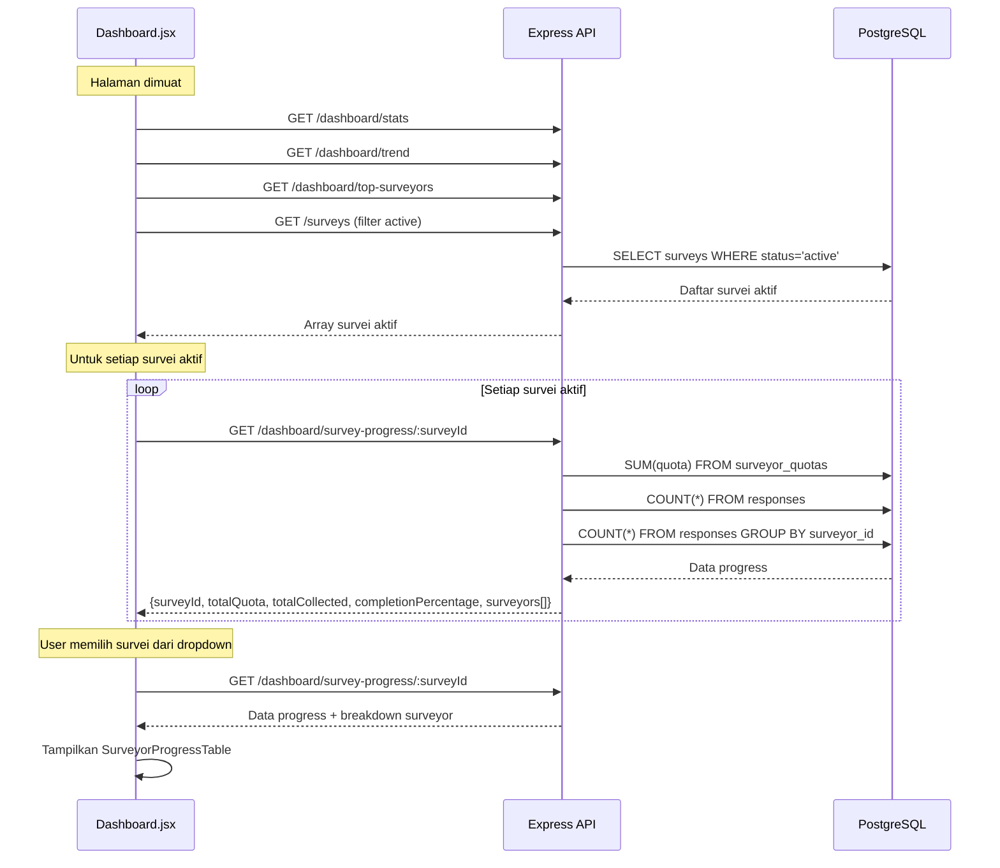
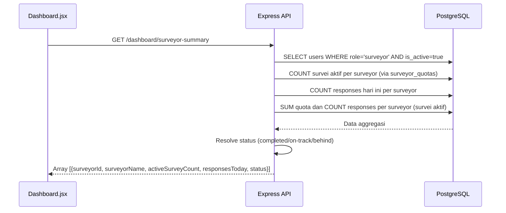
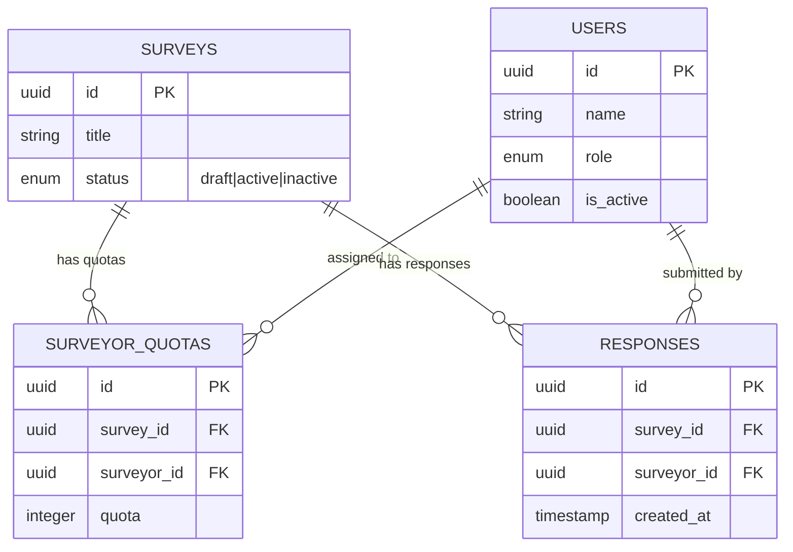

# Design Document: Dashboard Progress Survei

## Overview

Fitur ini memperkaya halaman dashboard admin/supervisor dengan informasi progress pengumpulan data yang lebih detail. Dua endpoint baru ditambahkan ke `dashboard.js`: `GET /dashboard/survey-progress/:surveyId` untuk progress per survei dengan breakdown per surveyor, dan `GET /dashboard/surveyor-summary` untuk ringkasan performa semua surveyor aktif. Di frontend, section baru "Progress Survei Aktif" ditambahkan di `Dashboard.jsx` dengan komponen `SurveyProgressCard.jsx` dan `SurveyorProgressTable.jsx`, serta dropdown filter survei.

**Perubahan utama:**
- 2 endpoint baru di `backend/src/routes/dashboard.js`
- Fungsi helper `calculateProgress` dan `resolveSurveyorStatus` di `dashboard.js`
- Komponen baru `frontend/src/components/SurveyProgressCard.jsx`
- Komponen baru `frontend/src/components/SurveyorProgressTable.jsx`
- Update `frontend/src/pages/Dashboard.jsx` (section progress + filter dropdown)
- Tidak ada perubahan database/migration (menggunakan tabel yang sudah ada)

**Endpoint yang sudah ada (tidak diubah):**
- `GET /dashboard/stats` — statistik ringkasan
- `GET /dashboard/trend` — tren 7 hari terakhir
- `GET /dashboard/top-surveyors` — top 5 surveyor

---

## Architecture

Tidak ada komponen arsitektur baru. Perubahan dilakukan pada lapisan yang sudah ada:

```
Admin/Supervisor (Dashboard.jsx)
  ├── Section yang sudah ada (stats, trend, top surveyors)
  │     └── GET /dashboard/stats, /trend, /top-surveyors (tidak berubah)
  │
  └── Section baru: "Progress Survei Aktif"
        ├── GET /surveys (filter status=active) → daftar survei aktif
        ├── SurveyProgressCard (per survei)
        │     └── Data dari GET /dashboard/survey-progress/:surveyId
        ├── Survey_Filter_Dropdown
        │     └── Memilih survei → trigger fetch progress detail
        └── SurveyorProgressTable (detail per surveyor)
              └── Data dari GET /dashboard/survey-progress/:surveyId → array surveyors
```



### Alur Data Endpoint Surveyor Summary



---

## Components and Interfaces

### 1. Backend: Endpoint Baru di `dashboard.js`

**File:** `backend/src/routes/dashboard.js`

#### 1.1 Helper: UUID Validator

```javascript
/**
 * Validasi format UUID v4.
 * @param {string} str
 * @returns {boolean}
 */
function isValidUUID(str) {
  return /^[0-9a-f]{8}-[0-9a-f]{4}-[0-9a-f]{4}-[0-9a-f]{4}-[0-9a-f]{12}$/i.test(str);
}
```

#### 1.2 Helper: Progress Calculator

```javascript
/**
 * Hitung completion percentage dengan pembulatan 1 desimal dan cap 100.0.
 * @param {number} collected - Jumlah responden terkumpul
 * @param {number} quota - Target kuota
 * @returns {number} Persentase (0.0 - 100.0)
 */
function calculatePercentage(collected, quota) {
  if (quota <= 0) return 0;
  const raw = (collected / quota) * 100;
  return Math.min(100.0, Math.round(raw * 10) / 10);
}

/**
 * Hitung remaining dengan minimum 0.
 * @param {number} quota
 * @param {number} collected
 * @returns {number}
 */
function calculateRemaining(quota, collected) {
  return Math.max(0, quota - collected);
}
```

#### 1.3 Helper: Surveyor Status Resolver

```javascript
/**
 * Tentukan status surveyor berdasarkan rasio collected/quota.
 * @param {number} totalCollected
 * @param {number} totalQuota
 * @returns {'completed' | 'on-track' | 'behind'}
 */
function resolveSurveyorStatus(totalCollected, totalQuota) {
  if (totalQuota === 0) return 'on-track';
  if (totalCollected >= totalQuota) return 'completed';
  const ratio = totalCollected / totalQuota;
  return ratio >= 0.5 ? 'on-track' : 'behind';
}
```

#### 1.4 `GET /dashboard/survey-progress/:surveyId`

```javascript
router.get('/survey-progress/:surveyId', authMiddleware, requireRole(['admin', 'supervisor']), async (req, res, next) => {
  try {
    const { surveyId } = req.params;

    // Validasi format UUID
    if (!isValidUUID(surveyId)) {
      return res.status(422).json({ error: 'Format surveyId tidak valid' });
    }

    // Cek survei ada
    const survey = await Survey.findOne({ where: { id: surveyId }, attributes: ['id', 'title'] });
    if (!survey) {
      return res.status(404).json({ error: 'Survei tidak ditemukan' });
    }

    // Ambil semua kuota surveyor untuk survei ini
    const quotas = await SurveyorQuota.findAll({
      where: { survey_id: surveyId },
      include: [{ model: User, as: 'surveyor', attributes: ['id', 'name'] }],
      raw: true,
      nest: true,
    });

    // Hitung total kuota
    const totalQuota = quotas.reduce((sum, q) => sum + q.quota, 0);

    // Hitung total responden
    const totalCollected = await Response.count({ where: { survey_id: surveyId } });

    // Hitung responden per surveyor
    const responseCounts = await Response.findAll({
      attributes: ['surveyor_id', [fn('COUNT', col('id')), 'count']],
      where: { survey_id: surveyId },
      group: ['surveyor_id'],
      raw: true,
    });

    const responseMap = {};
    responseCounts.forEach((r) => { responseMap[r.surveyor_id] = parseInt(r.count, 10); });

    // Build breakdown per surveyor
    const surveyors = quotas.map((q) => {
      const collected = responseMap[q.surveyor.id] || 0;
      return {
        surveyorId: q.surveyor.id,
        surveyorName: q.surveyor.name,
        quota: q.quota,
        collected,
        percentage: calculatePercentage(collected, q.quota),
        remaining: calculateRemaining(q.quota, collected),
      };
    });

    // Urutkan berdasarkan percentage descending
    surveyors.sort((a, b) => b.percentage - a.percentage);

    const completionPercentage = calculatePercentage(totalCollected, totalQuota);

    res.json({
      surveyId: survey.id,
      surveyTitle: survey.title,
      totalQuota,
      totalCollected,
      completionPercentage,
      surveyors,
    });
  } catch (error) {
    next(error);
  }
});
```

#### 1.5 `GET /dashboard/surveyor-summary`

```javascript
router.get('/surveyor-summary', authMiddleware, requireRole(['admin', 'supervisor']), async (req, res, next) => {
  try {
    const todayStart = new Date();
    todayStart.setUTCHours(0, 0, 0, 0);
    const todayEnd = new Date();
    todayEnd.setUTCHours(23, 59, 59, 999);

    // Ambil semua surveyor aktif
    const surveyors = await User.findAll({
      where: { role: 'surveyor', is_active: true },
      attributes: ['id', 'name'],
      raw: true,
    });

    // Ambil survei aktif
    const activeSurveys = await Survey.findAll({
      where: { status: 'active' },
      attributes: ['id'],
      raw: true,
    });
    const activeSurveyIds = activeSurveys.map((s) => s.id);

    // Ambil kuota per surveyor di survei aktif
    let quotaRows = [];
    if (activeSurveyIds.length > 0) {
      quotaRows = await SurveyorQuota.findAll({
        where: { survey_id: activeSurveyIds },
        attributes: ['surveyor_id', 'survey_id', 'quota'],
        raw: true,
      });
    }

    // Hitung responses per surveyor di survei aktif
    let responseRows = [];
    if (activeSurveyIds.length > 0) {
      responseRows = await Response.findAll({
        attributes: ['surveyor_id', [fn('COUNT', col('id')), 'count']],
        where: { survey_id: activeSurveyIds },
        group: ['surveyor_id'],
        raw: true,
      });
    }

    // Hitung responses hari ini per surveyor
    const todayRows = await Response.findAll({
      attributes: ['surveyor_id', [fn('COUNT', col('id')), 'count']],
      where: {
        created_at: { [Op.between]: [todayStart, todayEnd] },
      },
      group: ['surveyor_id'],
      raw: true,
    });

    // Build lookup maps
    const quotaMap = {};   // surveyorId → { totalQuota, surveyCount }
    quotaRows.forEach((q) => {
      if (!quotaMap[q.surveyor_id]) {
        quotaMap[q.surveyor_id] = { totalQuota: 0, surveyIds: new Set() };
      }
      quotaMap[q.surveyor_id].totalQuota += q.quota;
      quotaMap[q.surveyor_id].surveyIds.add(q.survey_id);
    });

    const responseMap = {};
    responseRows.forEach((r) => { responseMap[r.surveyor_id] = parseInt(r.count, 10); });

    const todayMap = {};
    todayRows.forEach((r) => { todayMap[r.surveyor_id] = parseInt(r.count, 10); });

    // Build result
    const result = surveyors.map((s) => {
      const qData = quotaMap[s.id];
      const activeSurveyCount = qData ? qData.surveyIds.size : 0;
      const totalQuota = qData ? qData.totalQuota : 0;
      const totalCollected = responseMap[s.id] || 0;
      const responsesToday = todayMap[s.id] || 0;
      const status = resolveSurveyorStatus(totalCollected, totalQuota);

      return {
        surveyorId: s.id,
        surveyorName: s.name,
        activeSurveyCount,
        responsesToday,
        status,
      };
    });

    res.json(result);
  } catch (error) {
    next(error);
  }
});
```

### 2. Frontend: Komponen `SurveyProgressCard.jsx`

**File baru:** `frontend/src/components/SurveyProgressCard.jsx`

```jsx
/**
 * Card progress untuk satu survei aktif.
 * Menerima data progress melalui props, tidak melakukan fetch API.
 *
 * @param {{
 *   surveyTitle: string,
 *   totalQuota: number,
 *   totalCollected: number,
 *   completionPercentage: number,
 *   onClick?: () => void,
 * }} props
 */
function SurveyProgressCard({ surveyTitle, totalQuota, totalCollected, completionPercentage, onClick }) {
  // Tentukan warna progress bar
  let barColor = 'bg-red-500';       // < 50%
  if (completionPercentage >= 100) {
    barColor = 'bg-green-500';        // 100%
  } else if (completionPercentage >= 50) {
    barColor = 'bg-yellow-500';       // 50-99%
  }

  const widthPercent = Math.min(100, completionPercentage);

  return (
    <div
      className="bg-white rounded-lg shadow p-5 cursor-pointer hover:shadow-md transition-shadow"
      onClick={onClick}
      role="button"
      tabIndex={0}
      onKeyDown={(e) => { if (e.key === 'Enter' || e.key === ' ') onClick?.(); }}
      aria-label={`Progress survei ${surveyTitle}: ${completionPercentage}%`}
    >
      <h3 className="text-sm font-semibold text-gray-800 mb-2 truncate">{surveyTitle}</h3>
      <div
        className="w-full bg-gray-200 rounded-full h-3 overflow-hidden"
        role="progressbar"
        aria-valuenow={completionPercentage}
        aria-valuemin={0}
        aria-valuemax={100}
        aria-label={`Progres: ${completionPercentage}%`}
      >
        <div
          className={`h-3 rounded-full transition-all duration-300 ${barColor}`}
          style={{ width: `${widthPercent}%` }}
        />
      </div>
      <div className="flex items-center justify-between mt-2">
        <span className="text-xs text-gray-500">
          {totalCollected} dari {totalQuota} responden
        </span>
        <span className={`text-xs font-semibold ${
          completionPercentage >= 100 ? 'text-green-600' :
          completionPercentage >= 50 ? 'text-yellow-600' : 'text-red-600'
        }`}>
          {completionPercentage}%
        </span>
      </div>
    </div>
  );
}

export default SurveyProgressCard;
```

### 3. Frontend: Komponen `SurveyorProgressTable.jsx`

**File baru:** `frontend/src/components/SurveyorProgressTable.jsx`

```jsx
/**
 * Tabel breakdown progress per surveyor dalam satu survei.
 * Menerima data melalui props, tidak melakukan fetch API.
 *
 * @param {{ surveyors: Array<{
 *   surveyorId: string,
 *   surveyorName: string,
 *   quota: number,
 *   collected: number,
 *   percentage: number,
 *   remaining: number,
 * }> }} props
 */
function SurveyorProgressTable({ surveyors = [] }) {
  if (surveyors.length === 0) {
    return (
      <p className="text-sm text-gray-400 text-center py-8">
        Belum ada surveyor yang ditugaskan untuk survei ini.
      </p>
    );
  }

  return (
    <div className="overflow-x-auto">
      <table className="w-full text-sm text-left" role="table">
        <thead>
          <tr className="border-b border-gray-100">
            <th scope="col" className="pb-2 pr-4 font-medium text-gray-500 w-8">No</th>
            <th scope="col" className="pb-2 pr-4 font-medium text-gray-500">Nama Surveyor</th>
            <th scope="col" className="pb-2 pr-4 font-medium text-gray-500 text-right">Kuota</th>
            <th scope="col" className="pb-2 pr-4 font-medium text-gray-500 text-right">Terkumpul</th>
            <th scope="col" className="pb-2 pr-4 font-medium text-gray-500 text-right">Persentase</th>
            <th scope="col" className="pb-2 font-medium text-gray-500 text-right">Sisa</th>
          </tr>
        </thead>
        <tbody>
          {surveyors.map((s, index) => (
            <tr key={s.surveyorId} className="border-b border-gray-50 hover:bg-gray-50 transition-colors">
              <td className="py-2.5 pr-4 text-gray-400 font-medium">{index + 1}</td>
              <td className="py-2.5 pr-4 text-gray-800 font-medium">{s.surveyorName}</td>
              <td className="py-2.5 pr-4 text-right text-gray-600">{s.quota}</td>
              <td className="py-2.5 pr-4 text-right text-gray-600">{s.collected}</td>
              <td className="py-2.5 pr-4 text-right">
                {s.percentage >= 100 ? (
                  <span className="inline-flex items-center px-2 py-0.5 rounded-full text-xs font-semibold bg-green-100 text-green-700">
                    Selesai
                  </span>
                ) : (
                  <span className={s.percentage < 50 ? 'text-red-600 font-medium' : 'text-gray-700'}>
                    {s.percentage}%
                  </span>
                )}
              </td>
              <td className="py-2.5 text-right text-gray-600">{s.remaining}</td>
            </tr>
          ))}
        </tbody>
      </table>
    </div>
  );
}

export default SurveyorProgressTable;
```

### 4. Frontend: Update `Dashboard.jsx`

**File:** `frontend/src/pages/Dashboard.jsx`

Perubahan pada `Dashboard.jsx`:

**Import tambahan:**
```javascript
import SurveyProgressCard from '../components/SurveyProgressCard';
import SurveyorProgressTable from '../components/SurveyorProgressTable';
```

**State tambahan:**
```javascript
const [activeSurveys, setActiveSurveys] = useState([]);
const [progressMap, setProgressMap] = useState({});       // surveyId → progress data
const [selectedSurvey, setSelectedSurvey] = useState(''); // '' = semua survei
const [progressLoading, setProgressLoading] = useState(true);
const [progressError, setProgressError] = useState(null);
const [detailLoading, setDetailLoading] = useState(false);
const [selectedProgress, setSelectedProgress] = useState(null);
```

**Fetch data progress (independen dari section lain):**
```javascript
useEffect(() => {
  let cancelled = false;

  async function fetchProgress() {
    setProgressLoading(true);
    setProgressError(null);
    try {
      // Ambil daftar survei aktif
      const surveysRes = await api.get('/surveys');
      const active = surveysRes.data.filter((s) => s.status === 'active');
      if (cancelled) return;
      setActiveSurveys(active);

      // Ambil progress untuk setiap survei aktif
      const progressResults = await Promise.all(
        active.map((s) =>
          api.get(`/dashboard/survey-progress/${s.id}`)
            .then((r) => ({ id: s.id, data: r.data }))
            .catch(() => ({ id: s.id, data: null }))
        )
      );

      if (cancelled) return;
      const map = {};
      progressResults.forEach((r) => { if (r.data) map[r.id] = r.data; });
      setProgressMap(map);
    } catch (err) {
      if (!cancelled) {
        setProgressError(err.response?.data?.error || err.message || 'Gagal memuat data progress.');
      }
    } finally {
      if (!cancelled) setProgressLoading(false);
    }
  }

  fetchProgress();
  return () => { cancelled = true; };
}, []);
```

**Handler filter dropdown:**
```javascript
async function handleSurveyFilter(surveyId) {
  setSelectedSurvey(surveyId);
  if (surveyId) {
    setDetailLoading(true);
    try {
      const res = await api.get(`/dashboard/survey-progress/${surveyId}`);
      setSelectedProgress(res.data);
    } catch {
      setSelectedProgress(null);
    } finally {
      setDetailLoading(false);
    }
  } else {
    setSelectedProgress(null);
  }
}
```

**Section "Progress Survei Aktif" (ditambahkan setelah section Top 5 Surveyor):**
```jsx
<section className="bg-white rounded-lg shadow p-5" aria-label="Progress survei aktif">
  <h2 className="text-base font-semibold text-gray-700 mb-4">Progress Survei Aktif</h2>

  {/* Filter Dropdown */}
  <div className="mb-4">
    <label htmlFor="survey-filter" className="block text-xs font-medium text-gray-600 mb-1">
      Pilih Survei
    </label>
    <select
      id="survey-filter"
      value={selectedSurvey}
      onChange={(e) => handleSurveyFilter(e.target.value)}
      disabled={progressLoading}
      className="border border-gray-300 rounded-lg px-3 py-2 text-sm w-full sm:w-64"
    >
      {progressLoading ? (
        <option>Memuat...</option>
      ) : (
        <>
          <option value="">Semua Survei</option>
          {activeSurveys.map((s) => (
            <option key={s.id} value={s.id}>{s.title}</option>
          ))}
        </>
      )}
    </select>
  </div>

  {/* Content */}
  {progressLoading ? (
    <p className="text-sm text-gray-400 text-center py-8">Memuat data progress...</p>
  ) : progressError ? (
    <div className="bg-red-50 border border-red-200 text-red-700 rounded-lg p-4" role="alert">
      <p className="text-sm">{progressError}</p>
    </div>
  ) : activeSurveys.length === 0 ? (
    <p className="text-sm text-gray-400 text-center py-8">Tidak ada survei aktif saat ini.</p>
  ) : selectedSurvey ? (
    /* Tampilan survei terpilih + tabel breakdown */
    <div>
      {progressMap[selectedSurvey] && (
        <SurveyProgressCard {...progressMap[selectedSurvey]} />
      )}
      {detailLoading ? (
        <p className="text-sm text-gray-400 text-center py-4 mt-4">Memuat data breakdown...</p>
      ) : selectedProgress ? (
        <div className="mt-4">
          <SurveyorProgressTable surveyors={selectedProgress.surveyors} />
        </div>
      ) : null}
    </div>
  ) : (
    /* Tampilan semua survei (card grid) */
    <div className="grid grid-cols-1 sm:grid-cols-2 xl:grid-cols-3 gap-4">
      {activeSurveys.map((s) => {
        const progress = progressMap[s.id];
        return progress ? (
          <SurveyProgressCard
            key={s.id}
            surveyTitle={progress.surveyTitle}
            totalQuota={progress.totalQuota}
            totalCollected={progress.totalCollected}
            completionPercentage={progress.completionPercentage}
            onClick={() => handleSurveyFilter(s.id)}
          />
        ) : null;
      })}
    </div>
  )}
</section>
```

---

## Data Models

### Tabel yang Digunakan (Tidak Ada Perubahan)

Fitur ini menggunakan tabel yang sudah ada tanpa perubahan skema:

| Tabel | Penggunaan |
|---|---|
| `surveys` | Mengambil daftar survei aktif (`status = 'active'`) |
| `surveyor_quotas` | Mengambil target kuota per surveyor per survei |
| `responses` | Menghitung jumlah responden terkumpul per survei dan per surveyor |
| `users` | Mengambil data surveyor (nama, status aktif) |

### Relasi yang Digunakan



### Response Schema Endpoint Baru

**`GET /dashboard/survey-progress/:surveyId`** — Response:

```json
{
  "surveyId": "uuid",
  "surveyTitle": "string",
  "totalQuota": 100,
  "totalCollected": 65,
  "completionPercentage": 65.0,
  "surveyors": [
    {
      "surveyorId": "uuid",
      "surveyorName": "string",
      "quota": 50,
      "collected": 45,
      "percentage": 90.0,
      "remaining": 5
    }
  ]
}
```

**`GET /dashboard/surveyor-summary`** — Response:

```json
[
  {
    "surveyorId": "uuid",
    "surveyorName": "string",
    "activeSurveyCount": 3,
    "responsesToday": 5,
    "status": "on-track"
  }
]
```


---

## Correctness Properties

*A property is a characteristic or behavior that should hold true across all valid executions of a system — essentially, a formal statement about what the system should do. Properties serve as the bridge between human-readable specifications and machine-verifiable correctness guarantees.*

### Property 1: Perhitungan Completion Percentage

*For any* pasangan `(collected, quota)` di mana `collected` dan `quota` adalah bilangan bulat non-negatif, fungsi `calculatePercentage(collected, quota)` harus mengembalikan:
- `0` ketika `quota` bernilai 0
- Nilai `(collected / quota) * 100` dibulatkan ke satu angka desimal ketika `collected <= quota`
- Nilai maksimum `100.0` ketika `collected > quota`

Hasil selalu berada dalam rentang `[0, 100.0]`.

**Validates: Requirements 1.4, 1.5, 1.6, 2.3**

### Property 2: Perhitungan Remaining

*For any* pasangan `(quota, collected)` di mana `quota` adalah bilangan bulat positif dan `collected` adalah bilangan bulat non-negatif, fungsi `calculateRemaining(quota, collected)` harus mengembalikan `max(0, quota - collected)`. Selain itu, ketika `collected <= quota`, maka `collected + remaining = quota`.

**Validates: Requirements 2.4, 8.4**

### Property 3: Klasifikasi Status Surveyor

*For any* pasangan `(totalCollected, totalQuota)` di mana keduanya bilangan bulat non-negatif, fungsi `resolveSurveyorStatus(totalCollected, totalQuota)` harus mengembalikan:
- `"on-track"` ketika `totalQuota` bernilai 0
- `"completed"` ketika `totalCollected >= totalQuota` dan `totalQuota > 0`
- `"on-track"` ketika `totalCollected < totalQuota` dan `totalCollected / totalQuota >= 0.5`
- `"behind"` ketika `totalCollected < totalQuota` dan `totalCollected / totalQuota < 0.5`

Hasil selalu salah satu dari tiga nilai: `"completed"`, `"on-track"`, atau `"behind"`.

**Validates: Requirements 3.5, 3.6, 3.7, 3.8**

### Property 4: Konsistensi Total Collected dengan Breakdown Surveyor

*For any* kumpulan surveyor yang masing-masing memiliki kuota dan jumlah responden, ketika semua responden dalam survei berasal dari surveyor yang memiliki kuota, maka penjumlahan `collected` dari semua elemen dalam array `surveyors` harus sama dengan `totalCollected` pada level survei.

**Validates: Requirements 2.2, 8.3**

### Property 5: Hanya Surveyor dengan Kuota yang Muncul

*For any* kumpulan surveyor (sebagian memiliki kuota, sebagian tidak) dalam satu survei, array `surveyors` dalam response endpoint harus hanya berisi surveyor yang memiliki baris di tabel `surveyor_quotas`. Surveyor tanpa kuota tidak boleh muncul.

**Validates: Requirements 1.7, 2.5**

### Property 6: Pengurutan Surveyor berdasarkan Persentase Menurun

*For any* array `surveyors` dalam response endpoint, elemen-elemen harus terurut berdasarkan field `percentage` secara menurun (descending). Untuk setiap pasangan elemen berurutan `(surveyors[i], surveyors[i+1])`, berlaku `surveyors[i].percentage >= surveyors[i+1].percentage`.

**Validates: Requirements 2.6**

---

## Error Handling

### Backend

| Kondisi | HTTP | Pesan |
|---|---|---|
| `surveyId` bukan format UUID valid | 422 | `"Format surveyId tidak valid"` |
| Survei tidak ditemukan | 404 | `"Survei tidak ditemukan"` |
| Role bukan admin/supervisor | 403 | `"Anda tidak memiliki izin untuk mengakses resource ini"` |
| Error database (survey-progress) | 500 | `"Terjadi kesalahan internal server"` |
| Error database (surveyor-summary) | 500 | `"Terjadi kesalahan internal server"` |

Error handling menggunakan pola yang sudah ada di project:
- Validasi input dilakukan di awal handler
- Error database ditangkap oleh `try/catch` dan diteruskan ke `next(error)`
- Global error handler di `app.js` memformat response error secara konsisten

### Frontend

| Kondisi | Penanganan |
|---|---|
| Endpoint progress mengembalikan error | Alert merah di dalam section "Progress Survei Aktif", section lain tidak terpengaruh |
| Endpoint survey-progress/:id gagal | Card survei tetap ditampilkan tanpa data progress (graceful degradation) |
| Data sedang dimuat | Teks "Memuat data progress..." ditampilkan |
| Breakdown sedang dimuat | Indikator loading di area tabel |
| Tidak ada survei aktif | Pesan "Tidak ada survei aktif saat ini." |

---

## Testing Strategy

### Pendekatan Pengujian Ganda

Fitur ini menggunakan dua pendekatan pengujian yang saling melengkapi:

1. **Unit Tests**: Memverifikasi contoh spesifik, kasus tepi, dan kondisi error untuk endpoint dan komponen.
2. **Property-Based Tests**: Memverifikasi properti universal pada fungsi kalkulasi murni (`calculatePercentage`, `calculateRemaining`, `resolveSurveyorStatus`) dan invariant data menggunakan library **fast-check**.

### Property-Based Testing

Library: **fast-check** (sudah digunakan di project — `fast-check@3.20.0`)
Minimum iterasi: **100** per property test

Setiap property test diberi tag referensi ke properti desain:

```javascript
// Tag format: Feature: dashboard-progress, Property {N}: {property_text}
```

**Property tests yang akan diimplementasikan:**

1. **Property 1**: `calculatePercentage` — generate random `(collected, quota)` pairs (termasuk edge cases: quota=0, collected>quota), verifikasi formula dan cap.
   Tag: `Feature: dashboard-progress, Property 1: Perhitungan completion percentage`

2. **Property 2**: `calculateRemaining` — generate random `(quota, collected)` pairs, verifikasi `max(0, quota - collected)` dan invariant `collected + remaining = quota` ketika `collected <= quota`.
   Tag: `Feature: dashboard-progress, Property 2: Perhitungan remaining`

3. **Property 3**: `resolveSurveyorStatus` — generate random `(totalCollected, totalQuota)` pairs (termasuk quota=0), verifikasi klasifikasi status sesuai aturan.
   Tag: `Feature: dashboard-progress, Property 3: Klasifikasi status surveyor`

4. **Property 4**: Konsistensi total — generate random array of `{quota, collected}` per surveyor, verifikasi sum of collected = totalCollected.
   Tag: `Feature: dashboard-progress, Property 4: Konsistensi total collected dengan breakdown surveyor`

5. **Property 5**: Filter surveyor — generate random sets of surveyors (dengan/tanpa kuota), verifikasi hanya yang memiliki kuota muncul di output.
   Tag: `Feature: dashboard-progress, Property 5: Hanya surveyor dengan kuota yang muncul`

6. **Property 6**: Sorting — generate random array of surveyor progress data, verifikasi output terurut descending by percentage.
   Tag: `Feature: dashboard-progress, Property 6: Pengurutan surveyor berdasarkan persentase menurun`

### Unit Tests Backend (`backend/tests/unit/dashboard.test.js`)

Tambahkan describe block baru:

**`GET /dashboard/survey-progress/:surveyId`:**
1. Mengembalikan 401 tanpa token
2. Mengembalikan 403 untuk role surveyor
3. Mengembalikan 403 untuk role viewer
4. Mengembalikan 200 untuk admin dengan data progress yang benar
5. Mengembalikan 200 untuk supervisor
6. Mengembalikan 404 untuk surveyId yang tidak ditemukan
7. Mengembalikan 422 untuk surveyId bukan UUID valid
8. Mengembalikan completionPercentage 0 ketika tidak ada kuota
9. Mengembalikan completionPercentage maksimum 100.0 ketika collected > quota
10. Array surveyors terurut berdasarkan percentage descending
11. Hanya surveyor dengan kuota yang muncul di array surveyors
12. Mengembalikan 500 ketika terjadi error database

**`GET /dashboard/surveyor-summary`:**
1. Mengembalikan 401 tanpa token
2. Mengembalikan 403 untuk role surveyor
3. Mengembalikan 403 untuk role viewer
4. Mengembalikan 200 untuk admin dengan data ringkasan yang benar
5. Mengembalikan 200 untuk supervisor
6. Hanya menyertakan surveyor aktif (is_active = true)
7. Status "completed" ketika collected >= quota
8. Status "on-track" ketika rasio >= 0.5
9. Status "behind" ketika rasio < 0.5
10. Status "on-track" ketika surveyor tidak memiliki kuota
11. Mengembalikan 500 ketika terjadi error database

### Unit Tests Frontend

**`SurveyProgressCard` (`frontend/src/components/__tests__/SurveyProgressCard.test.jsx`):**
1. Menampilkan judul survei, persentase, dan teks responden
2. Progress bar berwarna hijau ketika 100%
3. Progress bar berwarna kuning ketika 50-99%
4. Progress bar berwarna merah ketika < 50%
5. Atribut ARIA (role="progressbar", aria-valuenow, aria-valuemin, aria-valuemax) ada
6. Lebar progress bar proporsional terhadap persentase

**`SurveyorProgressTable` (`frontend/src/components/__tests__/SurveyorProgressTable.test.jsx`):**
1. Menampilkan header kolom yang benar
2. Menampilkan satu baris per surveyor
3. Badge hijau "Selesai" untuk surveyor dengan 100%
4. Teks merah untuk surveyor dengan < 50%
5. Pesan kosong ketika array surveyors kosong
6. Atribut ARIA (role="table", scope="col") ada

**`Dashboard.jsx` — section progress (`frontend/src/pages/__tests__/Dashboard.test.jsx`):**
1. Section "Progress Survei Aktif" ditampilkan
2. Dropdown filter survei ditampilkan dengan label "Pilih Survei"
3. Card progress ditampilkan untuk setiap survei aktif
4. Pesan "Tidak ada survei aktif saat ini." ketika tidak ada survei aktif
5. Memilih survei dari dropdown menampilkan tabel breakdown
6. Memilih "Semua Survei" menampilkan semua card tanpa tabel
7. Loading state "Memuat data progress..." ditampilkan saat loading
8. Error alert ditampilkan tanpa mengganggu section lain
9. Dropdown disabled dengan "Memuat..." saat loading
