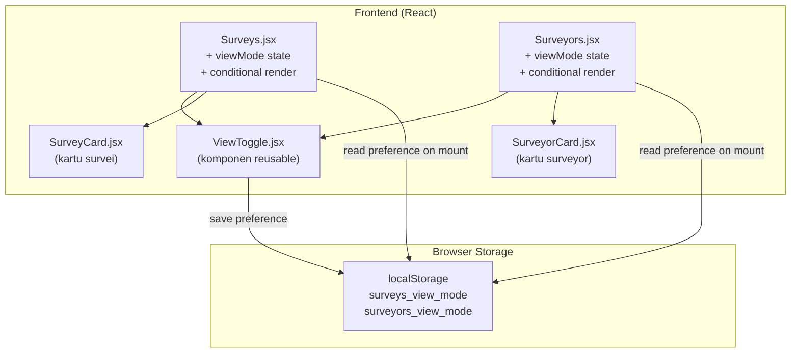

# Dokumen Desain: Grid View Toggle

## Overview

Fitur Grid View Toggle menambahkan mode tampilan alternatif berupa grid kartu (card) pada halaman Manajemen Survei (`Surveys.jsx`) dan Manajemen Surveyor (`Surveyors.jsx`). Saat ini kedua halaman hanya menampilkan data dalam bentuk tabel. Dengan fitur ini, pengguna (Admin/Supervisor) dapat beralih antara tampilan tabel dan tampilan grid melalui tombol toggle di header halaman.

Fitur ini murni frontend — tidak ada perubahan backend, database, atau API. Perubahan terdiri dari:
1. **Komponen reusable `ViewToggle`**: Tombol toggle dengan ikon tabel dan grid, lengkap dengan aksesibilitas (`aria-label`, `aria-pressed`)
2. **Komponen kartu**: `SurveyCard` dan `SurveyorCard` yang menampilkan informasi ringkas per item dengan tombol aksi yang sama seperti tampilan tabel
3. **Persistensi preferensi**: Pilihan mode tampilan disimpan di `localStorage` per halaman, dengan fallback ke tampilan tabel sebagai default
4. **Integrasi pada halaman existing**: Modifikasi `Surveys.jsx` dan `Surveyors.jsx` untuk mendukung kedua mode tampilan

## Architecture

Arsitektur mengikuti pola komponen React yang sudah ada di codebase. Tidak ada perubahan pada backend atau data flow — komponen baru hanya mengonsumsi data yang sudah di-fetch oleh halaman induk.



### Keputusan Desain

1. **Komponen kartu terpisah dari halaman**: `SurveyCard` dan `SurveyorCard` dibuat sebagai komponen terpisah di `frontend/src/components/` agar mudah ditest secara independen dan menjaga halaman induk tetap bersih. Ini mengikuti pola yang sudah ada seperti `SurveyProgressCard.jsx` dan `ReviewStatusBadge.jsx`.

2. **State `viewMode` di halaman induk, bukan di komponen toggle**: Halaman induk (`Surveys.jsx`, `Surveyors.jsx`) mengelola state `viewMode` dan meneruskannya ke `ViewToggle` sebagai prop. Ini memungkinkan halaman induk melakukan conditional rendering antara tabel dan grid tanpa lifting state yang kompleks.

3. **localStorage key per halaman**: Menggunakan key berbeda (`surveys_view_mode` dan `surveyors_view_mode`) agar preferensi tampilan independen antar halaman. Pengguna mungkin ingin tabel untuk survei tapi grid untuk surveyor.

4. **Props drilling untuk aksi**: Komponen kartu menerima callback aksi (edit, delete, activate, dll.) melalui props dari halaman induk. Ini konsisten dengan pola yang sudah ada di codebase — tidak menggunakan context atau state management library.

5. **Tidak menggunakan library ikon eksternal**: Ikon toggle menggunakan SVG inline sederhana (ikon tabel dan grid) untuk menghindari penambahan dependency baru. Ini konsisten dengan penggunaan emoji dan inline elements di codebase saat ini.

## Components and Interfaces

### 1. ViewToggle Component

**File**: `frontend/src/components/ViewToggle.jsx`

Komponen reusable yang menampilkan dua tombol ikon untuk beralih antara mode tabel dan grid.

```jsx
/**
 * @param {{
 *   viewMode: 'table' | 'grid',
 *   onViewChange: (mode: 'table' | 'grid') => void,
 * }} props
 */
function ViewToggle({ viewMode, onViewChange })
```

**Props**:
- `viewMode` — Mode tampilan aktif saat ini
- `onViewChange` — Callback ketika pengguna mengklik tombol toggle

**Behavior**:
- Menampilkan dua tombol: ikon tabel (garis horizontal) dan ikon grid (kotak-kotak)
- Tombol aktif memiliki background `bg-blue-100` dan warna ikon `text-blue-700`
- Tombol tidak aktif memiliki background `bg-gray-50` dan warna ikon `text-gray-400`
- Setiap tombol memiliki `aria-label` ("Tampilan Tabel" / "Tampilan Grid") dan `aria-pressed` sesuai status aktif
- Tombol dikelompokkan dalam container dengan `role="group"` dan `aria-label="Pilih mode tampilan"`

### 2. SurveyCard Component

**File**: `frontend/src/components/SurveyCard.jsx`

Komponen kartu untuk menampilkan satu survei dalam mode grid.

```jsx
/**
 * @param {{
 *   survey: object,
 *   onBuilder: (survey) => void,
 *   onClone: (survey) => void,
 *   onActivate: (survey) => void,
 *   onDeactivate: (survey) => void,
 *   onDelete: (survey) => void,
 *   cloningId: string | null,
 *   confirmDeleteId: string | null,
 *   onConfirmDelete: (id) => void,
 *   onCancelDelete: () => void,
 *   confirmDeactivateId: string | null,
 *   onConfirmDeactivate: (id) => void,
 *   onCancelDeactivate: () => void,
 *   formatDate: (dateStr) => string,
 * }} props
 */
function SurveyCard({ survey, ...actionProps })
```

**Layout kartu**:
- **Header**: Judul survei (truncated, `title` tooltip), badge status (`SurveyStatusBadge`), badge temporal (`TemporalBadge`)
- **Body**: Metadata grid — jumlah pertanyaan, jumlah responden, tanggal pembuatan
- **Footer**: Tombol aksi — Builder, Duplikasi, Aktifkan/Nonaktifkan, Hapus (sesuai kondisi)

**Styling**: `bg-white rounded-xl shadow border border-gray-100 hover:shadow-md transition-shadow p-5`

### 3. SurveyorCard Component

**File**: `frontend/src/components/SurveyorCard.jsx`

Komponen kartu untuk menampilkan satu surveyor dalam mode grid.

```jsx
/**
 * @param {{
 *   surveyor: object,
 *   currentUser: object,
 *   onEdit: (surveyor) => void,
 *   onActivate: (surveyor) => void,
 *   onDeactivate: (surveyor) => void,
 *   onDelete: (surveyor) => void,
 *   confirmDeactivateId: string | null,
 *   onConfirmDeactivate: (id) => void,
 *   onCancelDeactivate: () => void,
 *   confirmDeleteId: string | null,
 *   onConfirmDelete: (id) => void,
 *   onCancelDelete: () => void,
 *   expandedQuotaId: string | null,
 *   onToggleQuota: (id) => void,
 *   formatDate: (dateStr) => string,
 * }} props
 */
function SurveyorCard({ surveyor, currentUser, ...actionProps })
```

**Layout kartu**:
- **Header**: Nama surveyor (truncated, `title` tooltip), badge status (`StatusBadge`)
- **Body**: Email, jumlah responden, tanggal bergabung
- **Footer**: Tombol aksi — Lihat Kuota, Edit, Nonaktifkan/Aktifkan, Hapus (admin only)
- **Expandable**: Panel kuota (`QuotaPanel`) ditampilkan di bawah footer ketika "Lihat Kuota" aktif

**Styling**: Sama dengan `SurveyCard` — `bg-white rounded-xl shadow border border-gray-100 hover:shadow-md transition-shadow p-5`

### 4. Surveys.jsx Modifications

**Perubahan pada halaman Manajemen Survei**:

1. **Import**: Tambah import `ViewToggle` dan `SurveyCard`
2. **State baru**: `viewMode` — diinisialisasi dari `localStorage.getItem('surveys_view_mode') || 'table'`
3. **Handler baru**: `handleViewChange(mode)` — set state dan simpan ke `localStorage`
4. **Header update**: Tambah `ViewToggle` di antara judul dan tombol "Buat Survei"
5. **Conditional render**: Jika `viewMode === 'grid'`, render grid kartu; jika `'table'`, render tabel existing

```jsx
// Di header
<div className="flex items-center justify-between">
  <h1 className="text-2xl font-bold text-gray-800">Manajemen Survei</h1>
  <div className="flex items-center gap-3">
    <ViewToggle viewMode={viewMode} onViewChange={handleViewChange} />
    <button onClick={() => setShowCreateModal(true)} ...>
      + Buat Survei
    </button>
  </div>
</div>

// Di content area
{viewMode === 'grid' ? (
  <div className="grid grid-cols-1 md:grid-cols-2 lg:grid-cols-3 gap-4">
    {surveys.map(survey => <SurveyCard key={survey.id} survey={survey} ... />)}
  </div>
) : (
  // existing table code
)}
```

### 5. Surveyors.jsx Modifications

**Perubahan pada halaman Manajemen Surveyor**:

Pola yang sama dengan Surveys.jsx:
1. **Import**: Tambah import `ViewToggle` dan `SurveyorCard`
2. **State baru**: `viewMode` — diinisialisasi dari `localStorage.getItem('surveyors_view_mode') || 'table'`
3. **Handler baru**: `handleViewChange(mode)`
4. **Header update**: Tambah `ViewToggle` di antara judul dan tombol-tombol aksi
5. **Conditional render**: Grid kartu atau tabel existing

### 6. Helper: useViewMode Hook (opsional)

**File**: `frontend/src/components/ViewToggle.jsx` (diekspor dari file yang sama)

Custom hook kecil untuk mengelola state view mode dengan localStorage:

```jsx
/**
 * @param {string} storageKey — localStorage key (e.g. 'surveys_view_mode')
 * @returns {['table' | 'grid', (mode: 'table' | 'grid') => void]}
 */
export function useViewMode(storageKey) {
  const [viewMode, setViewMode] = useState(() => {
    try {
      const saved = localStorage.getItem(storageKey);
      return saved === 'grid' ? 'grid' : 'table';
    } catch {
      return 'table';
    }
  });

  const handleViewChange = useCallback((mode) => {
    setViewMode(mode);
    try {
      localStorage.setItem(storageKey, mode);
    } catch {
      // localStorage might be full or disabled
    }
  }, [storageKey]);

  return [viewMode, handleViewChange];
}
```

Ini menghindari duplikasi logika localStorage di kedua halaman.

## Data Models

Tidak ada perubahan data model backend. Fitur ini hanya menggunakan data yang sudah tersedia dari API existing.

### localStorage Keys

| Key | Nilai Valid | Default | Digunakan Oleh |
|-----|-------------|---------|----------------|
| `surveys_view_mode` | `'table'` \| `'grid'` | `'table'` | `Surveys.jsx` |
| `surveyors_view_mode` | `'table'` \| `'grid'` | `'table'` | `Surveyors.jsx` |

### Data Shape yang Dikonsumsi Kartu

**SurveyCard** mengonsumsi objek survei dari `GET /surveys`:
```json
{
  "id": "uuid",
  "title": "Judul Survei",
  "status": "draft | active | inactive",
  "question_count": 10,
  "response_count": 50,
  "start_date": "2024-01-01T00:00:00.000Z",
  "end_date": "2024-06-30T23:59:59.000Z",
  "created_at": "2024-01-01T00:00:00.000Z"
}
```

**SurveyorCard** mengonsumsi objek surveyor dari `GET /surveyors`:
```json
{
  "id": "uuid",
  "name": "Nama Surveyor",
  "email": "surveyor@example.com",
  "is_active": true,
  "response_count": 25,
  "created_at": "2024-01-01T00:00:00.000Z"
}
```

## Correctness Properties

*A property is a characteristic or behavior that should hold true across all valid executions of a system — essentially, a formal statement about what the system should do. Properties serve as the bridge between human-readable specifications and machine-verifiable correctness guarantees.*

### Property 1: Preference persistence round-trip

*For any* valid view mode value (`'table'` or `'grid'`) and *for any* valid storage key (`'surveys_view_mode'` or `'surveyors_view_mode'`), when the view mode is saved to localStorage via `handleViewChange` and then read back via `useViewMode` initialization, the resulting view mode SHALL equal the originally saved value.

**Validates: Requirements 2.1, 2.2, 2.3**

### Property 2: Survey card displays all required information

*For any* survey object with a non-empty title, a valid status (`'draft'`, `'active'`, or `'inactive'`), non-negative question and response counts, and a valid creation date, the rendered `SurveyCard` SHALL contain the survey title (or a truncated version with `title` attribute), the status badge text, the question count, the response count, and the formatted creation date.

**Validates: Requirements 3.2, 6.4**

### Property 3: Survey card action buttons match survey state

*For any* survey object, the `SurveyCard` SHALL display the "Builder" and "Duplikasi" buttons unconditionally; SHALL display the "Aktifkan" button if and only if the survey status is `'draft'` or `'inactive'`; SHALL display the "Nonaktifkan" button if and only if the survey status is `'active'`; and SHALL display the "Hapus" button if and only if the survey status is `'draft'` AND the response count is 0.

**Validates: Requirements 3.3, 3.5, 3.6**

### Property 4: Surveyor card displays all required information

*For any* surveyor object with a non-empty name, a valid email, a boolean `is_active` status, a non-negative response count, and a valid creation date, the rendered `SurveyorCard` SHALL contain the surveyor name (or a truncated version with `title` attribute), the email, the status badge text, the response count, and the formatted join date.

**Validates: Requirements 4.2, 6.4**

### Property 5: Surveyor card action buttons match surveyor state and user role

*For any* surveyor object and *for any* user role, the `SurveyorCard` SHALL display the "Lihat Kuota" and "Edit" buttons unconditionally; SHALL display the "Nonaktifkan" button if and only if the surveyor `is_active` is `true`; SHALL display the "Aktifkan" button if and only if `is_active` is `false`; and SHALL display the "Hapus" button if and only if the current user's role is `'admin'`.

**Validates: Requirements 4.3, 4.6**

## Error Handling

### Frontend Error Handling

| Skenario | Penanganan |
|----------|------------|
| `localStorage` tidak tersedia (private browsing, penuh) | `try/catch` pada read/write, fallback ke `'table'` sebagai default |
| Nilai tidak valid di `localStorage` (bukan `'table'` atau `'grid'`) | `useViewMode` hook memvalidasi: jika bukan `'grid'`, default ke `'table'` |
| Data survei/surveyor kosong pada grid mode | Tampilkan empty state yang sama dengan tampilan tabel ("Belum ada data...") |
| Data sedang dimuat pada grid mode | Tampilkan loading indicator yang sama dengan tampilan tabel |
| Fetch error pada grid mode | Tampilkan error message + tombol retry yang sama dengan tampilan tabel |
| Aksi gagal pada grid mode (activate, delete, dll.) | Pesan error/sukses ditampilkan di level halaman (di atas grid/tabel), sama seperti saat ini |

Semua error handling untuk aksi (create, edit, delete, activate, deactivate, clone) tetap di halaman induk — komponen kartu hanya memanggil callback props. Ini memastikan konsistensi penanganan error antara mode tabel dan grid.

## Testing Strategy

### Property-Based Tests (fast-check)

Library: `fast-check` (sudah terinstall di `devDependencies`)
Runner: Vitest (sudah dikonfigurasi di frontend)
Minimum iterations: 100 per property

| Property | Test File | Strategi |
|----------|-----------|----------|
| Property 1: Preference round-trip | `frontend/src/components/__tests__/ViewToggle.test.jsx` | Generate random valid modes dan storage keys, simpan via hook, baca kembali, verifikasi kesamaan |
| Property 2: Survey card info | `frontend/src/components/__tests__/SurveyCard.test.jsx` | Generate random survey objects via `fc.record()`, render `SurveyCard`, verifikasi semua field ada di DOM |
| Property 3: Survey card actions | Same file | Generate surveys dengan random status dan response_count, verifikasi tombol aksi yang benar muncul |
| Property 4: Surveyor card info | `frontend/src/components/__tests__/SurveyorCard.test.jsx` | Generate random surveyor objects, render `SurveyorCard`, verifikasi semua field ada di DOM |
| Property 5: Surveyor card actions | Same file | Generate surveyors dengan random `is_active` dan user roles, verifikasi tombol aksi yang benar muncul |

Tag format: **Feature: grid-view-toggle, Property {N}: {title}**

### Unit Tests (Vitest + React Testing Library)

| Test | File | Cakupan |
|------|------|---------|
| ViewToggle renders two buttons | `frontend/src/components/__tests__/ViewToggle.test.jsx` | Req 1.1 |
| ViewToggle active button has distinct styling | Same file | Req 1.2 |
| ViewToggle click table icon calls onViewChange('table') | Same file | Req 1.3 |
| ViewToggle click grid icon calls onViewChange('grid') | Same file | Req 1.4 |
| ViewToggle has correct aria-label and aria-pressed | Same file | Req 1.5 |
| useViewMode defaults to 'table' when localStorage empty | Same file | Req 2.4 |
| SurveyCard shows delete confirmation for draft with 0 responses | `frontend/src/components/__tests__/SurveyCard.test.jsx` | Req 3.5 |
| SurveyCard shows deactivate confirmation for active survey | Same file | Req 3.6 |
| SurveyorCard shows quota panel on button click | `frontend/src/components/__tests__/SurveyorCard.test.jsx` | Req 4.5 |
| SurveyorCard shows deactivate confirmation | Same file | Req 4.6 |
| Surveys page renders grid when viewMode is 'grid' | `frontend/src/pages/__tests__/Surveys.test.jsx` | Req 3.1 |
| Surveyors page renders grid when viewMode is 'grid' | `frontend/src/pages/__tests__/Surveyors.test.jsx` | Req 4.1 |
| Loading/error/empty states consistent in both modes | Same files | Req 5.4, 5.5 |
