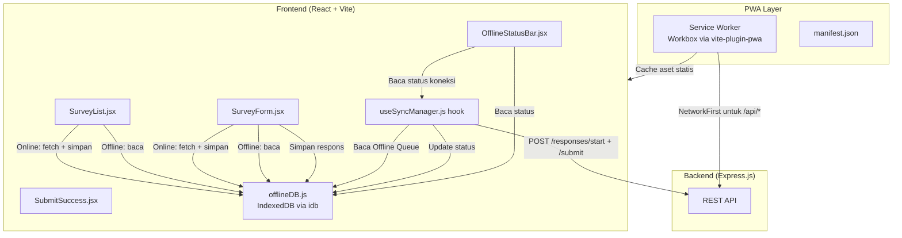
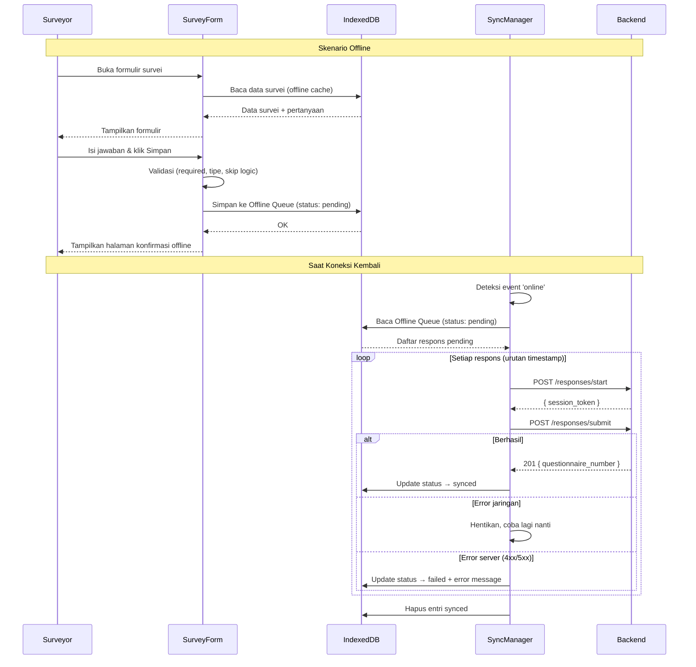

# Dokumen Desain: Offline Mode PWA

## Ikhtisar (Overview)

Fitur ini mengubah aplikasi surveyor menjadi Progressive Web App (PWA) yang dapat berfungsi penuh tanpa koneksi internet. Arsitektur terdiri dari tiga lapisan utama:

1. **PWA Shell** — `manifest.json`, Service Worker (via `vite-plugin-pwa`), dan konfigurasi Vite yang memungkinkan instalasi dan caching aset statis.
2. **Offline Data Layer** — Modul `offlineDB.js` berbasis IndexedDB untuk menyimpan data survei (pre-cache) dan antrian respons (Offline Queue).
3. **Sync Manager** — Hook `useSyncManager.js` yang mendeteksi perubahan koneksi, mengirim data dari Offline Queue ke backend secara berurutan, dan memperbarui status setiap entri.

Halaman surveyor (`SurveyList`, `SurveyForm`, `SubmitSuccess`) dimodifikasi untuk membaca dari IndexedDB saat offline dan menulis ke Offline Queue alih-alih langsung ke API. Komponen `OfflineStatusBar` ditambahkan ke header kedua halaman surveyor untuk menampilkan status koneksi dan jumlah data pending secara real-time.

### Keputusan Desain Utama

- **`vite-plugin-pwa` dengan Workbox**: Menggunakan plugin resmi untuk Vite agar Service Worker dan precache manifest dihasilkan otomatis saat build. Strategi `NetworkFirst` untuk API dan `CacheFirst` untuk aset statis.
- **IndexedDB via idb**: Library `idb` (wrapper Promise untuk IndexedDB) digunakan agar kode async lebih bersih dibanding raw IndexedDB API.
- **Offline Queue sebagai sumber kebenaran**: Semua respons — baik online maupun offline — melewati Offline Queue sebelum dikirim ke backend. Ini menyederhanakan logika sinkronisasi dan memastikan konsistensi.
- **Sinkronisasi sequential**: Respons dikirim satu per satu sesuai urutan timestamp untuk menghindari race condition pada penomoran kuesioner.
- **Foto dilewati saat offline**: Upload foto memerlukan multipart request yang tidak dapat di-queue dengan mudah. Pertanyaan `photo` ditandai opsional saat offline dan tidak disertakan dalam payload Offline Queue.
- **Tidak ada background sync API**: Background Sync API (Service Worker) tidak digunakan karena keterbatasan dukungan browser dan kompleksitas. Sinkronisasi dilakukan di foreground saat tab aktif dan koneksi tersedia.

---

## Arsitektur (Architecture)



### Alur Pengisian Offline



---

## Komponen dan Antarmuka (Components and Interfaces)

### 1. Konfigurasi PWA

#### `frontend/public/manifest.json`
```json
{
  "name": "Web Survey Platform",
  "short_name": "Survey",
  "start_url": "/surveyor",
  "display": "standalone",
  "theme_color": "#2563eb",
  "background_color": "#f9fafb",
  "icons": [
    { "src": "/icons/icon-192.png", "sizes": "192x192", "type": "image/png" },
    { "src": "/icons/icon-512.png", "sizes": "512x512", "type": "image/png" }
  ]
}
```

#### `frontend/vite.config.js` — tambahan plugin PWA
```javascript
import { VitePWA } from 'vite-plugin-pwa';

export default defineConfig({
  plugins: [
    react(),
    VitePWA({
      registerType: 'prompt',          // Tampilkan prompt update ke user
      includeAssets: ['icons/*.png'],
      manifest: false,                 // Gunakan manifest.json dari public/
      workbox: {
        globPatterns: ['**/*.{js,css,html,ico,png,svg}'],
        runtimeCaching: [
          {
            urlPattern: /^https?:\/\/.*\/api\/.*/,
            handler: 'NetworkFirst',
            options: {
              cacheName: 'api-cache',
              expiration: { maxEntries: 50, maxAgeSeconds: 86400 },
              networkTimeoutSeconds: 10,
            },
          },
        ],
      },
    }),
  ],
});
```

#### `frontend/index.html` — tambahan meta tags
```html
<link rel="manifest" href="/manifest.json" />
<meta name="theme-color" content="#2563eb" />
<meta name="apple-mobile-web-app-capable" content="yes" />
<meta name="apple-mobile-web-app-status-bar-style" content="default" />
```

#### `frontend/src/main.jsx` — registrasi Service Worker
```javascript
import { registerSW } from 'virtual:pwa-register';

const updateSW = registerSW({
  onNeedRefresh() {
    // Tampilkan notifikasi update tersedia
    if (confirm('Pembaruan aplikasi tersedia. Muat ulang sekarang?')) {
      updateSW(true);
    }
  },
  onOfflineReady() {
    console.log('Aplikasi siap digunakan offline');
  },
});
```

---

### 2. Offline Data Layer: `frontend/src/utils/offlineDB.js`

Modul tunggal yang mengenkapsulasi semua operasi IndexedDB. Menggunakan library `idb`.

#### Schema IndexedDB

**Database**: `survey-offline-db` (version 1)

| Object Store | Key Path | Indexes | Deskripsi |
|---|---|---|---|
| `surveys` | `id` | — | Cache daftar survei + pertanyaan |
| `offline_queue` | `localId` (autoIncrement) | `status`, `survey_id`, `timestamp` | Antrian respons offline |

#### Interface Fungsi

```javascript
// ─── Inisialisasi ─────────────────────────────────────────────────────────────
async function openDB(): Promise<IDBDatabase>

// ─── Survey Cache ─────────────────────────────────────────────────────────────
/**
 * Simpan data survei (termasuk questions) ke IndexedDB.
 * @param {object} survey - Objek survei lengkap dengan field questions[]
 */
async function cacheSurvey(survey: object): Promise<void>

/**
 * Ambil satu survei dari cache.
 * @param {string} surveyId
 * @returns {object|undefined}
 */
async function getCachedSurvey(surveyId: string): Promise<object|undefined>

/**
 * Simpan daftar survei (tanpa questions) ke IndexedDB.
 * @param {object[]} surveys
 */
async function cacheSurveyList(surveys: object[]): Promise<void>

/**
 * Ambil semua survei dari cache (untuk SurveyList offline).
 * @returns {object[]}
 */
async function getCachedSurveyList(): Promise<object[]>

// ─── Offline Queue ────────────────────────────────────────────────────────────
/**
 * Tambahkan respons ke Offline Queue dengan status 'pending'.
 * @param {object} responsePayload - Payload identik dengan POST /responses/submit
 * @returns {number} localId yang di-generate
 */
async function enqueueResponse(responsePayload: object): Promise<number>

/**
 * Ambil semua respons dengan status tertentu, diurutkan berdasarkan timestamp.
 * @param {'pending'|'synced'|'failed'} status
 * @returns {object[]}
 */
async function getQueueByStatus(status: string): Promise<object[]>

/**
 * Update status satu entri di Offline Queue.
 * @param {number} localId
 * @param {'pending'|'synced'|'failed'} status
 * @param {string} [errorMessage] - Diisi jika status 'failed'
 */
async function updateQueueStatus(localId: number, status: string, errorMessage?: string): Promise<void>

/**
 * Hapus semua entri dengan status 'synced' dari Offline Queue.
 */
async function clearSyncedQueue(): Promise<void>

/**
 * Hapus satu entri dari Offline Queue (untuk tombol Hapus pada failed items).
 * @param {number} localId
 */
async function deleteQueueEntry(localId: number): Promise<void>

/**
 * Hitung jumlah entri dengan status 'pending'.
 * @returns {number}
 */
async function getPendingCount(): Promise<number>
```

#### Struktur Entri Offline Queue

```javascript
{
  localId: 1,                    // autoIncrement PK
  status: 'pending',             // 'pending' | 'synced' | 'failed'
  timestamp: 1700000000000,      // Date.now() saat disimpan
  errorMessage: null,            // Diisi saat status 'failed'
  survey_id: 'uuid-...',
  answers: [...],                // Identik dengan payload POST /responses/submit
  geo: { status, lat, lng },
  // Tidak ada session_token — akan di-generate saat sinkronisasi
}
```

---

### 3. Sync Manager: `frontend/src/surveyor/hooks/useSyncManager.js`

Custom React hook yang mengelola sinkronisasi data offline ke backend.

```javascript
/**
 * Hook untuk mengelola sinkronisasi Offline Queue ke backend.
 *
 * @returns {{
 *   isOnline: boolean,
 *   isSyncing: boolean,
 *   pendingCount: number,
 *   failedItems: object[],
 *   syncNow: () => Promise<void>,
 *   deleteFailedItem: (localId: number) => Promise<void>,
 * }}
 */
function useSyncManager()
```

**State internal:**
- `isOnline` — dari `navigator.onLine`, diperbarui via event `online`/`offline`
- `isSyncing` — true saat proses sinkronisasi berjalan
- `pendingCount` — jumlah entri `pending` di Offline Queue
- `failedItems` — array entri `failed` untuk ditampilkan di UI

**Logika sinkronisasi (`syncNow`):**
1. Set `isSyncing = true`
2. Ambil semua entri `pending` dari IndexedDB, diurutkan berdasarkan `timestamp` ASC
3. Untuk setiap entri:
   a. `POST /responses/start` dengan `{ survey_id }`
   b. Jika berhasil, `POST /responses/submit` dengan `{ session_token, survey_id, answers, geo }`
   c. Jika berhasil (201): update status → `synced`
   d. Jika error jaringan: set `isSyncing = false`, hentikan loop, return
   e. Jika error server (4xx/5xx): update status → `failed` dengan pesan error, lanjut ke entri berikutnya
4. Hapus semua entri `synced` dari IndexedDB
5. Refresh `pendingCount` dan `failedItems`
6. Set `isSyncing = false`

**Event listeners:**
```javascript
useEffect(() => {
  const handleOnline = () => {
    setIsOnline(true);
    syncNow(); // Otomatis sync saat kembali online
  };
  const handleOffline = () => setIsOnline(false);

  window.addEventListener('online', handleOnline);
  window.addEventListener('offline', handleOffline);
  return () => {
    window.removeEventListener('online', handleOnline);
    window.removeEventListener('offline', handleOffline);
  };
}, []);
```

---

### 4. Komponen Baru: `OfflineStatusBar.jsx`

Komponen header yang menampilkan status koneksi dan sinkronisasi.

```javascript
/**
 * @param {{
 *   isOnline: boolean,
 *   isSyncing: boolean,
 *   pendingCount: number,
 * }} props
 */
function OfflineStatusBar({ isOnline, isSyncing, pendingCount })
```

**Tampilan berdasarkan state:**

| Kondisi | Tampilan |
|---|---|
| Online, tidak ada pending | Badge hijau "Online" |
| Online, ada pending, tidak syncing | Badge hijau "Online" + "N data menunggu sinkronisasi" |
| Online, sedang syncing | Badge biru + spinner "Menyinkronkan data..." |
| Offline | Badge merah "Offline" |
| Baru selesai sync (3 detik) | Badge hijau "Semua data berhasil disinkronkan" |

---

### 5. Modifikasi `SurveyList.jsx`

**Perubahan:**
- Import `useSyncManager` dan `offlineDB`
- Render `OfflineStatusBar` di header
- `fetchData`: jika online → fetch API + `cacheSurveyList()` + `cacheSurvey()` per survei; jika offline → `getCachedSurveyList()`
- Tampilkan daftar `failedItems` dari `useSyncManager` dengan tombol Hapus per item
- Tampilkan pesan "Data survei belum tersedia offline..." jika offline dan cache kosong

**Struktur data yang di-cache per survei di SurveyList:**
```javascript
// Disimpan di object store 'surveys' dengan id = survey.id
{
  id: survey.id,
  title: survey.title,
  description: survey.description,
  start_date: survey.start_date,
  end_date: survey.end_date,
  // questions TIDAK disimpan di sini — disimpan saat buka SurveyForm
}
```

---

### 6. Modifikasi `SurveyForm.jsx`

**Perubahan:**
- Import `useSyncManager`, `offlineDB`, dan `useOnlineStatus` (dari `useSyncManager`)
- Render `OfflineStatusBar` di header
- `init()`: jika online → fetch API + `cacheSurvey()`; jika offline → `getCachedSurvey()`
- Jika offline dan cache kosong → tampilkan pesan error khusus
- Pertanyaan `photo`: jika offline → tampilkan sebagai opsional dengan pesan
- Pertanyaan `unique_id`: jika offline → skip pengecekan ketersediaan
- `handleSubmit` saat offline:
  1. Jalankan validasi lokal (required, tipe, skip logic) — sama seperti online
  2. Bangun payload identik dengan `POST /responses/submit`
  3. `enqueueResponse(payload)` ke IndexedDB
  4. Navigate ke `SubmitSuccess` dengan state `{ offline: true }`

---

### 7. Modifikasi `SubmitSuccess.jsx`

**Perubahan:**
- Terima prop/state `offline: boolean` dari `location.state`
- Jika `offline: true`:
  - Tampilkan ikon berbeda (jam/cloud) alih-alih centang hijau
  - Heading: "Data tersimpan secara lokal!"
  - Pesan: "Data akan otomatis dikirim saat koneksi internet tersedia."
  - Tidak menampilkan nomor kuesioner (belum ada)
  - Tetap increment `session_response_count`

---

## Model Data (Data Models)

### IndexedDB Schema

#### Object Store: `surveys`
```javascript
{
  id: string,           // UUID survei (key path)
  title: string,
  description: string,
  start_date: string|null,
  end_date: string|null,
  questions: Array<{    // Hanya ada jika di-cache dari SurveyForm
    id: string,
    text: string,
    type: string,
    order_index: number,
    is_required: boolean,
    options: object|array|null,
    skip_logic: array|null,
  }>,
  cachedAt: number,     // timestamp cache
}
```

#### Object Store: `offline_queue`
```javascript
{
  localId: number,      // autoIncrement (key path)
  status: 'pending' | 'synced' | 'failed',
  timestamp: number,    // Date.now() saat disimpan
  errorMessage: string|null,
  survey_id: string,
  answers: Array<{
    question_id: string,
    answer_value?: string,
    answer_json?: any,
    photo_path?: string|null,
  }>,
  geo: {
    status: 'granted' | 'denied' | 'unavailable',
    lat: number|null,
    lng: number|null,
  },
}
```

---

## Correctness Properties

### Property 1: Round-trip Offline Queue

*For any* payload respons yang valid, menyimpan payload ke Offline Queue via `enqueueResponse()` lalu membacanya kembali via `getQueueByStatus('pending')` SHALL menghasilkan objek yang identik dengan payload asli (kecuali field `localId`, `status`, dan `timestamp` yang ditambahkan oleh sistem).

**Validates: Requirements 8.4, 8.5**

### Property 2: Urutan Sinkronisasi

*For any* kumpulan entri di Offline Queue dengan timestamp berbeda, `getQueueByStatus('pending')` SHALL mengembalikan entri dalam urutan timestamp ascending (terlama lebih dulu).

**Validates: Requirement 5.2**

### Property 3: Konsistensi Status Transisi

*For any* entri di Offline Queue, status SHALL hanya bertransisi dari `pending` → `synced` atau `pending` → `failed`. Transisi dari `synced` atau `failed` ke status lain SHALL tidak diizinkan oleh `updateQueueStatus()`.

**Validates: Requirements 5.3, 5.5, 6.1, 6.4**

### Property 4: Idempotency Penghapusan Synced

*For any* kumpulan entri di Offline Queue, memanggil `clearSyncedQueue()` dua kali berturut-turut SHALL menghasilkan state yang sama dengan memanggil sekali (tidak ada error, tidak ada data yang terhapus dua kali).

**Validates: Requirement 5.7**

### Property 5: Isolasi Offline Queue per Status

*For any* operasi `enqueueResponse()`, `updateQueueStatus()`, atau `deleteQueueEntry()`, operasi tersebut SHALL tidak mengubah entri dengan `localId` yang berbeda dari yang ditargetkan.

**Validates: Requirements 5.3, 5.5**

---

## Penanganan Error (Error Handling)

### Skenario Error dan Penanganannya

| Skenario | Penanganan |
|---|---|
| IndexedDB tidak tersedia (browser lama) | Tampilkan pesan "Browser tidak mendukung mode offline" dan fallback ke mode online-only |
| Cache survei kosong saat offline | Tampilkan pesan "Data survei belum tersedia offline. Hubungkan ke internet untuk mengunduh data survei terlebih dahulu." |
| Sinkronisasi gagal karena error jaringan | Hentikan sinkronisasi, coba lagi saat event `online` berikutnya |
| Sinkronisasi gagal karena HTTP 403 (kuota) | Update status → `failed`, simpan pesan error, lanjut ke entri berikutnya |
| Sinkronisasi gagal karena HTTP 4xx lainnya | Update status → `failed`, simpan pesan error, lanjut ke entri berikutnya |
| Sinkronisasi gagal karena HTTP 5xx | Update status → `failed`, simpan pesan error, lanjut ke entri berikutnya |
| Service Worker gagal register | Log error, aplikasi tetap berfungsi tanpa offline support |
| Storage quota penuh (IndexedDB) | Tampilkan pesan error saat `enqueueResponse()` gagal |

### Strategi Retry

Sinkronisasi tidak menggunakan exponential backoff. Setiap kali event `online` terpicu, `syncNow()` dipanggil dari awal. Ini cukup untuk use case lapangan di mana koneksi intermittent.

---

## Strategi Pengujian (Testing Strategy)

### Unit Tests (Vitest)

#### `offlineDB.test.js`
- `enqueueResponse` menyimpan entri dengan status `pending`
- `getQueueByStatus` mengembalikan entri sesuai status
- `updateQueueStatus` mengubah status dengan benar
- `clearSyncedQueue` hanya menghapus entri `synced`
- `deleteQueueEntry` menghapus entri spesifik
- `getPendingCount` mengembalikan jumlah yang benar

#### `useSyncManager.test.js`
- Deteksi perubahan status koneksi
- `syncNow` mengirim respons secara berurutan
- Penanganan error jaringan (hentikan sinkronisasi)
- Penanganan error server (lanjut ke entri berikutnya)
- Update status setelah sinkronisasi berhasil/gagal

#### `OfflineStatusBar.test.jsx`
- Render badge "Online" saat online
- Render badge "Offline" saat offline
- Tampilkan jumlah pending saat ada data
- Tampilkan spinner saat syncing

#### `SurveyList.offline.test.jsx`
- Memuat data dari IndexedDB saat offline
- Menampilkan pesan error saat cache kosong dan offline
- Menampilkan daftar failed items

#### `SurveyForm.offline.test.jsx`
- Memuat pertanyaan dari IndexedDB saat offline
- Menyimpan ke Offline Queue saat submit offline
- Pertanyaan photo ditandai opsional saat offline
- Validasi tetap berjalan saat offline

### Property-Based Tests (fast-check)

#### `offlineDB.property.test.js`
- **Property 1**: Round-trip Offline Queue
- **Property 2**: Urutan sinkronisasi (timestamp ascending)
- **Property 3**: Konsistensi transisi status
- **Property 4**: Idempotency `clearSyncedQueue`
- **Property 5**: Isolasi operasi per entri
