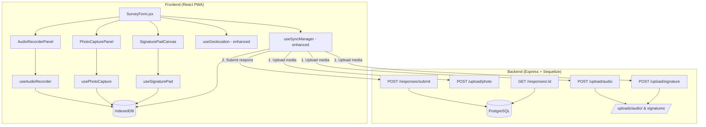
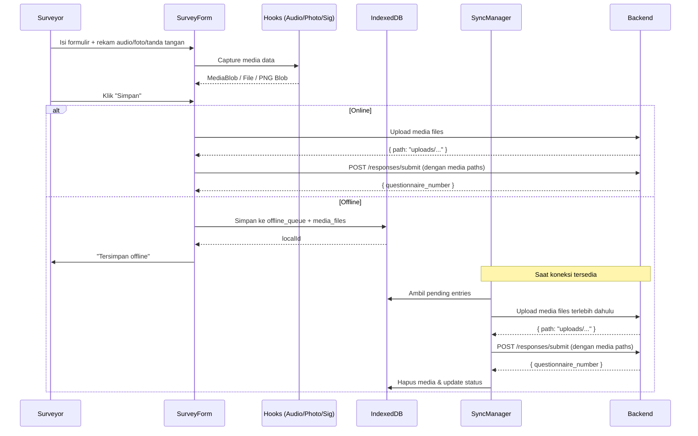

# Dokumen Desain — PWA Survey Field Tools

## Ikhtisar

Dokumen ini menjelaskan desain teknis untuk empat kapabilitas lapangan baru pada platform survei PWA Populi Center: **Perekaman Audio Real-time**, **Pelacakan Geolokasi yang Ditingkatkan**, **Pengambilan Foto (multi-foto per respons)**, dan **Tanda Tangan Digital**. Fitur-fitur ini terintegrasi ke dalam `SurveyForm.jsx` yang sudah ada, menggunakan pola offline-first melalui IndexedDB (`offlineDB.js`) dan sinkronisasi otomatis (`useSyncManager.js`).

### Keputusan Desain Utama

1. **Pemisahan media dari antrian offline**: Blob besar (audio, foto, tanda tangan) disimpan di object store `media_files` terpisah dari `offline_queue`, dengan referensi `localId`. Ini mencegah antrian offline membengkak dan mempermudah pengelolaan memori.
2. **Upload media sebelum submit respons**: Saat sinkronisasi, file media diunggah terlebih dahulu. Path hasil upload kemudian disertakan dalam payload submit respons. Ini memastikan integritas data.
3. **Hook-based architecture**: Setiap kapabilitas lapangan diimplementasikan sebagai custom React hook (`useAudioRecorder`, `usePhotoCapture`, `useSignaturePad`) yang mengelola state dan interaksi dengan browser API, sementara komponen presentasi terpisah.
4. **Backward-compatible migration**: Kolom baru ditambahkan ke tabel `responses` sebagai nullable, sehingga respons lama tetap valid.
5. **Reuse endpoint upload yang ada**: Foto menggunakan `POST /upload/photo` yang sudah ada. Audio dan tanda tangan mendapat endpoint baru yang mengikuti pola yang sama.

## Arsitektur

### Diagram Arsitektur Tingkat Tinggi



### Alur Data Offline-First



## Komponen dan Antarmuka

### 1. useAudioRecorder Hook

**Lokasi**: `frontend/src/surveyor/hooks/useAudioRecorder.js`

```javascript
/**
 * @returns {{
 *   isSupported: boolean,
 *   permissionDenied: boolean,
 *   status: 'idle' | 'recording' | 'paused' | 'stopped',
 *   duration: number,           // detik sejak mulai rekam
 *   audioBlob: Blob | null,     // hasil rekaman (WebM/MP4)
 *   startRecording: () => Promise<void>,
 *   pauseRecording: () => void,
 *   resumeRecording: () => void,
 *   stopRecording: () => void,
 *   resetRecording: () => void,
 * }}
 */
function useAudioRecorder() { ... }
```

**Keputusan desain**:
- Menggunakan `MediaRecorder` API dengan fallback MIME type: `audio/webm;codecs=opus` → `audio/mp4` → `audio/webm`
- Timer durasi menggunakan `setInterval` 1 detik, dijeda saat `pause`
- `audioBlob` dihasilkan dari `MediaRecorder.ondataavailable` chunks yang digabung saat `stop`
- Deteksi dukungan browser via `typeof MediaRecorder !== 'undefined'` dan `MediaRecorder.isTypeSupported()`

### 2. AudioRecorderPanel Komponen

**Lokasi**: `frontend/src/surveyor/components/AudioRecorderPanel.jsx`

```javascript
/**
 * Panel kontrol audio yang ditampilkan sticky di atas/bawah SurveyForm.
 * 
 * @param {{
 *   audioRecorder: ReturnType<typeof useAudioRecorder>,
 *   onAudioReady: (blob: Blob) => void,
 * }} props
 */
function AudioRecorderPanel({ audioRecorder, onAudioReady }) { ... }
```

- Tombol: Mulai Rekam / Jeda / Lanjutkan / Berhenti
- Indikator: durasi berjalan, status "Merekam" / "Dijeda"
- Ukuran sentuh minimal 44×44px
- Label ARIA pada semua kontrol

### 3. usePhotoCapture Hook

**Lokasi**: `frontend/src/surveyor/hooks/usePhotoCapture.js`

```javascript
/**
 * @returns {{
 *   photos: Array<{ id: string, blob: Blob, previewUrl: string }>,
 *   addPhoto: (file: File) => { success: boolean, error?: string },
 *   removePhoto: (id: string) => void,
 *   clearPhotos: () => void,
 *   getPhotoBlobs: () => Blob[],
 * }}
 */
function usePhotoCapture({ maxSizeMB?: number, allowedTypes?: string[] }) { ... }
```

**Keputusan desain**:
- Validasi ukuran file (maks 5 MB) dan tipe MIME (JPEG, PNG, WEBP) dilakukan di hook sebelum menambahkan ke daftar
- Preview URL dibuat via `URL.createObjectURL()` dan di-revoke saat foto dihapus atau komponen unmount
- Mendukung banyak foto per respons (tidak ada batas jumlah hard-coded, tapi UI menampilkan peringatan di atas 10)

### 4. PhotoCapturePanel Komponen

**Lokasi**: `frontend/src/surveyor/components/PhotoCapturePanel.jsx`

```javascript
/**
 * @param {{
 *   photoCapture: ReturnType<typeof usePhotoCapture>,
 * }} props
 */
function PhotoCapturePanel({ photoCapture }) { ... }
```

- Input file dengan `accept="image/jpeg,image/png,image/webp"` dan `capture="environment"` untuk kamera
- Grid thumbnail preview dengan tombol hapus per foto
- Pesan error untuk file terlalu besar atau format tidak didukung

### 5. useSignaturePad Hook

**Lokasi**: `frontend/src/surveyor/hooks/useSignaturePad.js`

```javascript
/**
 * @returns {{
 *   canvasRef: React.RefObject<HTMLCanvasElement>,
 *   isEmpty: boolean,
 *   strokeCount: number,
 *   clear: () => void,
 *   undo: () => void,
 *   toBlob: () => Promise<Blob | null>,  // PNG blob
 *   toPngDataUrl: () => string | null,
 * }}
 */
function useSignaturePad() { ... }
```

**Keputusan desain**:
- Menyimpan array of strokes (setiap stroke = array of points `{x, y}`) untuk mendukung undo per-stroke
- Event handling: `pointerdown` → mulai stroke, `pointermove` → tambah point, `pointerup` → akhiri stroke
- Menggunakan Pointer Events API (bukan Touch + Mouse terpisah) untuk kompatibilitas lintas perangkat
- Canvas di-render ulang dari strokes array setelah undo/clear
- `toBlob()` menggunakan `canvas.toBlob('image/png')` wrapped dalam Promise

### 6. SignaturePadCanvas Komponen

**Lokasi**: `frontend/src/surveyor/components/SignaturePadCanvas.jsx`

```javascript
/**
 * @param {{
 *   signaturePad: ReturnType<typeof useSignaturePad>,
 *   required: boolean,
 *   hasError: boolean,
 * }} props
 */
function SignaturePadCanvas({ signaturePad, required, hasError }) { ... }
```

- Canvas responsif (lebar 100% container, tinggi 200px)
- Tombol "Hapus" dan "Ulangi" di bawah canvas
- Border merah jika `hasError` dan canvas kosong
- Touch-action: none pada canvas untuk mencegah scroll saat menggambar

### 7. useGeolocation (Enhanced)

**Lokasi**: `frontend/src/surveyor/hooks/useGeolocation.js` (modifikasi)

Perubahan dari versi saat ini:
- Tidak ada perubahan pada interface `getLocation()` — tetap mengembalikan `{ status, lat, lng }`
- Hook dipanggil dua kali di SurveyForm: sekali saat form dimuat (start coordinates) dan sekali saat submit (end coordinates, perilaku yang sudah ada)

### 8. offlineDB.js (Enhanced)

**Lokasi**: `frontend/src/utils/offlineDB.js` (modifikasi)

Perubahan:
- DB_VERSION dinaikkan ke 2
- Object store baru: `media_files` dengan keyPath `fileId` (auto-increment) dan index `localId`
- Fungsi baru:

```javascript
// Simpan file media ke store media_files
export async function saveMediaFile({ localId, type, blob, filename }) → fileId

// Ambil semua media files untuk satu entri antrian
export async function getMediaFilesByLocalId(localId) → Array<{ fileId, type, blob, filename }>

// Hapus media files untuk satu entri antrian
export async function deleteMediaFilesByLocalId(localId) → void
```

**Keputusan desain**: Upgrade handler di `openDB` harus menangani upgrade dari versi 1 ke 2 tanpa menghapus store yang sudah ada.

### 9. useSyncManager (Enhanced)

**Lokasi**: `frontend/src/surveyor/hooks/useSyncManager.js` (modifikasi)

Perubahan pada `syncNow()`:
1. Untuk setiap pending entry, ambil media files dari `media_files` store
2. Upload setiap media file ke endpoint yang sesuai (`/upload/audio`, `/upload/photo`, `/upload/signature`)
3. Kumpulkan path hasil upload
4. Sertakan path dalam payload submit respons (`audio_path`, `photo_paths`, `signature_path`, `start_latitude`, `start_longitude`, `start_geo_status`)
5. Setelah berhasil, hapus media files dari IndexedDB

### 10. Backend Endpoints

#### POST /upload/audio

**Lokasi**: `backend/src/routes/upload.js` (tambahan)

```
POST /upload/audio
Content-Type: multipart/form-data
Field: audio (file)
Max size: 50 MB
Allowed MIME: audio/webm, audio/mp4, audio/mpeg, audio/ogg
Response: { path: "uploads/audio/audio-{timestamp}-{random}.webm" }
Auth: authMiddleware + requireRole(['admin', 'supervisor', 'surveyor'])
```

#### POST /upload/signature

**Lokasi**: `backend/src/routes/upload.js` (tambahan)

```
POST /upload/signature
Content-Type: multipart/form-data
Field: signature (file)
Max size: 2 MB
Allowed MIME: image/png
Response: { path: "uploads/signatures/sig-{timestamp}-{random}.png" }
Auth: authMiddleware + requireRole(['admin', 'supervisor', 'surveyor'])
```

### 11. SurveyForm Integration

**Lokasi**: `frontend/src/surveyor/pages/SurveyForm.jsx` (modifikasi)

Perubahan:
- Import dan inisialisasi hooks: `useAudioRecorder`, `usePhotoCapture`, `useSignaturePad`
- Panggil `getLocation()` saat form dimuat untuk start coordinates
- Render `AudioRecorderPanel` di sticky header/footer
- Render `PhotoCapturePanel` di body formulir (tombol "Tambah Foto")
- Render `SignaturePadCanvas` sebelum tombol submit
- Pada submit (online): upload media → submit respons dengan paths
- Pada submit (offline): simpan media blobs ke `media_files` store, simpan metadata ke `offline_queue`

## Model Data

### Perubahan Tabel `responses` (Migration)

```sql
ALTER TABLE responses ADD COLUMN audio_path VARCHAR(500) NULL;
ALTER TABLE responses ADD COLUMN signature_path VARCHAR(500) NULL;
ALTER TABLE responses ADD COLUMN photo_paths JSONB NULL DEFAULT '[]';
ALTER TABLE responses ADD COLUMN start_latitude DECIMAL(10,6) NULL;
ALTER TABLE responses ADD COLUMN start_longitude DECIMAL(10,6) NULL;
ALTER TABLE responses ADD COLUMN start_geo_status VARCHAR(30) NULL DEFAULT 'available';
```

**Migration file**: `backend/src/migrations/20240108000001-add-field-tools-columns.js`

### Model Response (Updated)

Kolom baru pada `backend/src/models/Response.js`:

| Kolom | Tipe | Nullable | Default | Deskripsi |
|-------|------|----------|---------|-----------|
| `audio_path` | VARCHAR(500) | Ya | null | Path file audio rekaman |
| `signature_path` | VARCHAR(500) | Ya | null | Path file tanda tangan PNG |
| `photo_paths` | JSONB | Ya | `[]` | Array path foto, e.g. `["uploads/photos/a.jpg", "uploads/photos/b.png"]` |
| `start_latitude` | DECIMAL(10,6) | Ya | null | Latitude saat form dibuka |
| `start_longitude` | DECIMAL(10,6) | Ya | null | Longitude saat form dibuka |
| `start_geo_status` | VARCHAR(30) | Ya | `'available'` | Status geolokasi awal |

### IndexedDB Schema (Updated)

```javascript
// DB_VERSION = 2
upgrade(db, oldVersion) {
  if (oldVersion < 1) {
    // existing stores: surveys, offline_queue
  }
  if (oldVersion < 2) {
    const mediaStore = db.createObjectStore('media_files', {
      keyPath: 'fileId',
      autoIncrement: true,
    });
    mediaStore.createIndex('localId', 'localId');
    mediaStore.createIndex('type', 'type');
  }
}
```

**media_files record schema**:

```javascript
{
  fileId: number,          // auto-increment PK
  localId: number,         // FK ke offline_queue.localId
  type: 'audio' | 'photo' | 'signature',
  blob: Blob,              // data file
  filename: string,        // nama file asli atau generated
}
```

**offline_queue record schema** (perubahan):

```javascript
{
  localId: number,         // auto-increment PK (existing)
  survey_id: string,       // (existing)
  answers: Array,          // (existing)
  geo: {                   // (existing, diperluas)
    status: string,
    lat: number | null,
    lng: number | null,
  },
  start_geo: {             // BARU: koordinat awal
    status: string,
    lat: number | null,
    lng: number | null,
  },
  has_audio: boolean,      // BARU: flag ada rekaman audio
  has_signature: boolean,  // BARU: flag ada tanda tangan
  photo_count: number,     // BARU: jumlah foto
  status: string,          // (existing)
  timestamp: number,       // (existing)
  errorMessage: string,    // (existing)
}
```

### Direktori Upload Backend

```
backend/uploads/
├── audio/          # BARU: file audio rekaman
├── photos/         # EXISTING: foto
└── signatures/     # BARU: file tanda tangan PNG
```


## Correctness Properties

*A property is a characteristic or behavior that should hold true across all valid executions of a system — essentially, a formal statement about what the system should do. Properties serve as the bridge between human-readable specifications and machine-verifiable correctness guarantees.*

### Property 1: Validitas Transisi State Audio Recorder

*For any* valid sequence of audio recorder actions (start, pause, resume, stop), the resulting state must always be a valid state (`idle`, `recording`, `paused`, `stopped`) and each transition must follow the allowed state machine:
- `idle` → `recording` (via start)
- `recording` → `paused` (via pause)
- `recording` → `stopped` (via stop)
- `paused` → `recording` (via resume)
- `paused` → `stopped` (via stop)

Invalid transitions (e.g., pause from idle, resume from recording) must be no-ops that preserve the current state.

**Validates: Requirements 1.1, 1.4, 1.5, 1.6**

### Property 2: Round-Trip Penyimpanan Media di IndexedDB

*For any* media file (audio blob, photo blob, atau signature PNG blob) dengan tipe dan localId yang valid, menyimpan file ke object store `media_files` kemudian mengambilnya kembali berdasarkan `localId` harus mengembalikan data dengan `type`, `filename`, dan ukuran blob yang identik dengan data asli.

**Validates: Requirements 1.7, 3.6, 4.6**

### Property 3: Validasi File Foto

*For any* file dengan MIME type dan ukuran tertentu, `addPhoto` harus menerima file jika dan hanya jika MIME type termasuk dalam `{image/jpeg, image/png, image/webp}` DAN ukuran file ≤ 5 MB. File yang ditolak harus menghasilkan pesan error yang sesuai dan tidak mengubah daftar foto.

**Validates: Requirements 3.8, 3.9, 3.10**

### Property 4: Invariant Koleksi Multi-Foto

*For any* urutan operasi penambahan dan penghapusan foto yang valid, panjang array `photos` harus selalu sama dengan jumlah foto yang ditambahkan dikurangi jumlah foto yang dihapus (minimum 0). Setiap foto dalam array harus memiliki `id`, `blob`, dan `previewUrl` yang valid.

**Validates: Requirements 3.3, 3.5**

### Property 5: Clear Signature Pad Mengembalikan State Kosong

*For any* urutan goresan (strokes) pada signature pad, memanggil `clear()` harus menghasilkan `isEmpty === true` dan `strokeCount === 0`, terlepas dari jumlah atau kompleksitas goresan sebelumnya.

**Validates: Requirements 4.3**

### Property 6: Undo Signature Pad Menghapus Goresan Terakhir

*For any* urutan N goresan (N > 0) pada signature pad, memanggil `undo()` harus menghasilkan `strokeCount === N - 1`. Memanggil `undo()` sebanyak N kali harus menghasilkan `isEmpty === true`. Memanggil `undo()` pada canvas kosong harus menjadi no-op (`isEmpty` tetap `true`).

**Validates: Requirements 4.4**

### Property 7: Preservasi Data Offline Queue

*For any* payload respons yang berisi `answers`, `geo` (end coordinates), `start_geo` (start coordinates), dan flag media (`has_audio`, `has_signature`, `photo_count`), menyimpan ke `offline_queue` kemudian mengambilnya kembali harus mengembalikan semua field dengan nilai yang identik.

**Validates: Requirements 2.5, 5.1**

### Property 8: Validasi Upload Backend (Audio dan Signature)

*For any* file yang diunggah ke endpoint `/upload/audio` atau `/upload/signature`:
- Audio: file diterima jika dan hanya jika MIME type ∈ `{audio/webm, audio/mp4, audio/mpeg, audio/ogg}` DAN ukuran ≤ 50 MB
- Signature: file diterima jika dan hanya jika MIME type = `image/png` DAN ukuran ≤ 2 MB

File yang ditolak harus mengembalikan status HTTP 413 (ukuran) atau 422 (format) dengan pesan error deskriptif.

**Validates: Requirements 1.11, 4.8**

### Property 9: Pembersihan Media Setelah Sinkronisasi Berhasil

*For any* entri offline queue yang berhasil disinkronkan (semua media terunggah dan respons tersubmit), `getMediaFilesByLocalId(localId)` harus mengembalikan array kosong setelah proses sinkronisasi selesai.

**Validates: Requirements 5.7**

## Error Handling

### Frontend Error Handling

| Skenario | Penanganan | Pesan ke Pengguna |
|----------|------------|-------------------|
| Browser tidak mendukung MediaRecorder | `isSupported = false`, sembunyikan kontrol audio | "Perekaman audio tidak didukung pada perangkat ini" |
| Izin mikrofon ditolak | `permissionDenied = true`, nonaktifkan tombol rekam | "Izin mikrofon diperlukan untuk merekam audio" |
| File foto > 5 MB | `addPhoto` mengembalikan `{ success: false, error }` | "Ukuran foto melebihi batas maksimal 5 MB" |
| Format foto tidak didukung | `addPhoto` mengembalikan `{ success: false, error }` | "Format foto tidak didukung. Gunakan JPEG, PNG, atau WEBP" |
| Canvas kosong saat submit (tanda tangan wajib) | Validasi di SurveyForm sebelum submit | "Tanda tangan wajib diisi" |
| Geolokasi awal gagal | Simpan `start_geo_status`, lanjutkan tanpa blokir | Status ditampilkan di UI, form tetap bisa diisi |
| IndexedDB penuh / error | Catch error, tampilkan pesan | "Gagal menyimpan data secara lokal. Silakan coba kembali." |
| Upload media gagal (network) | SyncManager berhenti untuk entri tersebut, retry nanti | Indikator pending di OfflineStatusBar |
| Upload media gagal (server 4xx/5xx) | SyncManager tandai `failed` dengan pesan error | Pesan error ditampilkan di daftar failed items |

### Backend Error Handling

| Skenario | HTTP Status | Response |
|----------|-------------|----------|
| File audio > 50 MB | 413 | `{ error: "Ukuran file melebihi batas maksimal 50 MB" }` |
| Format audio tidak didukung | 422 | `{ error: "Format file tidak didukung. Gunakan WebM, MP4, MPEG, atau OGG" }` |
| File signature > 2 MB | 413 | `{ error: "Ukuran file melebihi batas maksimal 2 MB" }` |
| Format signature bukan PNG | 422 | `{ error: "Format file tidak didukung. Gunakan PNG" }` |
| File tidak ditemukan dalam request | 422 | `{ error: "File tidak ditemukan dalam request" }` |
| Disk penuh / write error | 500 | `{ error: "Terjadi kesalahan internal server" }` |

### Strategi Retry

- **Network error saat upload**: SyncManager berhenti untuk entri tersebut, mencoba kembali saat event `online` berikutnya
- **Server error (4xx)**: Entri ditandai `failed`, tidak di-retry otomatis (kemungkinan error permanen seperti format tidak valid)
- **Server error (5xx)**: Entri ditandai `failed`, bisa di-retry manual oleh pengguna

## Testing Strategy

### Pendekatan Dual Testing

Fitur ini menggunakan kombinasi **unit tests** (contoh spesifik dan edge cases) dan **property-based tests** (properti universal) untuk cakupan komprehensif.

### Property-Based Tests

Library: **fast-check** (sudah terinstal di frontend dan backend)

Konfigurasi:
- Minimum **100 iterasi** per property test
- Setiap test di-tag dengan referensi ke property di dokumen desain
- Format tag: `Feature: pwa-survey-field-tools, Property {number}: {property_text}`

#### Frontend Property Tests

| Property | File Test | Deskripsi |
|----------|-----------|-----------|
| Property 1 | `frontend/src/surveyor/hooks/__tests__/useAudioRecorder.property.test.js` | State machine transitions |
| Property 2 | `frontend/src/utils/__tests__/offlineDB.property.test.js` | Media files round-trip |
| Property 3 | `frontend/src/surveyor/hooks/__tests__/usePhotoCapture.property.test.js` | File validation |
| Property 4 | `frontend/src/surveyor/hooks/__tests__/usePhotoCapture.property.test.js` | Multi-photo collection |
| Property 5 | `frontend/src/surveyor/hooks/__tests__/useSignaturePad.property.test.js` | Clear resets state |
| Property 6 | `frontend/src/surveyor/hooks/__tests__/useSignaturePad.property.test.js` | Undo removes last stroke |
| Property 7 | `frontend/src/utils/__tests__/offlineDB.property.test.js` | Offline queue preservation |

#### Backend Property Tests

| Property | File Test | Deskripsi |
|----------|-----------|-----------|
| Property 8 | `backend/tests/properties/fieldToolsUpload.property.test.js` | Upload validation (audio + signature) |

#### Sync Cleanup Test

| Property | File Test | Deskripsi |
|----------|-----------|-----------|
| Property 9 | `frontend/src/surveyor/hooks/__tests__/useSyncManager.property.test.js` | Media cleanup after sync |

### Unit Tests (Example-Based)

| Area | File Test | Cakupan |
|------|-----------|---------|
| AudioRecorderPanel | `frontend/src/surveyor/components/__tests__/AudioRecorderPanel.test.jsx` | Render states, button visibility, ARIA labels |
| PhotoCapturePanel | `frontend/src/surveyor/components/__tests__/PhotoCapturePanel.test.jsx` | Thumbnail preview, delete button, error messages |
| SignaturePadCanvas | `frontend/src/surveyor/components/__tests__/SignaturePadCanvas.test.jsx` | Canvas render, clear/undo buttons, required validation |
| useGeolocation (start) | `frontend/src/surveyor/hooks/__tests__/useGeolocation.test.js` | Start coordinates capture on form load |
| SurveyForm integration | `frontend/src/surveyor/pages/__tests__/SurveyForm.test.jsx` | Field tools integration, offline submit with media |
| Upload endpoints | `backend/tests/unit/upload.test.js` | Audio/signature upload success and error cases |
| Response model | `backend/tests/unit/responses.test.js` | New columns (audio_path, signature_path, photo_paths, start coordinates) |
| Migration | Manual verification | Kolom baru ditambahkan dengan benar |

### Integration Tests

| Area | Deskripsi |
|------|-----------|
| Offline → Online sync | Simpan respons offline dengan media, simulasi online, verifikasi upload dan submit berurutan |
| End-to-end form submit | Isi form dengan audio + foto + tanda tangan, submit online, verifikasi semua data tersimpan |
| SyncManager media-first ordering | Verifikasi media diunggah sebelum respons disubmit |
