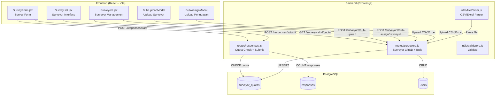
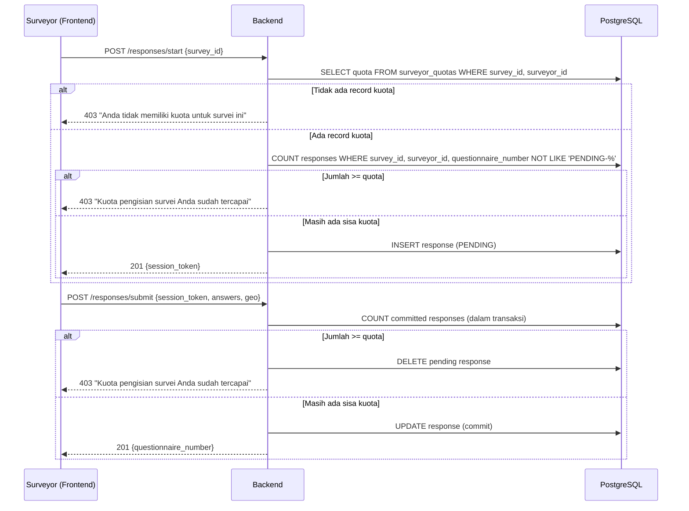

# Dokumen Desain: Quota Enforcement and Surveyor Management

## Ikhtisar (Overview)

Fitur ini menambahkan enam kapabilitas utama pada platform survei web:

1. **Penegakan kuota** — Backend menolak pengiriman respons jika surveyor sudah mencapai batas kuota, baik saat memulai sesi (`/responses/start`) maupun saat submit (`/responses/submit`).
2. **Penetapan kuota saat penugasan** — Admin/Supervisor dapat menetapkan kuota saat menugaskan surveyor ke survei, dengan validasi dan kemampuan mengubah kuota yang sudah ada.
3. **Penomoran kuesioner otomatis** — Sistem sudah memiliki mekanisme auto-numbering menggunakan PostgreSQL sequence; desain ini memastikan integrasi yang konsisten.
4. **Upload massal surveyor** — Admin/Supervisor dapat mengupload file CSV/Excel berisi data surveyor baru secara batch (maksimal 500 baris).
5. **Penugasan massal surveyor ke survei** — Admin/Supervisor dapat mengupload file CSV/Excel berisi penugasan surveyor beserta kuota.
6. **Tampilan kuota pada antarmuka surveyor** — Surveyor melihat informasi kuota (terisi/total) di halaman daftar survei, dengan tombol "Mulai Isi" yang dinonaktifkan saat kuota tercapai.

### Keputusan Desain Utama

- **Pengecekan kuota ganda (double-check)**: Kuota diperiksa di dua titik — saat `/responses/start` (mencegah pembuatan record PENDING yang sia-sia) dan saat `/responses/submit` (mencegah race condition). Penghitungan hanya menggunakan respons yang sudah ter-commit (bukan PENDING).
- **Operasi atomik untuk bulk upload**: Semua baris dalam file upload divalidasi terlebih dahulu; jika ada satu baris yang gagal validasi, tidak ada data yang disimpan (all-or-nothing).
- **Parsing file menggunakan library yang sudah ada**: Backend sudah memiliki dependency `exceljs` untuk export; library yang sama digunakan untuk parsing file Excel upload. Untuk CSV, digunakan parsing sederhana berbasis string splitting.
- **Multer untuk file upload**: Backend sudah menggunakan `multer` untuk upload foto; konfigurasi serupa digunakan untuk upload file CSV/Excel.

## Arsitektur (Architecture)



### Alur Penegakan Kuota



## Komponen dan Antarmuka (Components and Interfaces)

### Backend

#### 1. Modifikasi `routes/responses.js`

**`POST /responses/start`** — Tambahkan pengecekan kuota sebelum membuat record PENDING:
- Query `SurveyorQuota` untuk mendapatkan batas kuota
- Jika tidak ada record → 403 "Anda tidak memiliki kuota untuk survei ini"
- Hitung respons ter-commit (questionnaire_number NOT LIKE 'PENDING-%')
- Jika jumlah >= kuota → 403 "Kuota pengisian survei Anda sudah tercapai"

**`POST /responses/submit`** — Tambahkan pengecekan kuota di dalam transaksi:
- Hitung respons ter-commit di dalam transaksi (locking)
- Jika jumlah >= kuota → rollback, hapus record PENDING, return 403
- Jika masih ada sisa → lanjutkan commit seperti biasa

#### 2. Modifikasi `routes/surveyors.js`

**`POST /surveyors/:id/quota`** — Sudah ada, tidak perlu perubahan signifikan.

**`POST /surveyors/bulk-upload`** (baru):
- Menerima file CSV/Excel via multer
- Validasi format file (ekstensi .csv atau .xlsx)
- Parse file menggunakan `utils/fileParser.js`
- Validasi setiap baris: nama tidak kosong, email valid & unik, password memenuhi aturan
- Batas maksimal 500 baris
- Jika ada error → return daftar error per baris tanpa menyimpan
- Jika semua valid → buat semua akun dalam satu transaksi
- Return: `{ created_count, emails: [...] }`

**`POST /surveyors/bulk-assign/:surveyId`** (baru):
- Menerima file CSV/Excel via multer
- Parse file: kolom `email_surveyor`, `kuota`
- Validasi: email terdaftar sebagai surveyor aktif, kuota bilangan bulat positif > 0
- Jika ada error → return daftar error per baris
- Jika semua valid → upsert SurveyorQuota dalam satu transaksi
- Return: `{ assigned_count }`

**`GET /surveyors/:id/quota`** — Modifikasi response untuk menyertakan field `filled` (jumlah respons ter-commit, bukan termasuk PENDING):
- Saat ini mengembalikan `response_count` yang menghitung semua respons termasuk PENDING
- Perlu diubah agar hanya menghitung respons ter-commit

#### 3. Utilitas Baru: `utils/fileParser.js`

```javascript
/**
 * Parse file CSV atau Excel dan kembalikan array of objects.
 * @param {Buffer} buffer - File buffer
 * @param {string} mimetype - MIME type file
 * @param {string[]} expectedColumns - Kolom yang diharapkan
 * @returns {Promise<{ rows: object[], errors: string[] }>}
 */
async function parseUploadFile(buffer, mimetype, expectedColumns) { ... }
```

- Untuk `.xlsx`: gunakan `exceljs` (sudah ada di dependencies)
- Untuk `.csv`: parsing manual dengan split baris dan kolom
- Validasi header kolom sesuai `expectedColumns`
- Return array of objects dengan key sesuai header

#### 4. Modifikasi `utils/validators.js`

Tambahkan fungsi:
- `validateEmail(email)` — Validasi format email
- `validateBulkSurveyorRow(row)` — Validasi satu baris data surveyor (nama, email, password)
- `validateBulkAssignRow(row)` — Validasi satu baris penugasan (email, kuota)

### Frontend

#### 5. Komponen Baru: `BulkUploadModal.jsx`

Modal dialog untuk upload massal surveyor:
- Input file (accept: .csv, .xlsx)
- Tombol download template
- Tampilan progress upload
- Tampilan daftar error per baris jika ada
- Tampilan sukses dengan jumlah surveyor yang dibuat

#### 6. Komponen Baru: `BulkAssignModal.jsx`

Modal dialog untuk penugasan massal surveyor ke survei:
- Input file (accept: .csv, .xlsx)
- Tombol download template
- Tampilan daftar error per baris jika ada
- Tampilan sukses dengan jumlah penugasan

#### 7. Modifikasi `Surveyors.jsx`

- Tambahkan tombol "Upload Surveyor" yang membuka `BulkUploadModal`
- Tambahkan tombol "Upload Penugasan" (per survei) yang membuka `BulkAssignModal`

#### 8. Modifikasi `SurveyList.jsx` (Surveyor Interface)

- Tampilkan informasi kuota (terisi/total) menggunakan komponen `QuotaProgress` yang sudah ada
- Nonaktifkan tombol "Mulai Isi" dan tampilkan label "Kuota Tercapai" saat sisa kuota = 0
- Perbarui tampilan kuota setelah submit respons berhasil (sudah ada mekanisme `fetchData`)

#### 9. Modifikasi `SubmitSuccess.jsx`

- Setelah submit berhasil, refresh data kuota agar `SurveyList` menampilkan kuota terbaru saat navigasi kembali

## Model Data (Data Models)

### Tabel yang Sudah Ada (Tidak Perlu Migrasi Baru)

#### `surveyor_quotas`
| Kolom | Tipe | Keterangan |
|-------|------|------------|
| id | UUID (PK) | Primary key |
| survey_id | UUID (FK → surveys) | Referensi ke survei |
| surveyor_id | UUID (FK → users) | Referensi ke surveyor |
| quota | INTEGER | Batas kuota (min: 1) |
| created_at | TIMESTAMP | Waktu pembuatan |
| updated_at | TIMESTAMP | Waktu pembaruan |

**Unique constraint**: `(survey_id, surveyor_id)`

#### `responses`
| Kolom | Tipe | Keterangan |
|-------|------|------------|
| id | UUID (PK) | Primary key |
| survey_id | UUID (FK → surveys) | Referensi ke survei |
| surveyor_id | UUID (FK → users) | Referensi ke surveyor |
| questionnaire_number | VARCHAR(50) | Nomor kuesioner (PENDING-{uuid} atau format final) |
| ... | ... | Kolom lainnya |

**Catatan**: Respons ter-commit diidentifikasi dengan `questionnaire_number NOT LIKE 'PENDING-%'`.

#### `users`
| Kolom | Tipe | Keterangan |
|-------|------|------------|
| id | UUID (PK) | Primary key |
| name | VARCHAR(255) | Nama pengguna |
| email | VARCHAR(255) | Email (unique) |
| password_hash | VARCHAR(255) | Hash password |
| role | VARCHAR(20) | Role: admin, supervisor, viewer, surveyor |
| is_active | BOOLEAN | Status aktif |

### Format File Upload

#### Template Bulk Upload Surveyor (CSV)
```
nama,email,password
John Doe,john@example.com,Password123
Jane Smith,jane@example.com,SecurePass1
```

#### Template Bulk Assign (CSV)
```
email_surveyor,kuota
john@example.com,50
jane@example.com,30
```

### API Response Formats

#### Bulk Upload Response (Success)
```json
{
  "created_count": 2,
  "emails": ["john@example.com", "jane@example.com"]
}
```

#### Bulk Upload Response (Error)
```json
{
  "errors": [
    { "row": 2, "message": "Email tidak valid" },
    { "row": 3, "message": "Email sudah terdaftar" },
    { "row": 5, "message": "Password harus minimal 8 karakter, mengandung huruf besar, huruf kecil, dan angka" }
  ]
}
```

#### Quota Check Response (GET /surveyors/:id/quota)
```json
[
  {
    "survey_id": "uuid",
    "survey_title": "Survei Kepuasan",
    "quota": 50,
    "filled": 23
  }
]
```


## Correctness Properties

*A property is a characteristic or behavior that should hold true across all valid executions of a system — essentially, a formal statement about what the system should do. Properties serve as the bridge between human-readable specifications and machine-verifiable correctness guarantees.*

### Property 1: Keputusan Penegakan Kuota

*For any* surveyor dengan kuota `Q` dan jumlah respons ter-commit `C` untuk suatu survei, pengiriman respons baru SHALL diizinkan jika dan hanya jika `C < Q`. Jika `C >= Q`, sistem SHALL menolak dengan HTTP 403.

**Validates: Requirements 1.1, 1.2, 1.3**

### Property 2: Penghitungan Respons Ter-commit Mengecualikan PENDING

*For any* kumpulan respons yang terdiri dari campuran respons ter-commit (questionnaire_number tidak dimulai dengan 'PENDING-') dan respons PENDING, fungsi penghitungan kuota SHALL mengembalikan jumlah yang sama dengan jumlah respons ter-commit saja.

**Validates: Requirements 1.5**

### Property 3: Validasi Nilai Kuota

*For any* nilai input, fungsi `validateQuota` SHALL mengembalikan `true` jika dan hanya jika nilai tersebut adalah bilangan bulat (integer) dan lebih besar dari 0. Untuk semua nilai lainnya (float, negatif, nol, string, null, undefined), fungsi SHALL mengembalikan `false`.

**Validates: Requirements 2.2, 5.4**

### Property 4: Round-trip Upsert Kuota

*For any* kombinasi valid (survey_id, surveyor_id, quota), setelah operasi upsert pada SurveyorQuota, membaca kembali record dengan (survey_id, surveyor_id) SHALL mengembalikan nilai quota yang sama dengan yang di-set.

**Validates: Requirements 2.4, 2.5**

### Property 5: Format Nomor Kuesioner

*For any* judul survei, tanggal, dan nomor urut, fungsi `formatQuestionnaireNumber` SHALL menghasilkan string yang cocok dengan pola regex `^[A-Z0-9]{1,6}-\d{8}-\d{4,}$`, di mana bagian tanggal sesuai dengan tanggal input dalam format YYYYMMDD.

**Validates: Requirements 3.1**

### Property 6: Validasi Baris Data Surveyor untuk Bulk Upload

*For any* baris data surveyor, fungsi validasi SHALL mendeteksi semua field yang tidak valid: nama kosong, email dengan format tidak valid, dan password yang tidak memenuhi aturan keamanan (minimal 8 karakter, huruf besar, huruf kecil, dan angka). Baris dengan semua field valid SHALL lolos validasi.

**Validates: Requirements 4.5**

### Property 7: Atomisitas Operasi Bulk

*For any* batch upload (baik bulk surveyor maupun bulk assign) yang mengandung setidaknya satu baris tidak valid, sistem SHALL tidak menyimpan data apapun ke database dan SHALL mengembalikan daftar error yang mencakup semua baris yang tidak valid beserta nomor barisnya.

**Validates: Requirements 4.6, 5.5**

### Property 8: Keberhasilan Operasi Bulk

*For any* batch upload yang semua barisnya valid, sistem SHALL membuat semua record dalam satu transaksi. Jumlah record yang dibuat SHALL sama dengan jumlah baris dalam file, dan setiap record SHALL memiliki data yang sesuai dengan baris input.

**Validates: Requirements 4.7, 5.6**

## Penanganan Error (Error Handling)

### Backend Error Responses

| Skenario | HTTP Code | Pesan Error |
|----------|-----------|-------------|
| Surveyor tidak memiliki kuota untuk survei | 403 | "Anda tidak memiliki kuota untuk survei ini" |
| Kuota sudah tercapai | 403 | "Kuota pengisian survei Anda sudah tercapai" |
| Nilai kuota tidak valid | 422 | "Kuota harus berupa bilangan bulat positif lebih dari 0" |
| File upload format tidak valid | 422 | "Format file tidak didukung. Gunakan file CSV (.csv) atau Excel (.xlsx)" |
| File upload melebihi 500 baris | 422 | "Jumlah baris melebihi batas maksimal 500" |
| File upload header tidak sesuai | 422 | "Header file tidak sesuai. Kolom yang diharapkan: {expected}" |
| Baris data tidak valid (bulk) | 422 | `{ errors: [{ row, message }] }` |
| Email sudah terdaftar (bulk) | 422 | Error per baris: "Email sudah terdaftar" |
| Email surveyor tidak ditemukan (bulk assign) | 422 | Error per baris: "Surveyor dengan email ini tidak ditemukan atau tidak aktif" |
| Gagal menyimpan (DB error) | 500 | "Gagal menyimpan data. Silakan coba kembali" |

### Strategi Penanganan Error

1. **Validasi berlapis**: Frontend melakukan validasi dasar (format, required fields) sebelum mengirim ke backend. Backend melakukan validasi lengkap termasuk pengecekan database.
2. **Operasi atomik**: Semua operasi bulk menggunakan transaksi database. Jika terjadi error di tengah proses, seluruh operasi di-rollback.
3. **Race condition pada kuota**: Pengecekan kuota di `/responses/submit` dilakukan di dalam transaksi database untuk mencegah dua surveyor yang submit bersamaan melebihi kuota.
4. **Error reporting yang informatif**: Untuk bulk upload, setiap baris yang gagal dilaporkan dengan nomor baris dan pesan error spesifik.

## Strategi Pengujian (Testing Strategy)

### Pendekatan Pengujian Ganda

Fitur ini menggunakan kombinasi **unit test** dan **property-based test** untuk cakupan yang komprehensif:

- **Property-based tests** (menggunakan `fast-check`): Memverifikasi properti universal yang berlaku untuk semua input valid — kuota enforcement, validasi, format, atomisitas.
- **Unit tests** (menggunakan `jest` untuk backend, `vitest` untuk frontend): Memverifikasi contoh spesifik, edge case, dan integrasi komponen.

### Property-Based Tests (Backend — Jest + fast-check)

Setiap property test HARUS:
- Menggunakan library `fast-check` yang sudah ada di project
- Menjalankan minimal 100 iterasi per property
- Menyertakan tag komentar yang mereferensikan property di dokumen desain
- Format tag: **Feature: quota-enforcement-and-surveyor-management, Property {number}: {property_text}**

Property tests akan ditempatkan di `backend/tests/properties/quotaEnforcement.property.test.js`.

### Unit Tests

#### Backend (`backend/tests/unit/`)
- Endpoint `/responses/start` — pengecekan kuota
- Endpoint `/responses/submit` — pengecekan kuota dalam transaksi
- Endpoint `/surveyors/bulk-upload` — parsing dan validasi file
- Endpoint `/surveyors/bulk-assign/:surveyId` — parsing dan validasi penugasan
- Utilitas `fileParser.js` — parsing CSV dan Excel
- Utilitas `validators.js` — fungsi validasi baru

#### Frontend (`frontend/src/pages/__tests__/`)
- `BulkUploadModal` — render, upload flow, error display
- `BulkAssignModal` — render, upload flow, error display
- `SurveyList.jsx` — tampilan kuota, tombol disabled saat kuota tercapai
- `Surveyors.jsx` — tombol upload, integrasi modal

### Integration Tests
- Alur lengkap: assign surveyor → submit respons → verifikasi kuota berkurang
- Bulk upload → verifikasi akun dibuat → bulk assign → verifikasi kuota
- Concurrent submission → verifikasi kuota tidak terlampaui (race condition)
