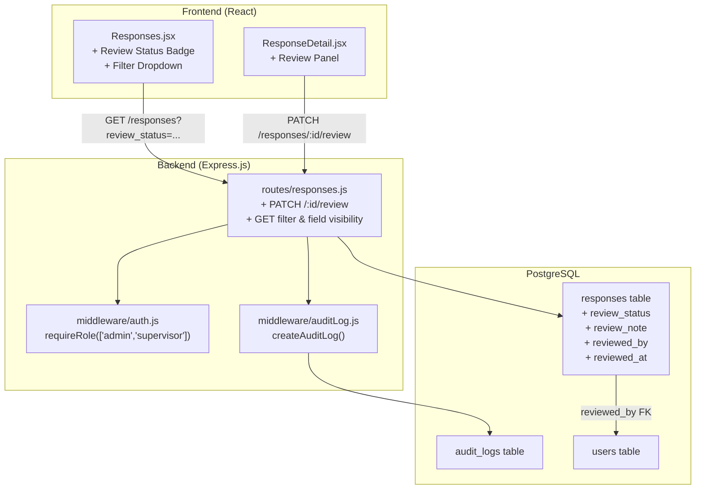

# Dokumen Desain: Response Review

## Overview

Fitur Response Review menambahkan kemampuan quality control pada respons survei. Admin dan Supervisor dapat meninjau respons yang dikumpulkan surveyor di lapangan, menandai respons yang mencurigakan (`flagged`), memverifikasi respons yang valid (`verified`), dan menambahkan catatan review. Proses review bersifat internal — surveyor tidak dapat melihat status review maupun catatan pada respons yang dikumpulkannya.

Fitur ini terdiri dari empat lapisan perubahan:
1. **Database**: Empat kolom baru pada tabel `responses` (`review_status`, `review_note`, `reviewed_by`, `reviewed_at`) melalui migration baru
2. **Backend API**: Endpoint `PATCH /responses/:id/review` untuk update review, modifikasi endpoint GET untuk menyertakan/menyembunyikan field review berdasarkan role, dan filter berdasarkan `review_status`
3. **Audit Logging**: Pencatatan setiap perubahan review ke tabel `audit_logs` menggunakan helper `createAuditLog` yang sudah ada
4. **Frontend**: Badge status review pada daftar respons, dropdown filter review_status, dan panel review pada halaman detail respons

## Architecture

Arsitektur mengikuti pola yang sudah ada di codebase: Express.js routes → Sequelize models → PostgreSQL, dengan React frontend yang berkomunikasi via axios.



### Keputusan Desain

1. **ENUM via CHECK constraint, bukan PostgreSQL ENUM type**: Mengikuti pola yang sudah ada di codebase (lihat `geo_status` pada Response model dan `questions_type_check`). Menggunakan CHECK constraint lebih mudah di-alter tanpa perlu drop/recreate type.

2. **Field visibility berdasarkan role di route layer**: Daripada membuat view atau scope di model, field review disertakan/disembunyikan di route handler berdasarkan `req.user.role`. Ini konsisten dengan pola yang sudah ada di `GET /responses` dan `GET /responses/:id`.

3. **Review endpoint sebagai sub-route pada responses router**: `PATCH /responses/:id/review` ditambahkan di `routes/responses.js` yang sudah ada, bukan router terpisah. Ini menjaga kohesi karena review adalah operasi pada resource response.

4. **Audit log menggunakan helper yang sudah ada**: `createAuditLog()` dari `middleware/auditLog.js` sudah menyediakan interface yang tepat dengan `old_value`/`new_value` JSONB fields.

## Components and Interfaces

### 1. Migration: Add Review Columns

**File**: `backend/src/migrations/20240107000001-add-response-review-columns.js`

Menambahkan empat kolom ke tabel `responses`:
- `review_status` — VARCHAR(20) dengan CHECK constraint, default `'unreviewed'`
- `review_note` — TEXT, nullable
- `reviewed_by` — UUID, nullable, FK ke `users.id`
- `reviewed_at` — TIMESTAMPTZ, nullable

Index pada `review_status` untuk mendukung filter query.

### 2. Response Model Update

**File**: `backend/src/models/Response.js`

Menambahkan field definitions untuk keempat kolom baru:

```javascript
review_status: {
  type: DataTypes.STRING(20),
  allowNull: false,
  defaultValue: 'unreviewed',
  validate: {
    isIn: [['unreviewed', 'flagged', 'verified']],
  },
},
review_note: {
  type: DataTypes.TEXT,
  allowNull: true,
},
reviewed_by: {
  type: DataTypes.UUID,
  allowNull: true,
  references: { model: 'users', key: 'id' },
},
reviewed_at: {
  type: DataTypes.DATE,
  allowNull: true,
},
```

### 3. Model Associations Update

**File**: `backend/src/models/index.js`

Menambahkan association:
```javascript
User.hasMany(Response, { foreignKey: 'reviewed_by', as: 'reviewedResponses' });
Response.belongsTo(User, { foreignKey: 'reviewed_by', as: 'reviewer' });
```

### 4. PATCH /responses/:id/review Endpoint

**File**: `backend/src/routes/responses.js`

```
PATCH /responses/:id/review
Authorization: admin, supervisor
Body: { review_status: string, review_note?: string | null }
Response 200: { id, review_status, review_note, reviewed_by, reviewed_at, reviewer_name }
Response 400: { error: "Status review tidak valid..." }
Response 403: { error: "Anda tidak memiliki izin..." }
Response 404: { error: "Data responden tidak ditemukan" }
```

Flow:
1. `authMiddleware` → `requireRole(['admin', 'supervisor'])`
2. Validate `review_status` ∈ `['unreviewed', 'flagged', 'verified']`
3. Find response by ID, return 404 if not found
4. Capture `old_value` (current review_status, review_note)
5. Update `review_status`, `review_note`, `reviewed_by = req.user.id`, `reviewed_at = new Date()`
6. Create audit log entry via `createAuditLog()`
7. Return updated review fields

### 5. GET /responses Modifications

Perubahan pada `GET /responses` dan `GET /responses/:id`:

**Field visibility by role**:
- `admin`, `supervisor`, `viewer`: Sertakan `review_status`, `review_note`, `reviewed_by`, `reviewed_at`, `reviewer_name` dalam response
- `surveyor`: Sembunyikan keempat field review dari response

**Filter support**:
- Query parameter `review_status` pada `GET /responses`
- Validasi nilai: jika tidak valid, abaikan filter (return semua)
- Hanya berlaku untuk role non-surveyor (surveyor tidak bisa filter by review_status)

### 6. Frontend: ReviewStatusBadge Component

**File**: `frontend/src/components/ReviewStatusBadge.jsx`

Komponen reusable yang menampilkan badge berwarna:
- `flagged` → merah, label "Flagged"
- `verified` → hijau, label "Verified"
- `unreviewed` → abu-abu, label "Unreviewed"

### 7. Frontend: Responses.jsx Updates

Perubahan pada halaman daftar respons:
- Tambah kolom "Status Review" pada tabel (setelah kolom Geolokasi)
- Tambah dropdown filter "Status Review" pada filter card
- Filter mengirim query parameter `review_status` ke backend
- Kolom dan filter hanya ditampilkan untuk role admin/supervisor/viewer

### 8. Frontend: ResponseDetail.jsx Review Panel

Perubahan pada halaman detail respons:
- Tambah panel review di sidebar (setelah metadata card) untuk admin/supervisor
- Panel berisi: dropdown status review, textarea catatan, info reviewer & waktu, tombol "Simpan Review"
- Viewer dapat melihat status review (read-only) tapi tidak bisa mengubah
- Surveyor tidak melihat panel review sama sekali
- Setelah simpan berhasil, tampilkan notifikasi sukses dan update badge

## Data Models

### Perubahan Tabel `responses`

| Kolom | Tipe | Nullable | Default | Keterangan |
|-------|------|----------|---------|------------|
| review_status | VARCHAR(20) | NOT NULL | 'unreviewed' | CHECK constraint: unreviewed, flagged, verified |
| review_note | TEXT | YES | NULL | Catatan review dari admin/supervisor |
| reviewed_by | UUID | YES | NULL | FK → users.id, siapa yang melakukan review |
| reviewed_at | TIMESTAMPTZ | YES | NULL | Waktu review terakhir |

### Index Baru

| Index | Kolom | Tipe |
|-------|-------|------|
| idx_responses_review_status | review_status | B-tree |

### API Response Shapes

**PATCH /responses/:id/review — Success (200)**:
```json
{
  "id": "uuid",
  "review_status": "flagged",
  "review_note": "Durasi pengisian terlalu singkat",
  "reviewed_by": "uuid",
  "reviewed_at": "2024-01-15T10:30:00.000Z",
  "reviewer_name": "Admin Name"
}
```

**GET /responses — Item shape (admin/supervisor/viewer)**:
```json
{
  "id": "uuid",
  "questionnaire_number": "SRV-20240115-0001",
  "survey_id": "uuid",
  "survey_title": "Survey Title",
  "surveyor_id": "uuid",
  "surveyor_name": "Surveyor Name",
  "start_time": "...",
  "end_time": "...",
  "duration_seconds": 300,
  "geo_status": "available",
  "created_at": "...",
  "review_status": "unreviewed",
  "review_note": null,
  "reviewed_by": null,
  "reviewed_at": null,
  "reviewer_name": null
}
```

**GET /responses — Item shape (surveyor)**: Sama seperti di atas tanpa field `review_status`, `review_note`, `reviewed_by`, `reviewed_at`, `reviewer_name`.


## Correctness Properties

*A property is a characteristic or behavior that should hold true across all valid executions of a system — essentially, a formal statement about what the system should do. Properties serve as the bridge between human-readable specifications and machine-verifiable correctness guarantees.*

### Property 1: Review update sets all fields correctly

*For any* valid `review_status` value (from `['unreviewed', 'flagged', 'verified']`) and *for any* `review_note` string (including null and empty string), when a review update is performed by an authorized user, the resulting response record SHALL have `review_status` equal to the provided value, `review_note` equal to the provided value, `reviewed_by` equal to the authenticated user's ID, and `reviewed_at` set to a timestamp within a reasonable window of the current time.

**Validates: Requirements 2.1, 2.4, 2.7**

### Property 2: Review status validation

*For any* string value, the review endpoint SHALL accept the value as `review_status` if and only if it is one of `'unreviewed'`, `'flagged'`, or `'verified'`. All other string values SHALL be rejected with HTTP 400.

**Validates: Requirements 2.2, 2.3**

### Property 3: Audit log creation on review transition

*For any* review state transition (from any valid `review_status` to any valid `review_status`), when the review is successfully saved, an audit log entry SHALL be created with `action` equal to `'REVIEW_RESPONSE'`, `entity_type` equal to `'response'`, `entity_id` equal to the response ID, `old_value` containing the previous review state, and `new_value` containing the new review state.

**Validates: Requirements 2.5**

### Property 4: Review endpoint authorization by role

*For any* user role in `['admin', 'supervisor', 'viewer', 'surveyor']`, the `PATCH /responses/:id/review` endpoint SHALL return a successful response if and only if the role is `'admin'` or `'supervisor'`. For all other roles, the endpoint SHALL return HTTP 403.

**Validates: Requirements 3.1, 3.2**

### Property 5: Review field visibility by role

*For any* response with any review state, when accessed via `GET /responses` or `GET /responses/:id`, the response body SHALL include the fields `review_status`, `review_note`, `reviewed_by`, and `reviewed_at` if and only if the requesting user's role is NOT `'surveyor'`. For surveyor users, these fields SHALL be absent from the response body.

**Validates: Requirements 3.3, 3.4**

### Property 6: Review status filter returns only matching responses

*For any* set of responses with varying `review_status` values, and *for any* valid filter value from `['unreviewed', 'flagged', 'verified']`, when `GET /responses` is called with query parameter `review_status` equal to that filter value, every response in the result set SHALL have `review_status` equal to the filter value, and no response matching the filter SHALL be excluded from the result set.

**Validates: Requirements 4.1**

## Error Handling

### Backend Error Handling

| Skenario | HTTP Status | Pesan Error | Penanganan |
|----------|-------------|-------------|------------|
| review_status tidak valid | 400 | "Status review tidak valid. Gunakan: unreviewed, flagged, atau verified" | Validasi sebelum query DB |
| Response tidak ditemukan | 404 | "Data responden tidak ditemukan" | Cek hasil findByPk |
| Role tidak diizinkan (review) | 403 | "Anda tidak memiliki izin untuk mengakses resource ini" | `requireRole(['admin', 'supervisor'])` |
| Token tidak valid/expired | 401 | "Sesi telah berakhir, silakan login kembali" | `authMiddleware` existing |
| Query param review_status tidak valid | — | Filter diabaikan, return semua | Validasi di route, skip filter jika invalid |
| Database error saat update | 500 | "Terjadi kesalahan internal server" | Global error handler existing |
| Audit log gagal dibuat | 500 | "Terjadi kesalahan internal server" | Audit log creation dalam try/catch, tidak rollback review update |

### Frontend Error Handling

| Skenario | Penanganan |
|----------|------------|
| PATCH review gagal (400/403/404) | Tampilkan pesan error dari response body |
| PATCH review gagal (500/network) | Tampilkan pesan error generik |
| GET responses gagal | Tampilkan pesan error dengan tombol retry (pola existing) |
| GET response detail gagal | Tampilkan pesan error dengan link kembali (pola existing) |

## Testing Strategy

### Property-Based Tests (fast-check)

Library: `fast-check` (sudah terinstall di devDependencies)
Runner: Jest (sudah dikonfigurasi)
Minimum iterations: 100 per property

Setiap property test akan menggunakan helper functions yang mengekstrak logika murni dari route handlers, sehingga bisa ditest tanpa HTTP overhead:

| Property | Test File | Strategi |
|----------|-----------|----------|
| Property 1: Review update fields | `backend/tests/properties/responseReview.property.test.js` | Generate random valid status + note, verify all 4 fields set correctly via helper function |
| Property 2: Status validation | Same file | Generate random strings via `fc.string()`, verify acceptance iff string ∈ valid set |
| Property 3: Audit log creation | Same file | Generate random state transitions, verify audit log params via mock |
| Property 4: Authorization | Same file | Generate random roles, verify access granted iff role ∈ {admin, supervisor} |
| Property 5: Field visibility | Same file | Generate random roles + response data, verify field presence/absence |
| Property 6: Filter correctness | Same file | Generate array of responses with random statuses, apply filter, verify all results match |

Tag format: `Feature: response-review, Property {N}: {title}`

### Unit Tests (Jest)

| Test | File | Cakupan |
|------|------|---------|
| PATCH review — response not found | `backend/tests/unit/responseReview.test.js` | Req 2.6 |
| PATCH review — invalid status returns 400 | Same file | Req 2.3 |
| PATCH review — review_note null/empty accepted | Same file | Req 2.7 |
| GET responses — invalid filter ignored | Same file | Req 4.3 |
| GET responses — no filter returns all | Same file | Req 4.4 |
| ReviewStatusBadge renders correct colors | `frontend/src/components/__tests__/ReviewStatusBadge.test.jsx` | Req 5.2, 5.3, 5.4 |
| Review panel visible for admin/supervisor | `frontend/src/components/__tests__/ReviewPanel.test.jsx` | Req 6.1, 6.7 |
| Review panel hidden for surveyor | Same file | Req 6.7 |
| Review panel displays existing data | Same file | Req 6.2, 6.6 |
| Review panel submits PATCH request | Same file | Req 6.3 |
| Review panel shows success/error notifications | Same file | Req 6.4, 6.5 |

### Integration Tests

| Test | Cakupan |
|------|---------|
| Migration runs successfully and columns exist | Req 1.1–1.5 |
| Full review flow: create response → review → verify audit log | Req 2.1, 2.5 |
| Filter responses by review_status end-to-end | Req 4.1 |
