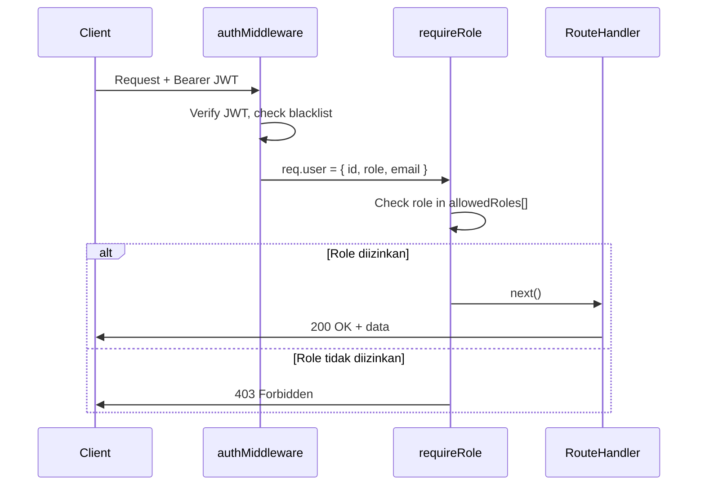

# Design Document — Role-Based Access Control (RBAC)

## Overview

Fitur ini memperluas sistem RBAC yang sudah ada dari dua role (`admin`, `surveyor`) menjadi empat role: **admin**, **supervisor**, **viewer**, dan **surveyor**. Perubahan bersifat additive — tidak ada data yang dihapus atau diubah, hanya constraint database yang diperluas dan middleware otorisasi yang diperbarui.

**Tujuan utama:**
- Delegasi akses granular: supervisor mengelola operasional survei tanpa menyentuh akun admin; viewer hanya membaca dan mengunduh laporan.
- Backward compatibility penuh: semua akun `admin` dan `surveyor` yang ada tetap berfungsi tanpa perubahan data.
- Satu sumber kebenaran untuk access control: `requireRole` middleware di backend, `ProtectedRoute` di frontend.

**Lingkup perubahan:**
1. Database: migration baru untuk memperbarui CHECK constraint kolom `role`
2. Model Sequelize `User`: tambah nilai valid `supervisor` dan `viewer`
3. Middleware `requireRole`: dukung array role
4. Route baru: `/supervisors` dan `/viewers`
5. Route yang ada: perbarui `requireRole` calls sesuai access matrix
6. Frontend `App.jsx`: `ProtectedRoute` mendukung array role
7. Frontend `Layout.jsx`: navigasi dinamis berdasarkan role
8. Frontend `AdminUsers.jsx` → `UserManagement.jsx`: halaman terpadu dengan tab per role

---

## Architecture

### Alur Otorisasi



### Arsitektur Komponen

```mermaid
graph TD
    subgraph Backend
        A[auth.js middleware] --> B[requireRole array]
        B --> C[/admins routes]
        B --> D[/supervisors routes NEW]
        B --> E[/viewers routes NEW]
        B --> F[/surveyors routes UPDATED]
        B --> G[/surveys routes UPDATED]
        B --> H[/reports routes UPDATED]
        B --> I[/dashboard routes UPDATED]
        B --> J[/map routes UPDATED]
        B --> K[/audit-logs routes UPDATED]
    end

    subgraph Frontend
        L[App.jsx ProtectedRoute] --> M[role array check]
        M --> N[Layout.jsx nav filter]
        N --> O[UserManagement.jsx UPDATED]
        N --> P[Surveys.jsx UPDATED]
        N --> Q[Surveyors.jsx UPDATED]
        N --> R[Reports.jsx UPDATED]
    end

    subgraph Database
        S[Migration: update CHECK constraint]
        T[users table: role IN admin,supervisor,viewer,surveyor]
    end
```

### Prinsip Desain

1. **Server-side authority**: Semua keputusan akses dibuat berdasarkan JWT payload yang sudah diverifikasi, bukan dari body/header request.
2. **Fail-closed**: Jika role tidak ada dalam daftar yang diizinkan, akses ditolak (403).
3. **Additive migration**: Migration baru, bukan modifikasi migration yang sudah ada.
4. **UI sebagai convenience, bukan security**: Navigasi per role di frontend hanya untuk UX; backend tetap memvalidasi setiap request.

---

## Components and Interfaces

### 1. Backend: `requireRole` (diperbarui)

**File:** `backend/src/middleware/auth.js`

```javascript
/**
 * requireRole - Check req.user.role matches one of the allowed roles
 * @param {string | string[]} roles - Single role or array of allowed roles
 */
function requireRole(roles) {
  const allowedRoles = Array.isArray(roles) ? roles : [roles];
  return (req, res, next) => {
    if (!req.user) {
      return res.status(401).json({ error: 'Sesi telah berakhir, silakan login kembali' });
    }
    if (!allowedRoles.includes(req.user.role)) {
      return res.status(403).json({ error: 'Anda tidak memiliki izin untuk mengakses resource ini' });
    }
    next();
  };
}
```

Perubahan dari implementasi saat ini:
- Parameter `role` (string) → `roles` (string | string[])
- Normalisasi ke array sebelum pengecekan
- Logika `!== role` → `!allowedRoles.includes(req.user.role)`
- Semua call site yang ada (`requireRole('admin')`) tetap berfungsi tanpa perubahan

### 2. Backend: Route `/supervisors` (baru)

**File:** `backend/src/routes/supervisors.js`

Endpoint yang disediakan:

| Method | Path | Middleware | Deskripsi |
|--------|------|-----------|-----------|
| `GET` | `/supervisors` | `auth, requireRole(['admin', 'supervisor'])` | List semua supervisor |
| `POST` | `/supervisors` | `auth, requireRole('admin')` | Buat akun supervisor baru |
| `PUT` | `/supervisors/:id` | `auth, requireRole(['admin', 'supervisor'])` | Update data supervisor (supervisor hanya diri sendiri) |
| `PATCH` | `/supervisors/:id/deactivate` | `auth, requireRole('admin')` | Nonaktifkan supervisor |
| `PATCH` | `/supervisors/:id/activate` | `auth, requireRole('admin')` | Aktifkan supervisor |

Catatan: Supervisor yang mengakses `PUT /supervisors/:id` hanya diizinkan jika `req.params.id === req.user.id` (self-update). Jika tidak, kembalikan 403.

### 3. Backend: Route `/viewers` (baru)

**File:** `backend/src/routes/viewers.js`

| Method | Path | Middleware | Deskripsi |
|--------|------|-----------|-----------|
| `GET` | `/viewers` | `auth, requireRole(['admin', 'supervisor'])` | List semua viewer |
| `POST` | `/viewers` | `auth, requireRole(['admin', 'supervisor'])` | Buat akun viewer baru |
| `PUT` | `/viewers/:id` | `auth, requireRole(['admin', 'supervisor'])` | Update data viewer |
| `PATCH` | `/viewers/:id/deactivate` | `auth, requireRole(['admin', 'supervisor'])` | Nonaktifkan viewer |
| `PATCH` | `/viewers/:id/activate` | `auth, requireRole(['admin', 'supervisor'])` | Aktifkan viewer |

### 4. Backend: Route yang Diperbarui

Perubahan `requireRole` pada route yang sudah ada:

| Route File | Endpoint | Sebelum | Sesudah |
|-----------|---------|---------|---------|
| `surveys.js` | Semua write ops | `requireRole('admin')` | `requireRole(['admin', 'supervisor'])` |
| `surveys.js` | `GET /surveys` | `requireRole('admin')` | `requireRole(['admin', 'supervisor', 'viewer', 'surveyor'])` |
| `surveys.js` | `GET /surveys/:id` | `requireRole('admin')` | `requireRole(['admin', 'supervisor', 'viewer', 'surveyor'])` |
| `questions.js` | Write ops | `requireRole('admin')` | `requireRole(['admin', 'supervisor'])` |
| `questions.js` | Read ops | `requireRole('admin')` | `requireRole(['admin', 'supervisor', 'viewer', 'surveyor'])` |
| `surveyors.js` | Semua ops | `requireRole('admin')` | `requireRole(['admin', 'supervisor'])` |
| `responses.js` | Read ops | `requireRole('admin')` | `requireRole(['admin', 'supervisor', 'viewer'])` |
| `reports.js` | Semua ops | `requireRole('admin')` | `requireRole(['admin', 'supervisor', 'viewer'])` |
| `dashboard.js` | Semua ops | `requireRole('admin')` | `requireRole(['admin', 'supervisor'])` |
| `map.js` | Read ops | `requireRole('admin')` | `requireRole(['admin', 'supervisor', 'viewer'])` |
| `upload.js` | `POST /upload/photo` | `requireRole('admin')` | `requireRole(['admin', 'supervisor', 'surveyor'])` |
| `audit-logs.js` | Semua ops | `requireRole('admin')` | `requireRole('admin')` (tidak berubah) |
| `admins.js` | Semua ops | `requireRole('admin')` | `requireRole('admin')` (tidak berubah) |

### 5. Backend: Auth Route (diperbarui)

**File:** `backend/src/routes/auth.js`

Saat login berhasil, JWT payload sudah menyertakan `role`. Tidak ada perubahan struktur JWT. Masa berlaku token untuk semua role (termasuk supervisor dan viewer) adalah 8 jam — konsisten dengan implementasi saat ini.

Audit log `LOGIN` dan `LOGOUT` sudah ada untuk admin dan surveyor; perlu dipastikan juga dicatat untuk supervisor dan viewer (tidak ada perubahan kode jika audit log sudah generic berdasarkan `req.user.id`).

### 6. Frontend: `ProtectedRoute` (diperbarui)

**File:** `frontend/src/App.jsx`

```jsx
function ProtectedRoute({ children, role }) {
  const token = localStorage.getItem('token');
  if (!token) return <Navigate to="/login" replace />;

  if (role) {
    try {
      const user = JSON.parse(localStorage.getItem('user') || '{}');
      const allowedRoles = Array.isArray(role) ? role : [role];
      if (!allowedRoles.includes(user.role)) {
        // Redirect ke halaman utama sesuai role
        const homeByRole = {
          admin: '/dashboard',
          supervisor: '/surveys',
          viewer: '/reports',
          surveyor: '/surveyor',
        };
        return <Navigate to={homeByRole[user.role] || '/login'} replace />;
      }
    } catch {
      return <Navigate to="/login" replace />;
    }
  }
  return children;
}
```

Perubahan: redirect ke halaman utama per role (bukan ke `/login`) ketika role tidak diizinkan, agar UX lebih baik.

### 7. Frontend: Navigasi Dinamis (diperbarui)

**File:** `frontend/src/components/Layout.jsx`

```javascript
const NAV_ITEMS_BY_ROLE = {
  admin: [
    { label: 'Dashboard', path: '/dashboard', icon: '📊' },
    { label: 'Manajemen Pengguna', path: '/users', icon: '👥' },
    { label: 'Surveyors', path: '/surveyors', icon: '🧑‍💼' },
    { label: 'Surveys', path: '/surveys', icon: '📋' },
    { label: 'Responses', path: '/responses', icon: '📝' },
    { label: 'Reports', path: '/reports', icon: '📈' },
    { label: 'Map', path: '/map', icon: '🗺️' },
    { label: 'Audit Log', path: '/audit-log', icon: '🔍' },
  ],
  supervisor: [
    { label: 'Dashboard', path: '/dashboard', icon: '📊' },
    { label: 'Surveys', path: '/surveys', icon: '📋' },
    { label: 'Surveyors', path: '/surveyors', icon: '🧑‍💼' },
    { label: 'Responses', path: '/responses', icon: '📝' },
    { label: 'Reports', path: '/reports', icon: '📈' },
    { label: 'Map', path: '/map', icon: '🗺️' },
  ],
  viewer: [
    { label: 'Reports', path: '/reports', icon: '📈' },
    { label: 'Map', path: '/map', icon: '🗺️' },
    { label: 'Responses', path: '/responses', icon: '📝' },
  ],
  surveyor: [], // surveyor menggunakan layout terpisah
};
```

`Layout.jsx` membaca `user.role` dari `localStorage` dan menggunakan `NAV_ITEMS_BY_ROLE[user.role]` untuk merender navigasi.

### 8. Frontend: Halaman Manajemen Pengguna Terpadu

**File:** `frontend/src/pages/UserManagement.jsx` (menggantikan `AdminUsers.jsx`)

Halaman ini menampilkan pengguna dalam tab berdasarkan role:

```
┌─────────────────────────────────────────────────────┐
│  Manajemen Pengguna                    [+ Tambah]   │
├──────────┬────────────┬──────────────────────────────┤
│  Admin   │ Supervisor │ Viewer                       │
│  (tab)   │  (tab)     │ (tab)                        │
├──────────┴────────────┴──────────────────────────────┤
│  Tabel pengguna sesuai tab aktif                     │
│  Kolom: Nama | Email | Status | Dibuat | Aksi        │
└─────────────────────────────────────────────────────┘
```

**Visibilitas tab per role:**
- `admin`: Tab Admin, Supervisor, Viewer (semua)
- `supervisor`: Tab Viewer saja (Admin dan Supervisor disembunyikan)

**Tombol "Tambah":**
- `admin`: Dapat membuat akun Admin, Supervisor, Viewer (pilihan role di form modal)
- `supervisor`: Hanya dapat membuat akun Viewer

**Form modal** menggunakan komponen yang sama dengan `AdminFormModal` yang sudah ada, dengan tambahan field `role` (dropdown) yang difilter berdasarkan role pengguna yang login.

---

## Data Models

### Perubahan Model `User`

**File:** `backend/src/models/User.js`

```javascript
role: {
  type: DataTypes.STRING(20),
  allowNull: false,
  validate: {
    // Diperluas dari ['admin', 'surveyor']
    isIn: [['admin', 'supervisor', 'viewer', 'surveyor']],
  },
},
```

Tidak ada perubahan struktur tabel — hanya perluasan nilai yang valid pada constraint.

### Migration Baru

**File:** `backend/src/migrations/20240102000001-update-role-constraint.js`

```javascript
'use strict';

module.exports = {
  async up(queryInterface) {
    await queryInterface.sequelize.transaction(async (t) => {
      // 1. Drop constraint lama
      await queryInterface.sequelize.query(
        `ALTER TABLE users DROP CONSTRAINT IF EXISTS users_role_check;`,
        { transaction: t }
      );
      // 2. Tambah constraint baru dengan empat nilai valid
      await queryInterface.sequelize.query(
        `ALTER TABLE users ADD CONSTRAINT users_role_check
         CHECK (role IN ('admin', 'supervisor', 'viewer', 'surveyor'));`,
        { transaction: t }
      );
    });
  },

  async down(queryInterface) {
    await queryInterface.sequelize.transaction(async (t) => {
      await queryInterface.sequelize.query(
        `ALTER TABLE users DROP CONSTRAINT IF EXISTS users_role_check;`,
        { transaction: t }
      );
      await queryInterface.sequelize.query(
        `ALTER TABLE users ADD CONSTRAINT users_role_check
         CHECK (role IN ('admin', 'surveyor'));`,
        { transaction: t }
      );
    });
  },
};
```

**Keamanan migrasi:**
- Dijalankan dalam satu transaksi → rollback otomatis jika gagal
- `DROP CONSTRAINT IF EXISTS` → idempoten, tidak error jika dijalankan ulang
- Tidak mengubah data yang ada, hanya constraint schema

### Audit Log Actions Baru

Tabel `audit_logs` tidak berubah strukturnya. Action baru yang akan dicatat:

| Action | Trigger |
|--------|---------|
| `CREATE_SUPERVISOR` | POST /supervisors berhasil |
| `UPDATE_SUPERVISOR` | PUT /supervisors/:id berhasil |
| `DEACTIVATE_SUPERVISOR` | PATCH /supervisors/:id/deactivate berhasil |
| `ACTIVATE_SUPERVISOR` | PATCH /supervisors/:id/activate berhasil |
| `CREATE_VIEWER` | POST /viewers berhasil |
| `UPDATE_VIEWER` | PUT /viewers/:id berhasil |
| `DEACTIVATE_VIEWER` | PATCH /viewers/:id/deactivate berhasil |
| `ACTIVATE_VIEWER` | PATCH /viewers/:id/activate berhasil |

---

## Correctness Properties

*A property is a characteristic or behavior that should hold true across all valid executions of a system — essentially, a formal statement about what the system should do. Properties serve as the bridge between human-readable specifications and machine-verifiable correctness guarantees.*

### Property 1: Validasi Role — Hanya Empat Nilai Valid

*For any* string yang diberikan sebagai nilai role, fungsi validasi SHALL menerima string tersebut jika dan hanya jika string tersebut adalah salah satu dari `'admin'`, `'supervisor'`, `'viewer'`, atau `'surveyor'`; dan SHALL menolak semua string lainnya.

**Validates: Requirements 1.1, 1.3**

---

### Property 2: Access Matrix — Unauthorized Role Selalu Mendapat 403

*For any* kombinasi (role, endpoint, method) di mana role tidak tercantum sebagai diizinkan dalam Access Matrix (Requirement 7), `requireRole` SHALL mengembalikan HTTP 403 dengan pesan error yang sesuai.

**Validates: Requirements 6.3, 7.1, 7.2, 11.1**

---

### Property 3: Access Matrix — Authorized Role Tidak Pernah Mendapat 403 Karena Role

*For any* kombinasi (role, endpoint, method) di mana role tercantum sebagai diizinkan dalam Access Matrix, `requireRole` SHALL meneruskan request ke handler berikutnya dan tidak mengembalikan HTTP 403 karena alasan role.

**Validates: Requirements 6.2, 7.1, 11.2**

---

### Property 4: Idempotency `requireRole`

*For any* role pengguna dan *for any* daftar role yang diizinkan, memanggil `requireRole(allowedRoles)` dua kali berturut-turut pada request yang sama SHALL menghasilkan keputusan akses yang identik (keduanya allow atau keduanya deny).

**Validates: Requirements 11.3**

---

### Property 5: Supervisor Tidak Dapat Membuat Akun Admin atau Supervisor

*For any* data akun yang valid (nama, email, password) dengan role `'admin'` atau `'supervisor'`, permintaan pembuatan akun yang dilakukan oleh pengguna dengan role `supervisor` SHALL selalu ditolak dengan HTTP 403.

**Validates: Requirements 5.4, 11.4**

---

### Property 6: Audit Log Selalu Dicatat untuk Operasi Supervisor dan Viewer

*For any* operasi create, update, atau deactivate yang berhasil pada akun supervisor atau viewer, SHALL selalu terdapat entri baru di tabel `audit_logs` dengan action yang sesuai (`CREATE_SUPERVISOR`, `UPDATE_VIEWER`, dll.), `user_id` pembuat, dan timestamp UTC.

**Validates: Requirements 5.6, 5.7, 5.8**

---

### Property 7: Navigasi UI Konsisten dengan Role

*For any* nilai role yang valid (`admin`, `supervisor`, `viewer`), fungsi `getNavItemsForRole(role)` SHALL mengembalikan tepat himpunan item navigasi yang didefinisikan untuk role tersebut — tidak lebih, tidak kurang.

**Validates: Requirements 8.1, 8.2**

---

### Property 8: JWT Payload Mengandung Role yang Benar

*For any* akun pengguna dengan role `supervisor` atau `viewer` yang berhasil login, JWT yang diterbitkan SHALL mengandung field `role` dengan nilai yang identik dengan role yang tersimpan di database untuk pengguna tersebut.

**Validates: Requirements 6.6**

---

### Property 9: Duplikasi Email Selalu Ditolak

*For any* email yang sudah terdaftar di sistem, upaya pembuatan akun baru (dengan role apapun) menggunakan email yang sama SHALL selalu ditolak dengan HTTP 409.

**Validates: Requirements 5.10**

---

## Error Handling

### Backend Error Responses

Semua error response mengikuti format yang sudah ada: `{ "error": "pesan deskriptif" }`. Tidak ada stack trace atau detail internal yang diekspos.

| Kondisi | HTTP Status | Pesan |
|---------|------------|-------|
| Token tidak ada / tidak valid | 401 | "Sesi telah berakhir, silakan login kembali" |
| Token di-blacklist | 401 | "Sesi telah berakhir, silakan login kembali" |
| Role tidak diizinkan | 403 | "Anda tidak memiliki izin untuk mengakses resource ini" |
| Self-deactivation | 403 | "Tidak dapat menonaktifkan akun sendiri" |
| Role tidak valid saat create | 422 | "Role tidak valid. Nilai yang diizinkan: admin, supervisor, viewer, surveyor" |
| Email sudah terdaftar | 409 | "Email sudah terdaftar" |
| Password tidak memenuhi syarat | 422 | "Password harus minimal 8 karakter, mengandung huruf besar, huruf kecil, dan angka" |
| Resource tidak ditemukan | 404 | "[Resource] tidak ditemukan" |

### Frontend Error Handling

- Token expired / 401 response: `api.js` interceptor menghapus `localStorage` dan redirect ke `/login`
- 403 response: tampilkan pesan "Anda tidak memiliki izin" tanpa redirect
- Network error: tampilkan pesan "Gagal terhubung ke server. Silakan coba lagi."

### Validasi Input

Validasi dilakukan di dua lapisan:
1. **Frontend**: validasi form sebelum submit (UX, bukan security)
2. **Backend**: validasi ulang semua input sebelum operasi database (security)

---

## Testing Strategy

### Pendekatan Dual Testing

Fitur ini menggunakan dua pendekatan testing yang saling melengkapi:

1. **Unit tests** (`backend/tests/unit/`): Verifikasi contoh spesifik, edge case, dan kondisi error
2. **Property-based tests** (`backend/tests/properties/`): Verifikasi properti universal menggunakan `fast-check`

### Property-Based Tests

Library: **fast-check** (sudah digunakan di proyek, lihat `auth.property.test.js`)
Konfigurasi: minimum **100 iterasi** per property test.

**File baru:** `backend/tests/properties/rbac.property.test.js`

Setiap property test harus diberi tag komentar:
```javascript
// Feature: role-based-access-control, Property N: <deskripsi singkat>
```

**Property 1 — Validasi Role:**
```javascript
// Feature: role-based-access-control, Property 1: role validation accepts only four valid values
fc.assert(fc.property(fc.string(), (roleStr) => {
  const valid = ['admin', 'supervisor', 'viewer', 'surveyor'];
  const result = isValidRole(roleStr);
  return result === valid.includes(roleStr);
}), { numRuns: 100 });
```

**Property 2 & 3 — Access Matrix:**
Enumerate semua kombinasi (role, endpoint, method) dari access matrix. Untuk setiap kombinasi, buat mock `req` dengan role yang sesuai dan verifikasi keputusan `requireRole`.

```javascript
// Feature: role-based-access-control, Property 2: unauthorized role always gets 403
// Feature: role-based-access-control, Property 3: authorized role never gets 403 due to role
const ACCESS_MATRIX = [
  { endpoint: 'GET /admins',    allowed: ['admin'] },
  { endpoint: 'POST /admins',   allowed: ['admin'] },
  { endpoint: 'GET /surveys',   allowed: ['admin', 'supervisor', 'viewer', 'surveyor'] },
  // ... semua kombinasi dari Requirement 7
];
```

**Property 4 — Idempotency:**
```javascript
// Feature: role-based-access-control, Property 4: requireRole is idempotent
fc.assert(fc.property(
  fc.constantFrom('admin', 'supervisor', 'viewer', 'surveyor'),
  fc.subarray(['admin', 'supervisor', 'viewer', 'surveyor'], { minLength: 1 }),
  (userRole, allowedRoles) => {
    const result1 = evaluateRequireRole(userRole, allowedRoles);
    const result2 = evaluateRequireRole(userRole, allowedRoles);
    return result1 === result2;
  }
), { numRuns: 100 });
```

**Property 5 — Supervisor tidak dapat membuat admin/supervisor:**
```javascript
// Feature: role-based-access-control, Property 5: supervisor cannot create admin or supervisor accounts
fc.assert(fc.property(
  fc.record({ name: fc.string({ minLength: 1 }), email: fc.emailAddress(), password: validPasswordArb }),
  fc.constantFrom('admin', 'supervisor'),
  async (userData, targetRole) => {
    const res = await request(app)
      .post(`/${targetRole}s`)
      .set('Authorization', `Bearer ${supervisorToken}`)
      .send({ ...userData, role: targetRole });
    return res.status === 403;
  }
), { numRuns: 100 });
```

**Property 6 — Audit log:**
```javascript
// Feature: role-based-access-control, Property 6: audit log always created for supervisor/viewer operations
```

**Property 7 — Navigasi UI:**
```javascript
// Feature: role-based-access-control, Property 7: nav items consistent with role
fc.assert(fc.property(
  fc.constantFrom('admin', 'supervisor', 'viewer'),
  (role) => {
    const items = getNavItemsForRole(role);
    const expected = NAV_ITEMS_BY_ROLE[role];
    return items.length === expected.length &&
      items.every(item => expected.some(e => e.path === item.path));
  }
), { numRuns: 100 });
```

### Unit Tests

**File baru:** `backend/tests/unit/supervisors.test.js`
- CRUD operations untuk supervisor
- Self-update restriction
- Audit log entries

**File baru:** `backend/tests/unit/viewers.test.js`
- CRUD operations untuk viewer
- Read-only access enforcement
- Audit log entries

**File diperbarui:** `backend/tests/unit/auth.test.js`
- Login dengan role supervisor dan viewer
- JWT payload mengandung role yang benar
- Masa berlaku token 8 jam

**File diperbarui:** `backend/tests/unit/surveyors.test.js`
- Supervisor dapat mengakses endpoint surveyors
- Viewer tidak dapat mengakses endpoint surveyors

### Smoke Tests

**File baru:** `backend/tests/integration/rbac-migration.test.js`
- Verifikasi CHECK constraint setelah migration
- Verifikasi data lama (admin, surveyor) tidak berubah
- Verifikasi migration idempoten

### Frontend Tests

**File baru:** `frontend/src/pages/__tests__/UserManagement.test.jsx`
- Tab visibility per role
- Form modal dengan pilihan role yang benar
- Tombol aksi yang sesuai per role

**File diperbarui:** `frontend/src/components/__tests__/Layout.test.jsx`
- Nav items yang ditampilkan sesuai role

---

## Migration Strategy

### Urutan Deployment

Strategi deployment menggunakan **expand-contract pattern** untuk zero-downtime:

```
Phase 1 (Expand):
  1. Deploy migration baru → constraint diperluas ke 4 role
  2. Deploy backend baru → requireRole mendukung array, route baru tersedia
  3. Deploy frontend baru → navigasi dinamis, halaman UserManagement

Phase 2 (Verify):
  4. Verifikasi semua akun lama (admin, surveyor) masih berfungsi
  5. Buat akun supervisor dan viewer pertama untuk testing
  6. Verifikasi access matrix berjalan sesuai requirements

Phase 3 (Rollback plan jika diperlukan):
  7. Jalankan migration down → constraint kembali ke 2 role
  8. Deploy backend lama → requireRole string-only
  9. Deploy frontend lama
```

### Checklist Migrasi

- [ ] Backup database sebelum menjalankan migration
- [ ] Jalankan `npx sequelize-cli db:migrate` di environment staging terlebih dahulu
- [ ] Verifikasi `\d users` di psql menunjukkan constraint baru
- [ ] Jalankan test suite lengkap di staging
- [ ] Deploy ke production dengan maintenance window minimal (migration hanya ALTER TABLE, tidak lock lama)
- [ ] Monitor error logs selama 30 menit setelah deployment

### Backward Compatibility

- Semua akun `admin` dan `surveyor` yang ada tidak perlu diubah
- JWT yang sudah diterbitkan tetap valid (payload `role` sudah ada)
- Semua call `requireRole('admin')` yang ada tetap berfungsi karena parameter string masih didukung
- Route `/admin-users` di frontend dapat di-redirect ke `/users` dengan `<Navigate>` untuk backward compatibility URL
