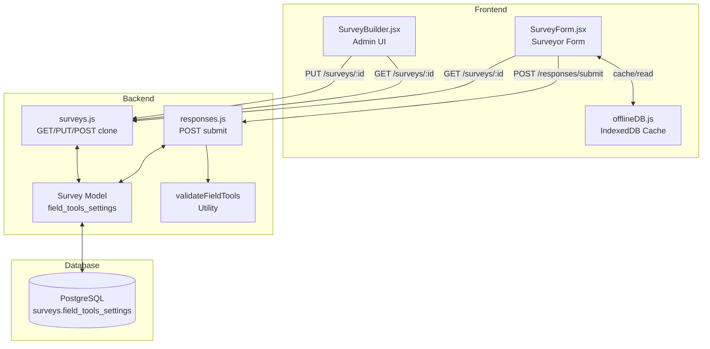

# Design Document: Survey Field Tools Settings

## Overview

Fitur ini menambahkan kolom JSONB `field_tools_settings` pada tabel `surveys` untuk mengontrol apakah setiap field tool (signature, audio, photo, GPS) bersifat `required`, `optional`, atau `disabled` per survei. Saat ini semua field tools selalu ditampilkan dan diwajibkan. Dengan fitur ini, admin dapat mengonfigurasi setiap field tool secara independen melalui Survey Builder, dan SurveyForm akan menyesuaikan tampilan serta validasi berdasarkan konfigurasi tersebut.

### Komponen yang Terpengaruh

- **Database**: Migrasi baru untuk menambah kolom `field_tools_settings` pada tabel `surveys`
- **Backend Model**: `Survey.js` — menambah field dan validasi
- **Backend Routes**: `surveys.js` — GET/PUT menyertakan `field_tools_settings`, clone menyalin settings
- **Backend Routes**: `responses.js` — validasi submission berdasarkan settings
- **Frontend Admin**: `SurveyBuilder.jsx` — UI konfigurasi field tools
- **Frontend Surveyor**: `SurveyForm.jsx` — tampilan field tools berdasarkan settings
- **Offline Support**: `offlineDB.js` dan `useSyncManager` — cache settings untuk offline

### Design Decisions

1. **JSONB column vs separate table**: Menggunakan JSONB column karena settings selalu 1:1 dengan survey, jumlah field tools tetap (4), dan tidak perlu query terpisah. JSONB juga mendukung partial update dan indexing jika diperlukan.

2. **Default `required` untuk backward compatibility**: Semua survei yang sudah ada akan mendapat default `required` untuk keempat field tools, sehingga perilaku tidak berubah tanpa konfigurasi eksplisit.

3. **Validasi di backend dan frontend**: Validasi field tools dilakukan di kedua sisi — frontend untuk UX (menyembunyikan/menampilkan komponen), backend untuk keamanan data (menolak submission yang tidak sesuai konfigurasi).

## Architecture



### Alur Data

1. **Admin mengonfigurasi**: SurveyBuilder → PUT `/surveys/:id` dengan `field_tools_settings` → Survey model menyimpan ke DB
2. **Surveyor memuat form**: SurveyForm → GET `/surveys/:id` → response menyertakan `field_tools_settings` → form menyesuaikan tampilan
3. **Surveyor submit**: SurveyForm → POST `/responses/submit` → backend memuat survey settings → validasi field tools → simpan/tolak
4. **Offline**: SurveyForm → cache survey data termasuk `field_tools_settings` ke IndexedDB → form offline menggunakan cached settings

## Components and Interfaces

### 1. Database Migration

**File**: `backend/src/migrations/20240109000001-add-field-tools-settings.js`

Menambah kolom `field_tools_settings` bertipe JSONB pada tabel `surveys` dengan default value:

```javascript
{
  signature_mode: 'required',
  audio_mode: 'required',
  photo_mode: 'required',
  gps_mode: 'required'
}
```

Migration juga mengupdate semua survei yang sudah ada dengan default value yang sama.

### 2. Survey Model Update

**File**: `backend/src/models/Survey.js`

Menambah field `field_tools_settings` dengan tipe `DataTypes.JSONB`, default value, dan validasi custom yang memastikan setiap mode bernilai `required`, `optional`, atau `disabled`.

### 3. Field Tools Validation Utility

**File**: `backend/src/utils/fieldToolsValidator.js`

Pure function untuk memvalidasi `field_tools_settings` object dan memvalidasi submission data terhadap settings.

```javascript
/**
 * Validasi objek field_tools_settings.
 * @param {object} settings - Objek field_tools_settings
 * @returns {{ valid: boolean, error?: string }}
 */
function validateFieldToolsSettings(settings) { ... }

/**
 * Validasi submission data terhadap field_tools_settings survei.
 * @param {object} submissionData - { signature_path, audio_path, photo_paths, latitude, longitude }
 * @param {object} settings - field_tools_settings dari survei
 * @returns {{ valid: boolean, error?: string }}
 */
function validateFieldToolsSubmission(submissionData, settings) { ... }

/**
 * Mengembalikan default field_tools_settings.
 * @returns {object}
 */
function getDefaultFieldToolsSettings() { ... }
```

### 4. Survey Routes Update

**File**: `backend/src/routes/surveys.js`

- **GET `/surveys/:id`**: Menyertakan `field_tools_settings` dalam response attributes
- **PUT `/surveys/:id`**: Menerima dan memvalidasi `field_tools_settings` dari request body, menyimpan ke model
- **POST `/surveys/:id/clone`**: Menyalin `field_tools_settings` dari survei sumber ke survei kloning
- **POST `/surveys`**: Survei baru otomatis mendapat default `field_tools_settings`

### 5. Response Routes Update

**File**: `backend/src/routes/responses.js`

- **POST `/responses/submit`**: Sebelum menyimpan, memuat `field_tools_settings` dari survei terkait, lalu memanggil `validateFieldToolsSubmission()` untuk memvalidasi data field tools dalam submission

### 6. SurveyBuilder UI Component

**File**: `frontend/src/pages/SurveyBuilder.jsx`

Menambah section "Pengaturan Field Tools" di bawah date picker section. Setiap field tool ditampilkan dengan 3 radio button: Wajib, Opsional, Nonaktif. Perubahan disimpan via PUT `/surveys/:id`.

```
┌─────────────────────────────────────────────┐
│ Pengaturan Field Tools                       │
├─────────────────────────────────────────────┤
│ Tanda Tangan    ○ Wajib  ○ Opsional  ○ Nonaktif │
│ Rekaman Audio   ○ Wajib  ○ Opsional  ○ Nonaktif │
│ Pengambilan Foto ○ Wajib  ○ Opsional  ○ Nonaktif │
│ Lokasi GPS      ○ Wajib  ○ Opsional  ○ Nonaktif │
│                              [Simpan Pengaturan] │
└─────────────────────────────────────────────┘
```

### 7. SurveyForm Update

**File**: `frontend/src/surveyor/pages/SurveyForm.jsx`

- Membaca `field_tools_settings` dari survey data (online atau cached)
- Menyembunyikan komponen field tool yang `disabled`
- Menampilkan label "(Opsional)" atau "(Wajib)" sesuai mode
- Melewatkan validasi signature required jika mode bukan `required`
- Menyesuaikan submission payload — tidak mengirim data field tool yang `disabled`

### 8. Offline Support Update

**File**: `frontend/src/utils/offlineDB.js`

Tidak perlu perubahan struktural — `field_tools_settings` sudah termasuk dalam survey object yang di-cache oleh `cacheSurvey()`. SurveyForm membaca settings dari cached survey saat offline.

## Data Models

### Survey Table — New Column

| Column | Type | Default | Nullable | Description |
|--------|------|---------|----------|-------------|
| `field_tools_settings` | JSONB | `{"signature_mode":"required","audio_mode":"required","photo_mode":"required","gps_mode":"required"}` | false | Konfigurasi mode setiap field tool |

### field_tools_settings Schema

```json
{
  "signature_mode": "required" | "optional" | "disabled",
  "audio_mode": "required" | "optional" | "disabled",
  "photo_mode": "required" | "optional" | "disabled",
  "gps_mode": "required" | "optional" | "disabled"
}
```

### Validation Rules

- Setiap properti (`signature_mode`, `audio_mode`, `photo_mode`, `gps_mode`) wajib ada
- Setiap nilai hanya boleh `required`, `optional`, atau `disabled`
- Objek tidak boleh memiliki properti tambahan selain keempat properti di atas

### API Response Format

**GET /surveys/:id** — response body ditambah field:

```json
{
  "id": "uuid",
  "title": "...",
  "field_tools_settings": {
    "signature_mode": "required",
    "audio_mode": "optional",
    "photo_mode": "disabled",
    "gps_mode": "required"
  },
  "questions": [...]
}
```

**PUT /surveys/:id** — request body (partial update):

```json
{
  "field_tools_settings": {
    "signature_mode": "optional",
    "audio_mode": "disabled",
    "photo_mode": "required",
    "gps_mode": "optional"
  }
}
```


## Correctness Properties

*A property is a characteristic or behavior that should hold true across all valid executions of a system — essentially, a formal statement about what the system should do. Properties serve as the bridge between human-readable specifications and machine-verifiable correctness guarantees.*

### Property 1: Settings round-trip preservation

*For any* valid `field_tools_settings` object (where each of the four modes is one of `required`, `optional`, `disabled`), updating a survey via PUT `/surveys/:id` with that settings object and then retrieving it via GET `/surveys/:id` should return the exact same `field_tools_settings` object.

**Validates: Requirements 1.1, 3.1**

### Property 2: Mode validation rejects invalid values

*For any* string that is not one of `required`, `optional`, or `disabled`, attempting to save a `field_tools_settings` object containing that string as any mode value should be rejected with a validation error. Conversely, *for any* settings object where all four modes are drawn from `{required, optional, disabled}`, the settings should be accepted.

**Validates: Requirements 1.3, 1.4, 3.4**

### Property 3: Required field tools enforcement

*For any* field tool (signature, audio, photo, GPS) that is set to `required` in a survey's `field_tools_settings`, submitting a response without the corresponding data (signature_path, audio_path, photo_paths, latitude/longitude) should be rejected with HTTP 422 and the appropriate error message.

**Validates: Requirements 5.1, 5.2, 5.3, 5.4**

### Property 4: Optional field tools acceptance

*For any* field tool set to `optional` in a survey's `field_tools_settings`, submitting a response should be accepted regardless of whether the corresponding field tool data is present or absent.

**Validates: Requirements 4.4, 4.5, 4.6, 4.7, 5.5**

### Property 5: Disabled field tools ignored

*For any* field tool set to `disabled` in a survey's `field_tools_settings`, submitting a response with or without data for that field tool should be accepted, and the disabled field tool's data should not cause validation errors.

**Validates: Requirements 5.6**

### Property 6: Clone preserves field tools settings

*For any* valid `field_tools_settings` configuration on a source survey, cloning that survey via POST `/surveys/:id/clone` should produce a new survey with identical `field_tools_settings`.

**Validates: Requirements 3.5**

## Error Handling

### Backend Validation Errors

| Scenario | HTTP Status | Error Message |
|----------|-------------|---------------|
| `field_tools_settings` berisi mode tidak valid | 422 | `"Nilai field tool mode tidak valid. Gunakan: required, optional, atau disabled"` |
| `field_tools_settings` missing required property | 422 | `"Field tools settings harus memiliki properti: signature_mode, audio_mode, photo_mode, gps_mode"` |
| Submission tanpa signature saat `signature_mode: required` | 422 | `"Tanda tangan wajib diisi"` |
| Submission tanpa audio saat `audio_mode: required` | 422 | `"Rekaman audio wajib diisi"` |
| Submission tanpa photo saat `photo_mode: required` | 422 | `"Foto wajib diisi"` |
| Submission tanpa GPS saat `gps_mode: required` | 422 | `"Lokasi GPS wajib diisi"` |

### Frontend Error Handling

- Jika PUT gagal saat menyimpan field tools settings, tampilkan pesan error di SurveyBuilder dan pertahankan state sebelumnya
- Jika GET gagal memuat settings, gunakan default `required` untuk semua field tools sebagai fallback
- Jika submission ditolak karena field tools validation, tampilkan pesan error spesifik dan scroll ke komponen field tool yang bermasalah

### Offline Error Handling

- Jika cached survey tidak memiliki `field_tools_settings` (survei di-cache sebelum fitur ini), gunakan default `required` untuk backward compatibility
- Validasi field tools tetap dilakukan saat sinkronisasi online — jika gagal, response masuk ke error queue dengan pesan error

## Testing Strategy

### Property-Based Tests (fast-check)

Property-based testing cocok untuk fitur ini karena:
- `validateFieldToolsSettings()` dan `validateFieldToolsSubmission()` adalah pure functions dengan input/output yang jelas
- Input space besar (kombinasi 4 mode × 3 nilai = 81 kombinasi settings, ditambah variasi submission data)
- Universal properties yang harus berlaku untuk semua kombinasi input

**Library**: `fast-check` (sudah digunakan di project)
**Minimum iterations**: 100 per property test
**Tag format**: `Feature: survey-field-tools-settings, Property {number}: {property_text}`

Property tests yang akan diimplementasi:
1. **Property 1**: Round-trip — generate random valid settings, PUT, GET, compare
2. **Property 2**: Validation — generate random strings, verify accept/reject behavior
3. **Property 3**: Required enforcement — generate random required tool + missing data combinations, verify rejection
4. **Property 4**: Optional acceptance — generate random optional tool + present/absent data combinations, verify acceptance
5. **Property 5**: Disabled ignored — generate random disabled tool + data combinations, verify acceptance
6. **Property 6**: Clone preservation — generate random valid settings, clone, compare

### Unit Tests

- Default value pada survei baru (Requirement 1.2, 6.3)
- GET `/surveys/:id` menyertakan `field_tools_settings` untuk admin (Requirement 3.2)
- GET `/surveys/:id` menyertakan `field_tools_settings` untuk surveyor (Requirement 3.3)
- SurveyBuilder menampilkan section "Pengaturan Field Tools" (Requirement 2.1)
- SurveyBuilder menampilkan 3 opsi per field tool (Requirement 2.2)
- SurveyBuilder menyimpan perubahan via PUT (Requirement 2.3)
- SurveyBuilder menampilkan settings yang tersimpan (Requirement 2.4)

### Integration Tests

- Offline caching menyertakan `field_tools_settings` (Requirement 7.1)
- Offline form menerapkan cached settings (Requirement 7.2)
- Offline submission menyertakan settings info (Requirement 7.3)

### Smoke Tests

- Migrasi berhasil menambah kolom `field_tools_settings` (Requirement 6.1)
- Migrasi menetapkan default untuk survei yang sudah ada (Requirement 6.2)
