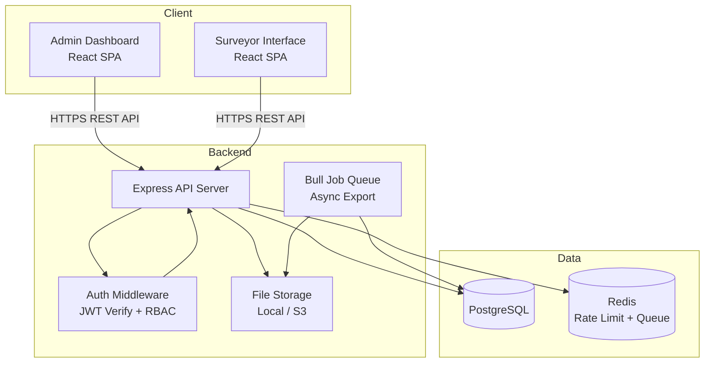
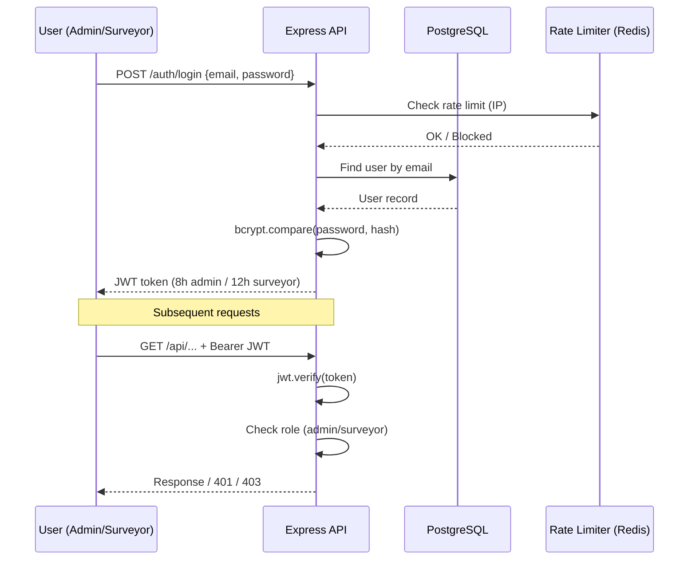
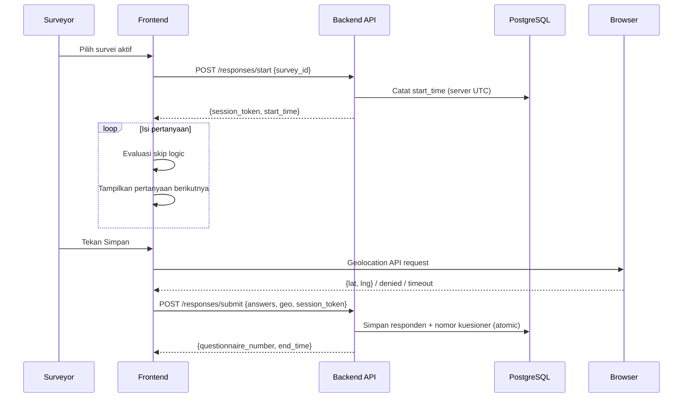

# Design Document: Web Survey Platform

## Overview

Web Survey Platform adalah aplikasi survei berbasis web full-stack yang memungkinkan admin mengelola survei dan surveyor, serta memungkinkan surveyor mengisi data responden secara online. Platform ini dirancang untuk mendukung pengumpulan data lapangan terstruktur dengan fitur skip logic, randomisasi jawaban, upload foto, pencatatan geolokasi, dan ekspor laporan.

### Tujuan Desain

- **Keandalan**: Data responden tidak boleh hilang; setiap penyimpanan bersifat atomik.
- **Keamanan**: Autentikasi JWT, otorisasi berbasis peran (RBAC), rate limiting, dan audit log.
- **Skalabilitas**: Ekspor data besar diproses secara asinkron.
- **Ketepatan Data**: Timestamp server (UTC), nomor kuesioner unik, dan geolokasi presisi tinggi.

### Stack Teknologi

| Layer | Teknologi |
|---|---|
| Frontend (Admin Dashboard) | React + Vite + Tailwind CSS |
| Frontend (Surveyor) | React + Vite + Tailwind CSS (SPA terpisah atau route terpisah) |
| Backend API | Node.js + Express.js |
| Database | PostgreSQL |
| ORM | Sequelize |
| Autentikasi | JWT (jsonwebtoken) + bcrypt |
| File Storage | Local filesystem (dapat diganti S3) |
| Ekspor | exceljs (xlsx) + csv-stringify |
| Peta | Leaflet.js |
| Job Queue | Bull + Redis (untuk ekspor asinkron) |
| Property-Based Testing | fast-check (JavaScript) |

---

## Architecture

### Arsitektur Sistem



### Arsitektur Autentikasi & Otorisasi



### Alur Pengisian Responden



---

## Components and Interfaces

### Backend Components

#### 1. Auth Module (`/routes/auth.js`)

| Endpoint | Method | Deskripsi |
|---|---|---|
| `/auth/login` | POST | Login admin atau surveyor, return JWT |
| `/auth/logout` | POST | Invalidasi session (blacklist token di Redis) |
| `/auth/me` | GET | Ambil profil user dari JWT |

#### 2. Admin Management Module (`/routes/admins.js`)

| Endpoint | Method | Deskripsi |
|---|---|---|
| `/admins` | GET | Daftar semua admin |
| `/admins` | POST | Buat admin baru |
| `/admins/:id` | PUT | Update data admin |
| `/admins/:id/deactivate` | PATCH | Nonaktifkan admin |

#### 3. Surveyor Management Module (`/routes/surveyors.js`)

| Endpoint | Method | Deskripsi |
|---|---|---|
| `/surveyors` | GET | Daftar semua surveyor |
| `/surveyors` | POST | Buat surveyor baru |
| `/surveyors/:id` | PUT | Update data surveyor |
| `/surveyors/:id/deactivate` | PATCH | Nonaktifkan surveyor |
| `/surveyors/:id/activate` | PATCH | Aktifkan kembali surveyor |
| `/surveyors/:id/quota` | GET | Ringkasan kuota per survei |

#### 4. Survey Management Module (`/routes/surveys.js`)

| Endpoint | Method | Deskripsi |
|---|---|---|
| `/surveys` | GET | Daftar survei (admin: semua; surveyor: aktif saja) |
| `/surveys` | POST | Buat survei baru (draft) |
| `/surveys/:id` | GET | Detail survei + pertanyaan |
| `/surveys/:id` | PUT | Update survei |
| `/surveys/:id/activate` | PATCH | Aktifkan survei |
| `/surveys/:id/deactivate` | PATCH | Nonaktifkan survei |
| `/surveys/:id` | DELETE | Hapus survei draft |

#### 5. Question Management Module (`/routes/questions.js`)

| Endpoint | Method | Deskripsi |
|---|---|---|
| `/surveys/:id/questions` | GET | Daftar pertanyaan survei |
| `/surveys/:id/questions` | POST | Tambah pertanyaan |
| `/surveys/:id/questions/:qid` | PUT | Update pertanyaan + skip logic |
| `/surveys/:id/questions/:qid` | DELETE | Hapus pertanyaan |
| `/surveys/:id/questions/reorder` | PATCH | Ubah urutan pertanyaan |

#### 6. Response Module (`/routes/responses.js`)

| Endpoint | Method | Deskripsi |
|---|---|---|
| `/responses/start` | POST | Mulai sesi pengisian (catat start_time) |
| `/responses/submit` | POST | Simpan data responden lengkap |
| `/responses` | GET | Daftar responden (admin: semua; surveyor: milik sendiri) |
| `/responses/:id` | GET | Detail responden |

#### 7. Report & Export Module (`/routes/reports.js`)

| Endpoint | Method | Deskripsi |
|---|---|---|
| `/reports/surveys/:id` | GET | Data laporan dengan filter |
| `/reports/surveys/:id/export/xlsx` | POST | Trigger ekspor Excel (async jika >1000) |
| `/reports/surveys/:id/export/csv` | POST | Trigger ekspor CSV |
| `/reports/exports/:jobId` | GET | Cek status job ekspor |
| `/reports/exports/:jobId/download` | GET | Download file ekspor |

#### 8. Dashboard Module (`/routes/dashboard.js`)

| Endpoint | Method | Deskripsi |
|---|---|---|
| `/dashboard/stats` | GET | Statistik ringkasan |
| `/dashboard/trend` | GET | Tren 7 hari terakhir |
| `/dashboard/top-surveyors` | GET | Top 5 surveyor |

#### 9. Map Module (`/routes/map.js`)

| Endpoint | Method | Deskripsi |
|---|---|---|
| `/map/points` | GET | Titik geolokasi dengan filter survei/surveyor/tanggal |

#### 10. Upload Module (`/routes/upload.js`)

| Endpoint | Method | Deskripsi |
|---|---|---|
| `/upload/photo` | POST | Upload foto (multipart/form-data) |

### Frontend Components

#### Admin Dashboard

```
src/
├── pages/
│   ├── Login.jsx
│   ├── Dashboard.jsx          # Statistik + grafik tren
│   ├── AdminUsers.jsx         # Manajemen admin
│   ├── Surveyors.jsx          # Manajemen surveyor + kuota
│   ├── Surveys.jsx            # Daftar survei
│   ├── SurveyBuilder.jsx      # Builder pertanyaan + skip logic
│   ├── Responses.jsx          # Laporan responden
│   ├── ResponseDetail.jsx     # Detail responden
│   ├── Reports.jsx            # Ekspor data
│   ├── MapView.jsx            # Peta sebaran geolokasi
│   └── AuditLog.jsx           # Log aktivitas
├── components/
│   ├── Layout.jsx
│   ├── SkipLogicEditor.jsx    # Komponen konfigurasi skip logic
│   ├── QuotaProgress.jsx      # Indikator progres kuota
│   └── GeoMap.jsx             # Komponen peta Leaflet
└── services/
    └── api.js                 # Axios instance + interceptors
```

#### Surveyor Interface

```
src/surveyor/
├── pages/
│   ├── SurveyList.jsx         # Daftar survei aktif + progres kuota
│   ├── SurveyForm.jsx         # Formulir pengisian responden
│   └── SubmitSuccess.jsx      # Konfirmasi + nomor kuesioner
└── hooks/
    ├── useSkipLogic.js        # Evaluasi skip logic di frontend
    └── useGeolocation.js      # Wrapper Geolocation API
```

---

## Data Models

### Entity Relationship Diagram

```mermaid
erDiagram
    USERS {
        uuid id PK
        string name
        string email UK
        string password_hash
        enum role "admin|surveyor"
        boolean is_active
        timestamp created_at
        timestamp updated_at
    }

    SURVEYS {
        uuid id PK
        string title
        text description
        enum status "draft|active|inactive"
        timestamp created_at
        timestamp updated_at
        uuid created_by FK
    }

    QUESTIONS {
        uuid id PK
        uuid survey_id FK
        string text
        enum type "single_choice|multiple_choice|short_text|long_text|numeric_scale|date|photo"
        integer order_index
        boolean is_required
        boolean randomize_options
        jsonb options
        jsonb skip_logic
        timestamp created_at
    }

    SURVEYOR_QUOTAS {
        uuid id PK
        uuid survey_id FK
        uuid surveyor_id FK
        integer quota
        timestamp created_at
        timestamp updated_at
    }

    RESPONSES {
        uuid id PK
        uuid survey_id FK
        uuid surveyor_id FK
        string questionnaire_number UK_per_survey
        timestamp start_time
        timestamp end_time
        integer duration_seconds
        decimal latitude
        decimal longitude
        enum geo_status "available|lokasi_tidak_tersedia|tidak_didukung|timeout"
        timestamp created_at
    }

    ANSWERS {
        uuid id PK
        uuid response_id FK
        uuid question_id FK
        text answer_value
        jsonb answer_json
        string photo_path
        timestamp created_at
    }

    AUDIT_LOGS {
        uuid id PK
        uuid user_id FK
        string action
        string entity_type
        uuid entity_id
        jsonb old_value
        jsonb new_value
        string ip_address
        timestamp created_at
    }

    EXPORT_JOBS {
        uuid id PK
        uuid survey_id FK
        uuid requested_by FK
        enum status "pending|processing|completed|failed"
        string format "xlsx|csv"
        string file_path
        jsonb filters
        timestamp created_at
        timestamp completed_at
    }

    USERS ||--o{ SURVEYS : "created_by"
    SURVEYS ||--o{ QUESTIONS : "has"
    SURVEYS ||--o{ SURVEYOR_QUOTAS : "has"
    USERS ||--o{ SURVEYOR_QUOTAS : "assigned_to"
    SURVEYS ||--o{ RESPONSES : "has"
    USERS ||--o{ RESPONSES : "filled_by"
    RESPONSES ||--o{ ANSWERS : "has"
    QUESTIONS ||--o{ ANSWERS : "answered_by"
    USERS ||--o{ AUDIT_LOGS : "performed_by"
```

### Schema Detail

#### Tabel `users`

```sql
CREATE TABLE users (
    id          UUID PRIMARY KEY DEFAULT gen_random_uuid(),
    name        VARCHAR(255) NOT NULL,
    email       VARCHAR(255) NOT NULL UNIQUE,
    password_hash VARCHAR(255) NOT NULL,
    role        VARCHAR(20) NOT NULL CHECK (role IN ('admin', 'surveyor')),
    is_active   BOOLEAN NOT NULL DEFAULT TRUE,
    created_at  TIMESTAMPTZ NOT NULL DEFAULT NOW(),
    updated_at  TIMESTAMPTZ NOT NULL DEFAULT NOW()
);
```

#### Tabel `surveys`

```sql
CREATE TABLE surveys (
    id          UUID PRIMARY KEY DEFAULT gen_random_uuid(),
    title       VARCHAR(500) NOT NULL,
    description TEXT,
    status      VARCHAR(20) NOT NULL DEFAULT 'draft'
                CHECK (status IN ('draft', 'active', 'inactive')),
    created_by  UUID NOT NULL REFERENCES users(id),
    created_at  TIMESTAMPTZ NOT NULL DEFAULT NOW(),
    updated_at  TIMESTAMPTZ NOT NULL DEFAULT NOW()
);
```

#### Tabel `questions`

```sql
CREATE TABLE questions (
    id              UUID PRIMARY KEY DEFAULT gen_random_uuid(),
    survey_id       UUID NOT NULL REFERENCES surveys(id) ON DELETE CASCADE,
    text            TEXT NOT NULL,
    type            VARCHAR(30) NOT NULL CHECK (type IN (
                        'single_choice','multiple_choice','short_text',
                        'long_text','numeric_scale','date','photo')),
    order_index     INTEGER NOT NULL,
    is_required     BOOLEAN NOT NULL DEFAULT FALSE,
    randomize_options BOOLEAN NOT NULL DEFAULT FALSE,
    options         JSONB,   -- [{value, label}, ...]
    skip_logic      JSONB,   -- [{condition: {question_id, operator, value}, target_question_id}, ...]
    created_at      TIMESTAMPTZ NOT NULL DEFAULT NOW(),
    UNIQUE (survey_id, order_index)
);
```

#### Tabel `surveyor_quotas`

```sql
CREATE TABLE surveyor_quotas (
    id          UUID PRIMARY KEY DEFAULT gen_random_uuid(),
    survey_id   UUID NOT NULL REFERENCES surveys(id) ON DELETE CASCADE,
    surveyor_id UUID NOT NULL REFERENCES users(id) ON DELETE CASCADE,
    quota       INTEGER NOT NULL CHECK (quota > 0),
    created_at  TIMESTAMPTZ NOT NULL DEFAULT NOW(),
    updated_at  TIMESTAMPTZ NOT NULL DEFAULT NOW(),
    UNIQUE (survey_id, surveyor_id)
);
```

#### Tabel `responses`

```sql
CREATE TABLE responses (
    id                   UUID PRIMARY KEY DEFAULT gen_random_uuid(),
    survey_id            UUID NOT NULL REFERENCES surveys(id),
    surveyor_id          UUID NOT NULL REFERENCES users(id),
    questionnaire_number VARCHAR(50) NOT NULL,
    start_time           TIMESTAMPTZ NOT NULL,
    end_time             TIMESTAMPTZ,
    duration_seconds     INTEGER,
    latitude             DECIMAL(10, 6),
    longitude            DECIMAL(10, 6),
    geo_status           VARCHAR(30) NOT NULL DEFAULT 'available'
                         CHECK (geo_status IN (
                             'available','lokasi_tidak_tersedia',
                             'tidak_didukung','timeout')),
    created_at           TIMESTAMPTZ NOT NULL DEFAULT NOW(),
    UNIQUE (survey_id, questionnaire_number)
);
```

#### Tabel `answers`

```sql
CREATE TABLE answers (
    id           UUID PRIMARY KEY DEFAULT gen_random_uuid(),
    response_id  UUID NOT NULL REFERENCES responses(id) ON DELETE CASCADE,
    question_id  UUID NOT NULL REFERENCES questions(id),
    answer_value TEXT,
    answer_json  JSONB,   -- untuk multiple_choice: ["val1","val2"]
    photo_path   VARCHAR(500),
    created_at   TIMESTAMPTZ NOT NULL DEFAULT NOW()
);
```

### Skip Logic Schema

Skip logic disimpan sebagai JSONB array pada kolom `questions.skip_logic`:

```json
[
  {
    "condition": {
      "question_id": "uuid-pertanyaan-sumber",
      "operator": "equals",
      "value": "ya"
    },
    "action": "jump_to",
    "target_question_id": "uuid-pertanyaan-target"
  }
]
```

Operator yang didukung: `equals`, `not_equals`, `contains`, `greater_than`, `less_than`.

Validasi siklus dilakukan dengan algoritma Depth-First Search (DFS) pada graf pertanyaan sebelum menyimpan konfigurasi skip logic.

### Nomor Kuesioner

Nomor kuesioner dibangkitkan secara atomik menggunakan PostgreSQL sequence per survei:

```sql
-- Sequence dibuat per survei saat survei diaktifkan
CREATE SEQUENCE questionnaire_seq_{survey_id};

-- Digunakan dalam transaksi atomik saat menyimpan responden
SELECT nextval('questionnaire_seq_{survey_id}');
-- Format: {SURVEY_PREFIX}-{YYYYMMDD}-{SEQUENCE_NUMBER:04d}
-- Contoh: SRV001-20240115-0001
```

---

## Correctness Properties

*A property is a characteristic or behavior that should hold true across all valid executions of a system — essentially, a formal statement about what the system should do. Properties serve as the bridge between human-readable specifications and machine-verifiable correctness guarantees.*

### Property 1: Nomor Kuesioner Unik per Survei

*For any* survei dan sejumlah penyimpanan data responden yang berhasil, tidak ada dua responden dalam survei yang sama yang memiliki nomor kuesioner yang identik.

**Validates: Requirements 13.1, 13.2**

---

### Property 2: Durasi Pengisian Konsisten dengan Timestamp

*For any* data responden yang berhasil disimpan, nilai `duration_seconds` harus sama dengan selisih antara `end_time` dan `start_time` dalam satuan detik, dan `end_time` harus lebih besar atau sama dengan `start_time`.

**Validates: Requirements 15.2, 15.3**

---

### Property 3: Skip Logic Bebas Siklus

*For any* konfigurasi skip logic yang berhasil disimpan oleh sistem, tidak ada jalur yang membentuk siklus (circular reference) dalam graf pertanyaan.

**Validates: Requirements 4.6**

---

### Property 4: Randomisasi Jawaban Mempertahankan Kelengkapan

*For any* pertanyaan dengan randomisasi aktif dan sejumlah pilihan jawaban, urutan tampilan yang diacak harus mengandung semua pilihan jawaban yang sama persis (tidak ada yang hilang atau duplikat).

**Validates: Requirements 5.2, 5.3**

---

### Property 5: Kuota Responden Hanya Menerima Bilangan Bulat Positif

*For any* input nilai kuota, sistem hanya menerima dan menyimpan nilai yang merupakan bilangan bulat positif (> 0); semua input lain harus ditolak.

**Validates: Requirements 14.1, 14.2**

---

### Property 6: Geolokasi Tersimpan dengan Presisi Minimal 6 Desimal

*For any* koordinat geolokasi yang diterima dari browser dengan status "available", nilai latitude dan longitude yang tersimpan di database harus memiliki presisi minimal 6 angka desimal.

**Validates: Requirements 16.2**

---

### Property 7: Jawaban Tersimpan Berdasarkan Nilai, Bukan Posisi

*For any* pertanyaan pilihan ganda dengan randomisasi aktif, nilai jawaban yang tersimpan di database harus sama dengan nilai pilihan yang dipilih surveyor, terlepas dari posisi urutan tampilan saat pengisian.

**Validates: Requirements 5.4**

---

### Property 8: Validasi Password Konsisten

*For any* string password, fungsi validasi harus menolak password yang tidak memenuhi semua syarat (minimal 8 karakter, mengandung huruf besar, huruf kecil, dan angka) dan menerima semua password yang memenuhi semua syarat tersebut.

**Validates: Requirements 2.7**

---

## Error Handling

### Strategi Penanganan Error

#### 1. Autentikasi & Otorisasi

| Kondisi | HTTP Status | Respons |
|---|---|---|
| Kredensial tidak valid | 401 | `{"error": "Email atau password tidak valid"}` |
| Token kedaluwarsa | 401 | `{"error": "Sesi telah berakhir, silakan login kembali"}` |
| Akses ditolak (role) | 403 | `{"error": "Anda tidak memiliki izin untuk mengakses resource ini"}` |
| Rate limit login | 429 | `{"error": "Terlalu banyak percobaan login. Coba lagi dalam 15 menit"}` |
| Akun nonaktif | 403 | `{"error": "Akun Anda tidak aktif. Hubungi administrator"}` |

#### 2. Validasi Data

| Kondisi | HTTP Status | Respons |
|---|---|---|
| Email duplikat | 409 | `{"error": "Email sudah terdaftar"}` |
| Password tidak memenuhi syarat | 422 | `{"error": "Password harus minimal 8 karakter, mengandung huruf besar, huruf kecil, dan angka"}` |
| Kuota bukan bilangan bulat positif | 422 | `{"error": "Kuota harus berupa bilangan bulat positif lebih dari 0"}` |
| Skip logic membentuk siklus | 422 | `{"error": "Konfigurasi skip logic membentuk siklus. Periksa kembali aturan yang dikonfigurasi"}` |

#### 3. Upload Foto

| Kondisi | HTTP Status | Respons |
|---|---|---|
| Format file tidak didukung | 422 | `{"error": "Format file tidak didukung. Gunakan JPEG, PNG, atau WEBP"}` |
| Ukuran file melebihi batas | 413 | `{"error": "Ukuran file melebihi batas maksimal 5 MB"}` |

#### 4. Penyimpanan Responden

| Kondisi | HTTP Status | Respons |
|---|---|---|
| Pertanyaan wajib belum dijawab | 422 | `{"error": "Pertanyaan wajib belum dijawab", "missing_questions": [...]}` |
| Gagal generate nomor kuesioner | 500 | `{"error": "Gagal menyimpan data. Silakan coba kembali"}` |
| Survei tidak aktif | 409 | `{"error": "Survei tidak lagi aktif"}` |

#### 5. Ekspor Data

| Kondisi | HTTP Status | Respons |
|---|---|---|
| Job ekspor gagal | 500 | `{"error": "Proses ekspor gagal. Silakan coba kembali"}` |
| File ekspor tidak ditemukan | 404 | `{"error": "File ekspor tidak ditemukan atau sudah kedaluwarsa"}` |

### Middleware Error Handler Global

```javascript
// Semua error yang tidak tertangani akan diformat secara konsisten
app.use((err, req, res, next) => {
  const status = err.status || 500;
  const message = status < 500 ? err.message : 'Terjadi kesalahan internal server';
  
  // Log error internal (tidak dikirim ke client)
  if (status >= 500) logger.error(err);
  
  res.status(status).json({ error: message });
});
```

### Penanganan Geolokasi di Frontend

```javascript
// useGeolocation.js
const getLocation = () => new Promise((resolve) => {
  if (!navigator.geolocation) {
    return resolve({ status: 'tidak_didukung', lat: null, lng: null });
  }
  
  const timeout = setTimeout(() => {
    resolve({ status: 'timeout', lat: null, lng: null });
  }, 10000);
  
  navigator.geolocation.getCurrentPosition(
    (pos) => {
      clearTimeout(timeout);
      resolve({
        status: 'available',
        lat: pos.coords.latitude,
        lng: pos.coords.longitude
      });
    },
    () => {
      clearTimeout(timeout);
      resolve({ status: 'lokasi_tidak_tersedia', lat: null, lng: null });
    }
  );
});
```

---

## Testing Strategy

### Pendekatan Pengujian Ganda

Platform ini menggunakan dua pendekatan pengujian yang saling melengkapi:

1. **Unit Tests**: Memverifikasi contoh spesifik, kasus tepi, dan kondisi error.
2. **Property-Based Tests**: Memverifikasi properti universal yang berlaku untuk semua input valid menggunakan library **fast-check** (JavaScript).

### Property-Based Testing

Library: **fast-check** (npm package `fast-check`)

Setiap property test dikonfigurasi dengan minimal **100 iterasi** dan diberi tag referensi ke properti desain:

```javascript
// Tag format: Feature: web-survey-platform, Property {N}: {property_text}
import fc from 'fast-check';

test('Property 1: Nomor kuesioner unik per survei', () => {
  // Feature: web-survey-platform, Property 1: Nomor kuesioner unik per survei
  fc.assert(
    fc.property(
      fc.array(fc.record({ surveyorId: fc.uuid(), surveyId: fc.uuid() }), { minLength: 2 }),
      (submissions) => {
        const numbers = submissions.map((s, i) => generateQuestionnaireNumber(s.surveyId, i + 1));
        const unique = new Set(numbers);
        return unique.size === numbers.length;
      }
    ),
    { numRuns: 100 }
  );
});
```

### Cakupan Pengujian per Modul

#### Auth Module
- **Unit**: Login sukses, login gagal, token expired, rate limiting
- **Property**: Validasi password (Property 8)

#### Survey & Question Module
- **Unit**: CRUD survei, perubahan status, penghapusan dengan data
- **Property**: Skip logic bebas siklus (Property 3)

#### Response Module
- **Unit**: Penyimpanan responden, validasi pertanyaan wajib, geolokasi null
- **Property**: Nomor kuesioner unik (Property 1), durasi konsisten (Property 2), jawaban berdasarkan nilai (Property 7)

#### Randomization Module
- **Property**: Kelengkapan pilihan setelah randomisasi (Property 4)

#### Quota Module
- **Unit**: Tampilan progres kuota, notifikasi target terpenuhi
- **Property**: Validasi input kuota (Property 5)

#### Geolocation Module
- **Unit**: Semua status geolokasi (available, denied, timeout, unsupported)
- **Property**: Presisi koordinat (Property 6)

#### Export Module
- **Unit**: Ekspor sinkron (<1000 responden), ekspor asinkron (>1000 responden), format xlsx dan csv
- **Integration**: Job queue Bull + Redis, notifikasi selesai

### Unit Test Examples

```javascript
// Contoh unit test untuk skip logic cycle detection
describe('Skip Logic Validator', () => {
  it('harus menolak skip logic yang membentuk siklus', () => {
    const questions = [
      { id: 'q1', skip_logic: [{ condition: {...}, target_question_id: 'q2' }] },
      { id: 'q2', skip_logic: [{ condition: {...}, target_question_id: 'q1' }] },
    ];
    expect(() => validateSkipLogic(questions)).toThrow('circular reference');
  });

  it('harus menerima skip logic linear yang valid', () => {
    const questions = [
      { id: 'q1', skip_logic: [{ condition: {...}, target_question_id: 'q3' }] },
      { id: 'q2', skip_logic: [] },
      { id: 'q3', skip_logic: [] },
    ];
    expect(() => validateSkipLogic(questions)).not.toThrow();
  });
});
```

### Integration Tests

- Alur lengkap login → pilih survei → isi responden → simpan → verifikasi nomor kuesioner
- Ekspor data dengan filter tanggal dan surveyor
- Geolokasi: semua skenario status tersimpan dengan benar di database
- Rate limiting: 5 percobaan gagal memblokir IP selama 15 menit

### Test Configuration

```javascript
// jest.config.js
module.exports = {
  testEnvironment: 'node',
  setupFilesAfterFramework: ['./tests/setup.js'],
  coverageThreshold: {
    global: { branches: 80, functions: 80, lines: 80, statements: 80 }
  }
};
```
